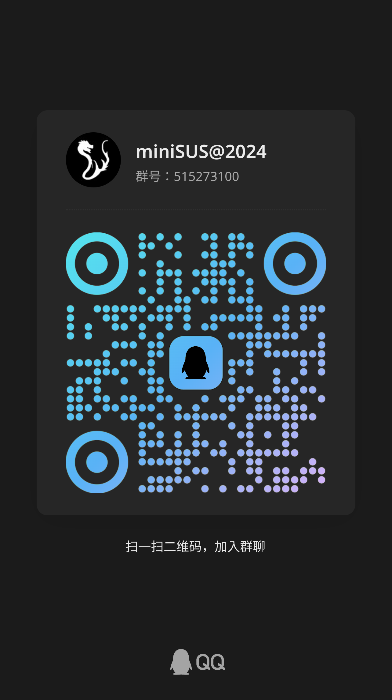

东南大学网络安全联盟（Security Union of SEU）成立于2005年，是一个以促进网络安全爱好者交流为目的，普及网络安全知识为宗旨的社团。多年来，网安一直坚持“秉承古典黑客精神，引领一流网络安全体验”的宗旨，活跃在学校的各个角落，致力于信息安全技术研究，为对信息安全感兴趣的同学提供技术交流和学习的平台。社团战队参加各类信息安全竞赛，在各类全国比赛乃至国际比赛中赢得优异成绩；社团内也走出了数位百度、阿里巴巴、腾讯、绿盟等著名互联网公司网络安全团队的技术人才。

SUS@2024 是：

<table class="members">
  <tbody>
    <tr>
    <td class="avatar">
      {.avatar}
    </td>
    <td>
      <a href="https://blog.135e2.dev">135e2</a>
      
Web

    </td>
  </tr>
  <tr>
    <td class="avatar">
      {.avatar}
    </td>
    <td>
      <a href="#">hardream</a>
      
Web

    </td>
  </tr>
  <tr>
    <td class="avatar">
      {.avatar}
    </td>
    <td>
      <a href="#">huangx607087</a>
      
Crypto

    </td>
  </tr>
  <tr>
    <td class="avatar">
      {.avatar}
    </td>
    <td>
      <a href="https://github.com/idawnlight">idawnlight</a>
      
Web

    </td>
  </tr>
  <tr>
    <td class="avatar">
      {.avatar}
    </td>
    <td>
      <a href="#">d3d0</a>
      
Web

    </td>
  </tr>
  <tr>
    <td class="avatar">
      {.avatar}
    </td>
    <td>
      <a href="#">可燃乌龙茶</a>
      
Reverse

    </td>
  </tr>
  <tr>
    <td class="avatar">
      {.avatar}
    </td>
    <td>
      <a href="https://github.com/lanpesk">lanpesk</a>
      
PWN

    </td>
  </tr>
  <tr>
    <td class="avatar">
      {.avatar}
    </td>
    <td>
      <a href="#">le premier homme</a>
      
Reverse

    </td>
  </tr>
  <tr>
    <td class="avatar">
      {.avatar}
    </td>
    <td>
      <a href="https://github.com/l0ngque">l0ngque</a>
      
PWN

    </td>
  </tr>
  <tr>
    <td class="avatar">
      {.avatar}
    </td>
    <td>
      <a href="#">蓝色星空</a>
      
Crypto

    </td>
  </tr>
  <tr>
    <td class="avatar">
      {.avatar}
    </td>
    <td>
      <a href="https://github.com/moeyork">moeyork</a>
      
MISC/Crypto

    </td>
  </tr>
  <tr>
    <td class="avatar">
      {.avatar}
    </td>
    <td>
      <a href="#">menduogesei</a>
      
Reverse

    </td>
  </tr>
  <tr>
    <td class="avatar">
      {.avatar}
    </td>
    <td>
      <a href="https://github.com/P1umH0">P1umH0</a>
      
Reverse

    </td>
  </tr>
  <tr>
    <td class="avatar">
      {.avatar}
    </td>
    <td>
      <a href="#">Queen</a>
      
Crypto

    </td>
  </tr>
  <tr>
    <td class="avatar">
      {.avatar}
    </td>
    <td>
      <a href="#">请问你有糖吗？</a>
      
Web

    </td>
  </tr>
  <tr>
    <td class="avatar">
      {.avatar}
    </td>
    <td>
      <a href="#">s1ain</a>
      
Web

    </td>
  </tr>
  <tr>
    <td class="avatar">
      {.avatar}
    </td>
    <td>
      <a href="#">ShouCheng</a>
      
PWN

    </td>
  </tr>
  <tr>
    <td class="avatar">
      {.avatar}
    </td>
    <td>
      <a href="#">slavin</a>
      
PWN

    </td>
  </tr>
  <tr>
    <td class="avatar">
      {.avatar}
    </td>
    <td>
      <a href="https://github.com/Lethephyr">Lethephyr</a>
      
Reverse

    </td>
  </tr>
  <tr>
    <td class="avatar">
      {.avatar}
    </td>
    <td>
      <a href="https://github.com/U3sug1Er1i">U3sug1Er1i</a>
      
Reverse

    </td>
  </tr>
  </tbody>
</table>

欢迎通过邮件联系我们： [team\<at\>seusus.com](mailto:team@seusus.com)

你也可以加入 miniSUS 的 QQ 群，与管理员联系：

{width=60%}
