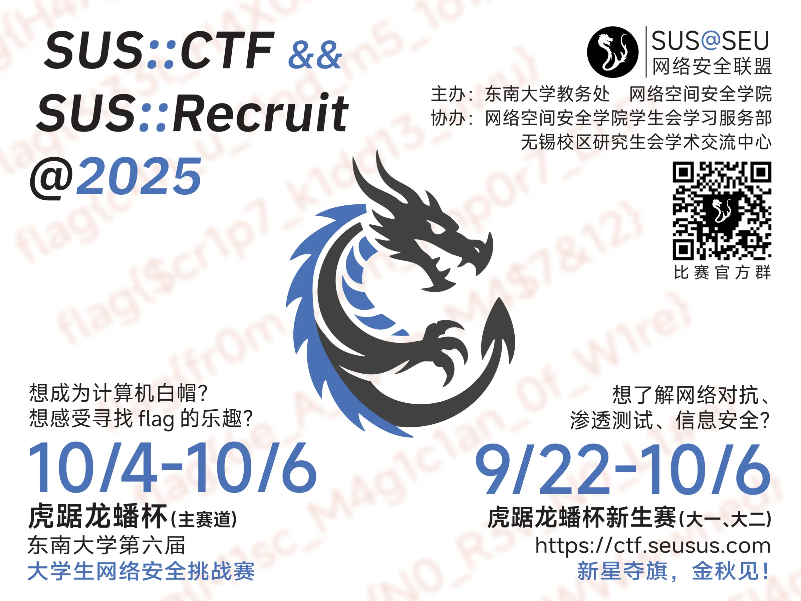

又到一年 SUS 招新季！今年的“虎踞龙蟠杯”东南大学第六届大学生网络安全挑战赛（SUSCTF）依旧将于国庆期间举办。同时，今年为鼓励新生参与，特别设置新生赛道，成绩优异者同样能获得奖状及 SRTP 学分。

别忘了比赛平台在 [ctf.seusus.com](https://ctf.seusus.com)，QQ 群是 798322315，欢迎各位大师傅小师傅萌新老司机来玩 :)

# 比赛时间

## 主赛道

2025/10/4 10 A.M. - 2025/10/6 10 P.M.

## 新生赛道（限校内大一、大二）

2025/9/22 10 A.M. - 2025/10/6 10 P.M.

# 常见问题 // FAQ

## 什么是 CTF？我该如何入门？

「CTF Capture The Flag」中文一般译作夺旗赛，在网络安全领域中指的是网络安全技术人员之间进行技术竞技的一种比赛形式。CTF 起源于 1996 年 DEFCON 全球黑客大会，以代替之前黑客们通过相发起真实攻击进行技术比拼的方式；其将安全相关的知识点抽象出来并加入到题目中，我们通过对知识点的理解认知，具体地进行实践来攻克题目。

入门推荐材料： [Hello CTF](https://hello-ctf.com/)

一些你可能感兴趣的在线靶场：

[MoeCTF](https://ctf.xidian.edu.cn/)
[BUUCTF](https://buuoj.cn/)

当然，我社平台上去年的赛题依旧开放，欢迎参考、提问！

## 如何注册？

1. 点击比赛平台左下角用户图标，选择登录

2. 点击注册按钮注册账号

**请注意：邮箱仅用于接受验证邮件用途，请务必填写真实邮箱**

3. 检查邮箱里的邮件，确认标题为“验证邮箱 - SUS::CTF”

4. 点击验证链接完成注册

## 如何报名？

### 校外参赛

1. 点击左侧战队图标，点击右上角创建一个队伍（队伍名将在平台榜单中公开显示）

2. 点击左侧赛事图标，选择你要参加的赛事

3. 点击报名参赛

4. 选择合适的分组

5. 等待管理员审核

*如审核过程中有任何问题，管理员会通过注册邮箱或留存的其他联系方式与您联系*

### 校内参赛

1. 点击比赛平台左下角用户图标，选择用户信息

2. 修改学工号为你的**学号**

3. 步骤同“校外参赛”

**请注意：如果你没有填写学号而依然选择了错误的分组，审核将不通过！请修改为正确分组后重新提交**

### 教务竞赛系统报名

如果你想要获得 SRTP 学分，请在教务系统一并报名，否则后续提交成绩时将无法计入校内最终颁奖榜单。步骤如下：

1. 使用**校园网**及推荐**Chrome浏览器**访问 [srtp.seu.edu.cn](https://srtp.seu.edu.cn/)

2. 点击“竞赛管理系统”

3. 点击“赛事管理”-“赛事报名管理”

4. 搜索“赛事名称”为“虎踞龙蟠杯”

5. 确认赛事名为““虎踞龙蟠杯”东南大学第六届大学生网络安全挑战赛”

6. 点击右侧“赛事报名”，填写相关信息并提交

## 比赛可以组队吗？

不可以。比赛为个人赛赛制，不符合条件的参赛报名不会通过审核；任何校内参赛者如果发现与其他人私下交流、分享解题思路及flag等情况，将判定成绩无效。

## SUS 与无锡 5USn 是什么关系？

5USn 为网络安全联盟与无锡科协联合成立战队，行政架构位于无锡研究生会学术交流中心名下，队员必须为无锡校区学生；实际参加比赛、日常交流均与 SUS 无异，同样是网络安全联盟的成员。